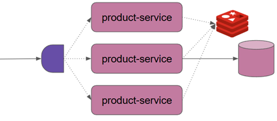
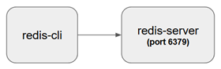

# Sección 03: Redis - Curso Intensivo

- [Redis Cheat Sheet](https://cheatography.com/tasjaevan/cheat-sheets/redis/)
- [Commands](https://redis.io/docs/latest/commands/)

---

## 🔹 Introducción a Redis

`Redis (Remote Dictionary Server)` es una base de datos `NoSQL`, en memoria, de estructura de datos `clave-valor`.
Es ampliamente reconocida por su alto rendimiento, baja latencia y su versatilidad para resolver distintos problemas
de arquitectura de software. Su enfoque en el almacenamiento en memoria hace que sea increíblemente rápido en
comparación con otras bases de datos que dependen del disco.

### ✅ Características principales

- 🚀 `Velocidad extrema`: Redis opera en `memoria RAM`, lo que permite tiempos de respuesta del orden de microsegundos.
- 🔄 `Persistencia opcional`: Aunque es una base de datos en memoria, puede configurarse para guardar datos en disco,
  usando mecanismos como RDB snapshots o AOF (Append-Only File).
- ⚙️ `Estructuras de datos avanzadas`: A diferencia de otras bases de datos `clave-valor` simples, `Redis` ofrece
  estructuras como:
    - Strings
    - Lists
    - Sets
    - Hashes
    - Sorted Sets
    - Bitmaps
    - HyperLogLogs
    - Streams
    - Geo data

- 🔁 Soporte para replicación, clustering y alta disponibilidad.
- 🧩 Extensibilidad mediante módulos adicionales.

### 🧠 Piensa en Redis como

> Un servidor de estructuras de datos multipropósito, que vive en memoria y responde con extrema rapidez.
> Es útil no solo como base de datos, sino también como middleware para acelerar y coordinar aplicaciones distribuidas.

### 📌 Casos de uso comunes

Redis puede cumplir distintos roles dentro de una arquitectura moderna:

- 🧠 `Caching (Almacenamiento en caché)`: Ideal para almacenar resultados de consultas a bases de datos tradicionales o
  llamadas a APIs costosas, acelerando las respuestas.
- 📣 `Pub/Sub (Publicación/Suscripción)`: Redis permite comunicación en tiempo real entre servicios o usuarios mediante
  canales de mensajes.
- 📬 `Message Queue (Cola de mensajes)`: Redis puede funcionar como sistema de colas, similar a RabbitMQ o Kafka, usando
  listas o streams.
- 📺 `Streaming de datos`: Con Redis Streams, se puede manejar flujo de datos continuo (por ejemplo, logs, eventos de
  usuarios, sensores IoT).
- 🌍 `GeoSpatial`: Redis permite almacenar, indexar y consultar datos geoespaciales (latitud/longitud), muy útil para
  mapas o servicios de geolocalización.
- 🔐 `Rate limiting (limitación de solicitudes)`: Muy usado para proteger APIs ante abusos o sobrecarga.
- ⏱️` Expiración y TTL (time-to-live)`: Ideal para datos temporales o sensibles.

### 🔄 Redis en la arquitectura de una aplicación

Redis no reemplaza a una base de datos relacional o documental como PostgreSQL o MongoDB. En lugar de eso, Redis
complementa estas tecnologías como un acelerador de rendimiento, o como componente especializado dentro de una
arquitectura más robusta.

📌 Ejemplo de integración:

- PostgreSQL para almacenamiento transaccional.
- Redis para caché de resultados o para gestionar sesiones de usuario.



### 🌐 Ecosistema Redis

- Redis es gratuito y de código abierto (`Open Source`).
- Existen dos portales principales que encontrarás al buscar información:
    - 🔗 `redis.io` – Sitio oficial del proyecto `open source`.
    - 🔗 `redislabs.com` – Redis Labs, ahora conocido como `Redis Inc.`, ofrece servicios comerciales y Redis en la
      nube (Redis Enterprise).

## 🛠️ Configuración de Redis mediante Docker

### 🔹 Componentes clave de Redis

`Redis` se compone principalmente de dos herramientas fundamentales que trabajan juntas para permitir su uso efectivo:

- 🧱 `redis-server`: Es el proceso principal del servidor Redis, encargado de gestionar las estructuras de datos,
  el almacenamiento en memoria, recibir comandos, mantener conexiones activas y ejecutar operaciones.
  `Es el servidor Redis propiamente dicho`.


- 🖥️ `redis-cli`: Es la herramienta de línea de comandos que permite interactuar con el `servidor Redis`. Nos permite
  conectarnos al servidor y enviarle comandos interactivos. Es esencial para pruebas, inspección o manipulación directa
  de datos. A través de `redis-cli`, podrás ejecutar comandos como `PING`, `SET`, `GET`, `DEL`, entre muchos otros.



Estos dos componentes existen independientemente de cómo decidas instalar Redis, ya sea:

- Directamente en tu sistema operativo (por ejemplo, con apt, brew, o desde el código fuente).
- Mediante un contenedor Docker.
- A través de una distribución en la nube.

📌 En resumen, tanto `redis-server` como `redis-cli` son elementos esenciales de `Redis` y se utilizan en todos los
entornos, no solo cuando se usa Docker.

### 📦 Creación del servicio Redis con Docker Compose

Para comenzar a trabajar con `Redis` en un entorno local de forma rápida y aislada, es muy común utilizar `Docker`.
Esto evita instalaciones complejas en el sistema operativo y permite que podamos levantar servicios reproducibles en
diferentes entornos (desarrollo, pruebas, producción).

> **Atención: Usuario de Windows (que no desea usar Docker)**
>
> `Redis` no admite la instalación directa en Windows. Existe una solución alternativa. El equipo de Redis ha creado un
> vídeo oficial con los pasos para la instalación de Redis en Windows,
> [disponible en YouTube](https://www.youtube.com/watch?v=1psWME8UH_0).

Para levantar el contenedor de Redis fácilmente, se recomienda usar `Docker Compose`, lo cual nos permite definir los
servicios en un archivo `compose.yml`. Este archivo especifica qué imagen usar, el nombre del contenedor, las reglas de
red, puertos expuestos, entre otros detalles.

````yml
services:
  s-redis:
    image: redis:8.0.3-alpine
    container_name: c-redis
    restart: unless-stopped
    ports:
      - '6379:6379'
````

### ▶️ Ejecutar el contenedor

Para levantar el servicio, nos posicionamos en el directorio dónde se encuentra el `compose.yml` y ejecutamos el
siguiente comando.

````bash
D:\programming\spring\01.udemy\03.vinoth_selvaraj\reactive-redis-masterclass\docker (feature/section-3)
$ docker compose up -d                                                                                 
[+] Running 8/8                                                                                        
 ✔ s-redis Pulled                                                                                      
   ✔ f18232174bc9 Already exists                                                                       
   ✔ 10753f8102ef Pull complete                                                                        
   ✔ a9c51c568321 Pull complete                                                                        
   ✔ b96ac5b0d90b Pull complete                                                                        
   ✔ 3b985785c0a3 Pull complete                                                                        
   ✔ 4f4fb700ef54 Pull complete                                                                        
   ✔ 6b9706545272 Pull complete                                                                        
[+] Running 2/2                                                                                        
 ✔ Network docker_default  Created                                                                     
 ✔ Container c-redis       Started                                                                     
````

Puedes listar los contenedores en ejecución con el siguiente comando.

````bash
$ docker container ls -a
CONTAINER ID   IMAGE                COMMAND                  CREATED              STATUS              PORTS                                         NAMES
f37a8bd54269   redis:8.0.3-alpine   "docker-entrypoint.s…"   About a minute ago   Up About a minute   0.0.0.0:6379->6379/tcp, [::]:6379->6379/tcp   c-redis
````

### 🧪 Probar conexión al servidor Redis

Para comprobar que el servidor Redis está activo y accesible, podemos ingresar al contenedor y ejecutar el cliente de
línea de comandos (`redis-cli`):

````bash
$ docker container exec -it c-redis /bin/sh
/data # redis-cli
127.0.0.1:6379> ping
PONG
127.0.0.1:6379>
````

El comando `PING` es una forma simple de testear conectividad con el servidor. La respuesta `PONG` indica que el
servidor Redis está funcionando correctamente y está aceptando comandos.

### ✅ Conclusión

Gracias al uso de `Docker` y `Docker Compose`, podemos levantar una instancia funcional de `Redis` en segundos, sin
necesidad de instalar nada en el sistema operativo. Esto es especialmente útil para pruebas locales, desarrollo o
para integrarlo dentro de arquitecturas de microservicios.

## 🔑 Almacenamiento de valores clave simples en Redis

### 🔹 Fundamentos de clave-valor en Redis

Una de las operaciones más básicas y esenciales en `Redis` es el almacenamiento de datos usando el modelo `clave-valor`
(`key-value`). En este modelo, se asocia un valor a una clave única, y `Redis` se encarga de guardar esa información
en memoria.

### 🧠 Conceptos clave:

- `Redis` es, en esencia, un almacén de estructuras de datos basado en `clave-valor`.
- Tanto las claves como los valores son, por defecto, cadenas de texto (`strings`). Incluso los valores numéricos se
  almacenan internamente como texto.
- `Redis` permite trabajar con claves binarias arbitrarias, lo que significa que puedes usar casi cualquier secuencia
  de bytes como nombre de clave. Aun así, se recomienda usar nombres legibles y cortos para facilitar su mantenimiento
  y comprensión.
- Redis puede manejar más de 2^32 claves (más de 4 mil millones), aunque la limitación real estará dada por la memoria
  disponible en el sistema.
- El tamaño máximo permitido para una clave o valor tipo string es de 512 MB.

### ▶️ Ejemplo práctico con SET y GET

Antes de ejecutar comandos, debemos asegurarnos de tener acceso al servidor `Redis` desde el contenedor. Comprobamos la
conexión con un `PING`:

````bash
$ docker container exec -it c-redis /bin/sh
/data # redis-cli
127.0.0.1:6379> ping
PONG
````

La respuesta `PONG` indica que el cliente (`redis-cli`) se está comunicando exitosamente con el servidor
(`redis-server`).

### 📦 Almacenar y recuperar datos

Probamos las operaciones básicas SET y GET en Redis:

````bash
127.0.0.1:6379> set a b
OK
127.0.0.1:6379> get a
"b"
127.0.0.1:6379> get c
(nil)
127.0.0.1:6379> set a 1
OK
127.0.0.1:6379> get a
"1"
127.0.0.1:6379>
````

1. `SET a b`: Se crea la clave a y se le asigna el valor "b". Redis responde con OK, lo que indica éxito en la
   operación.
2. `GET a`: Recupera el valor de la clave a, devolviendo `"b"`.
3. `GET c`: La clave c no existe, por lo tanto, Redis devuelve (nil), lo que indica ausencia de valor.
4. `SET a 1`: Sobrescribe el valor anterior de la clave a con `"1"`.
5. `GET a`: Devuelve `"1"`. Aunque sea un número, Redis lo almacena como cadena de texto, salvo que se utilicen
   comandos específicos para operar como números (`INCR`, `DECR`, etc.).

### 📝 Nota técnica: Strings en Redis

Aunque `Redis` almacena los valores como cadenas (`strings`), internamente es muy eficiente al detectar si el contenido
es numérico. Esto le permite ejecutar operaciones aritméticas directamente sobre ellos, lo cual veremos más adelante.

Ejemplo de operación con número:

````bash
127.0.0.1:6379> set a 1
OK
127.0.0.1:6379> incr a
(integer) 2
127.0.0.1:6379> get a
"2"
127.0.0.1:6379>
````

Si `a` contiene una cadena que representa un número, `INCR` lo convertirá en entero, lo incrementará y actualizará el
valor.

### 🧭 Convenciones para nombrar claves en Redis

A diferencia de bases de datos relacionales como `PostgreSQL` o documentales como `MongoDB`, `Redis` no organiza los
datos en tablas, colecciones ni esquemas estructurados.

- No hay columnas, filas, ni tipos complejos de entidades.
- Redis opera a nivel de claves individuales que apuntan a valores.
- Cada clave es totalmente independiente y no está "agrupada" en ninguna estructura formal.

Esto le da gran flexibilidad, pero traslada la responsabilidad de la organización a los desarrolladores, quienes deben
seguir convenciones claras al nombrar claves.

### 🧠 Convenciones comunes para definir claves

Como `Redis` no impone una jerarquía o agrupamiento, la comunidad ha adoptado convenciones semánticas para nombrar
claves de forma organizada.

Una muy extendida consiste en `simular rutas o endpoints`, como si fueran URLs, siguiendo una estructura lógica que
represente el recurso. Ejemplos:

| id | name | endpoint                     |
|----|------|------------------------------|
| 1  | sam  | /user/1/name                 |
| 2  | jake | /user/2/name or /user/name/2 |

Sin embargo, por convención, la comunidad `Redis` prefiere usar el carácter dos puntos `(:)` para estructurar las claves
de forma lógica y visual, como si fueran "rutas" jerárquicas. Esto ayuda a mantener orden y claridad al trabajar con
grandes volúmenes de claves.

✨ El carácter `:` no tiene ningún significado especial para Redis, pero se utiliza como una convención humana para
mantener un sistema de nombres limpio, predecible y más fácil de consultar.

````bash
127.0.0.1:6379> set user:1:name martin
OK
127.0.0.1:6379> set user:2:name milagros
OK
127.0.0.1:6379> get user:1:name
"martin"
127.0.0.1:6379> get user:2:name
"milagros"
127.0.0.1:6379>
````

En este caso:

- Las claves `user:1:name` y `user:2:name` siguen una convención de tipo: `recurso:id:atributo`
- Esto hace que sea más fácil visualizar, mantener y recuperar datos relacionados con estructuras complejas como
  usuarios, productos, sesiones, etc.

✅ Conclusión
> El modelo `clave-valor` de `Redis` es simple pero extremadamente poderoso. Las operaciones `SET` y `GET` permiten
> guardar y recuperar datos rápidamente, y su comportamiento predecible lo convierte en una herramienta ideal para
> casos de uso como almacenamiento en caché, configuración, sesiones, contadores y mucho más.

## 🔍 Accediendo a todas las claves en Redis

En Redis, las claves no están agrupadas por tabla o colección, por lo que si queremos inspeccionar las que ya existen,
podemos usar comandos especiales para listarlas. Esto es útil para `debugging`, `exploración` o `scripting`.

````bash
127.0.0.1:6379> keys *
1) "a"
2) "1"
3) "user:1:name"
4) "user:2:name"
5) "user/name/1"

127.0.0.1:6379> keys user*
1) "user:1:name"
2) "user:2:name"
3) "user/name/1"
````

- `KEYS *` devuelve todas las claves del servidor Redis.
- También puedes usar patrones con comodines:
    - `user*` – Claves que empiezan con `user`
    - `*name` – Claves que terminan en `name`
    - `*:*:name` – Claves con dos `:` y terminadas en `name`

⚠️ Advertencia importante:
> El comando `KEYS` recorre todas las claves en memoria, por lo que es muy costoso en rendimiento si tienes muchas
> claves (por ejemplo, millones). `Nunca debe usarse en producción`.

### 🔄 Alternativa segura: comando SCAN

`Redis` ofrece el comando `SCAN` como una alternativa no bloqueante al comando `KEYS`. En lugar de devolver todas
las claves de una sola vez, lo hace de forma iterativa y paginada.

Para ver en funcionamiento el comando `SCAN` vamos a agregar muchas claves. Estas claves adicionales nos permiten
simular una base de datos con múltiples elementos para probar el comportamiento de SCAN.

````bash
127.0.0.1:6379> set user:3:name 3
OK
127.0.0.1:6379> set user:4:name 4
OK
127.0.0.1:6379> set user:5:name 5
OK
127.0.0.1:6379> set user:6:name 6
OK
127.0.0.1:6379> set user:7:name 7
OK
127.0.0.1:6379> set user:8:name 8
OK
127.0.0.1:6379> set user:9:name 9
OK
127.0.0.1:6379> set user:10:name 10
OK
127.0.0.1:6379> set user:11:name 11
OK
127.0.0.1:6379> set user:12:name 12
OK
127.0.0.1:6379> set user:13:name 13
OK
127.0.0.1:6379> set user:14:name 14
````

A continuación, veremos en ejecución el comando `SCAN`.

````bash
127.0.0.1:6379> scan 0
1) "25"
2)  1) "user:9:name"
    2) "user:11:name"
    3) "user:7:name"
    4) "user:13:name"
    5) "user:10:name"
    6) "a"
    7) "user:4:name"
    8) "user:3:name"
    9) "1"
   10) "user:1:name"
127.0.0.1:6379> scan 25
1) "0"
2) 1) "user:2:name"
   2) "user:8:name"
   3) "user:14:name"
   4) "user/name/1"
   5) "user:12:name"
   6) "user:6:name"
   7) "user:5:name"
127.0.0.1:6379>
````

- `scan 0:` comienza desde el `cursor 0`, que representa el `inicio del escaneo`.
- El primer valor de la respuesta `("25")` es el nuevo cursor que se debe usar para la siguiente iteración.
- La segunda parte contiene una lista parcial de claves.
- Cuando el cursor devuelto sea `0`, significa que el escaneo ha finalizado.

📌 Esto lo hace ideal para aplicaciones que necesitan explorar claves sin bloquear el servidor `Redis`.

### 🎯 SCAN con filtros y límite de resultados

Aquí le decimos que nos retorne el listado de claves que hagan match con `user*` pero que solo nos muestre 2 resultados.

````bash
127.0.0.1:6379> scan 0 match user* count 2
1) "16"
2) 1) "user:9:name"
   2) "user:11:name"
````

Parámetros útiles:

- `MATCH <pattern>`: Filtra claves según un patrón, similar a KEYS.
- `COUNT <n>`: Indica cuántas claves `aproximadamente` se desea obtener por iteración. `No garantiza exactitud`.

> ℹ️ `SCAN` está diseñado para exploración segura en entornos productivos. Se recomienda usarlo junto con ciclos de
> código (loops) para recorrer todos los resultados.

## 🗑️ Eliminando claves en Redis

`Redis` nos permite `eliminar una o más claves` de la `base de datos en memoria` usando el comando `DEL`. Es una
operación sencilla pero muy útil, especialmente durante desarrollo, limpieza de datos temporales o invalidación de
cachés.

A continuación eliminamos múltiples claves: `a`, `1` y `user/name/1`:

- `Redis` devuelve el número total de claves eliminadas con éxito.
- Si una de las claves no existiera, el contador disminuiría según corresponda.

````bash
127.0.0.1:6379> del a 1 user/name/1
(integer) 3 
````

Si eliminamos una clave que no existe, simplemente nos indica que se han eliminado 0 claves. Esto es completamente
normal y no genera error. Redis ignora silenciosamente claves inexistentes.

````bash
127.0.0.1:6379> del user:100:name
(integer) 0 
````

### 🧹 Eliminando todas las claves de Redis

Redis permite eliminar todas las claves de la base de datos actual utilizando el comando `flushdb`. Este comando
reinicia por completo la base de datos seleccionada (por defecto, la número 0), eliminando todos los datos almacenados.

````bash
127.0.0.1:6379> flushdb
OK
127.0.0.1:6379> keys *
(empty array)
127.0.0.1:6379> 
````

## ⏱️ Claves con expiración en Redis – Parte 1

`Redis` permite asociar un tiempo de vida `(TTL: Time To Live)` a cualquier clave. Esto significa que una vez cumplido
ese tiempo, la clave será `eliminada automáticamente` por Redis, liberando espacio en memoria.

Esta funcionalidad es útil para:

- Cachear datos temporales.
- Manejar sesiones que caducan.
- Invalidar tokens o autorizaciones.
- Implementar lógica de "desaparición" (expiring state).

### ▶️ Usando SET con expiración

Redis nos permite definir el tiempo de vida directamente al momento de guardar una clave usando el modificador
`EX` (en segundos) o `PX` (en milisegundos).

````bash
127.0.0.1:6379> set a b EX 10
OK
127.0.0.1:6379> get a
"b"
127.0.0.1:6379> get a
"b"
127.0.0.1:6379> get a
"b"
127.0.0.1:6379> get a
(nil) 
````

- El valor `"b"` se almacena en la clave `a`.
- Luego de 10 segundos, al hacer `GET`, `Redis` devuelve (`nil`) porque la clave ha expirado.

### 📏 Verificando tiempo restante con TTL

`Redis` ofrece el comando `TTL (Time To Live)` para ver cuántos segundos le quedan de vida a una clave:

````bash
127.0.0.1:6379> set a b ex 10
OK
127.0.0.1:6379> ttl a
(integer) 7
127.0.0.1:6379> ttl a
(integer) 5
````

- El resultado indica cuántos segundos faltan para que la clave expire.
- Si la clave no tiene expiración, `TTL` devuelve `-1`.
- Si la clave no existe, `TTL` devuelve `-2`.

### 🔁 Extendiendo el TTL con EXPIRE

Puedes modificar o extender el tiempo de vida de una clave en cualquier momento usando `EXPIRE <clave> <segundos>`.

````bash
127.0.0.1:6379> expire a 60
(integer) 1
127.0.0.1:6379> ttl a
(integer) 58
127.0.0.1:6379> ttl a
(integer) 55

127.0.0.1:6379> expire a 600
(integer) 1
127.0.0.1:6379> ttl a
(integer) 598
127.0.0.1:6379> ttl a
(integer) 597
127.0.0.1:6379> ttl a
(integer) 595
127.0.0.1:6379>  
````

- Redis responde `1` si la expiración fue aplicada con éxito.

## ⏱️ Claves con expiración en Redis – Parte 2

### 🔹 Establecer expiración con una fecha exacta (EXAT)

Redis permite definir la expiración de una clave en un momento específico del tiempo (en segundos desde la época UNIX)
usando el modificador `EXAT`.

La sintaxis es `SET key value EXAT <timestamp_en_segundos>`. Esto es equivalente a decir: "Esta clave debe expirar
exactamente en el segundo `UNIX 1752161050`."

> `Nota`, en mi caso obtuve ese `timestamp` en java usando `Instant.now().plusSeconds(120).getEpochSecond();`

Veamos el siguiente ejemplo.

````bash
$ 127.0.0.1:6379> set a b exat 1752161050
OK
127.0.0.1:6379> ttl a
(integer) 98
127.0.0.1:6379> ttl a
(integer) 98
127.0.0.1:6379> ttl a
(integer) 92
127.0.0.1:6379> ttl a
(integer) 85
127.0.0.1:6379>
````

### 🔹 Establecer expiración en milisegundos (PX)

Redis también permite definir el tiempo de vida en milisegundos con el modificador `PX`.

````bash
127.0.0.1:6379> set a b px 3000
OK
127.0.0.1:6379> get a
"b"
127.0.0.1:6379> get a
"b"
127.0.0.1:6379> get a
(nil) 
````

- La clave `a` fue eliminada automáticamente luego de 3 segundos (3000 ms).
- Es útil cuando necesitas mayor precisión temporal, como para `throttling` o `expiración de tokens temporales`.

### 🧨 ¿Qué pasa si sobrescribo una clave con TTL?

Cuando sobrescribes una clave con `SET`, por defecto:

- ✅ El nuevo valor es guardado
- ❌ Pero el TTL anterior se pierde

Veamos el siguiente ejemplo.

````bash
127.0.0.1:6379> set a b ex 60
OK
127.0.0.1:6379> ttl a
(integer) 58
127.0.0.1:6379> ttl a
(integer) 22
127.0.0.1:6379> set a c
OK
127.0.0.1:6379> ttl a
(integer) -1
````

- El valor fue actualizado, pero Redis eliminó el TTL anterior.
- Esto puede romper una lógica si esperabas que expirara igual.

### 🔒 Mantener el TTL al sobrescribir (KEEPTTL)

Para evitar la pérdida del tiempo de expiración cuando sobrescribes una clave, Redis ofrece el modificador `KEEPTTL`.

````bash
127.0.0.1:6379> set a b ex 60
OK
127.0.0.1:6379> ttl a
(integer) 56
127.0.0.1:6379> ttl a
(integer) 52
127.0.0.1:6379> get a
"b"
127.0.0.1:6379> set a c keepttl
OK
127.0.0.1:6379> ttl a
(integer) 32
127.0.0.1:6379> ttl a
(integer) 29
127.0.0.1:6379> get a
"c"
````

- La clave `a` cambió su valor de `"b"` a `"c"`, pero mantuvo la expiración original.
- Redis continuará eliminando la clave en el momento previsto.

### 📘 Resumen de modificadores de expiración

| Modificador    | Significado                                         |
|----------------|-----------------------------------------------------|
| `EX <seg>`     | Expira en N segundos                                |
| `PX <ms>`      | Expira en N milisegundos                            |
| `EXAT <epoch>` | Expira en un instante UNIX exacto                   |
| `PXAT <epoch>` | Expira en un instante UNIX exacto (en milisegundos) |
| `KEEPTTL`      | Mantiene el TTL actual al sobrescribir la clave     |

## ⚙️ Opciones Condicionales para SET: NX y XX

### 🔹 ¿Qué son NX y XX?

Cuando usamos el comando `SET` en Redis, podemos aplicar condiciones sobre si la clave ya existe o no antes de realizar
la operación.

Estas opciones te permiten controlar si quieres:

- ✅ Crear una clave solo si no existe (`NX`)
- ✅ Actualizar una clave solo si ya existe (`XX`)

### Sintaxis general

````bash
SET <clave> <valor> [NX | XX] 
````

| Opción | Significado                                       |
|--------|---------------------------------------------------|
| `NX`   | Solo establece el valor **si la clave NO existe** |
| `XX`   | Solo establece el valor **si la clave SÍ existe** |

### 🔸 Usando XX (Solo si la clave ya existe)

````bash
127.0.0.1:6379>  SET a b XX
(nil) 
````

Como la clave a no existe, Redis no hace nada y devuelve (nil).

### 🔸 Usando NX (Solo si la clave no existe)

````bash
127.0.0.1:6379>  SET a b NX
OK
127.0.0.1:6379> GET a
"b" 
````

Redis crea la clave `a` con valor  `"b"` porque aún no existía.

### 🔸 Intento de sobrescribir usando NX

````bash
127.0.0.1:6379> SET a c NX
(nil)
127.0.0.1:6379> GET a
"b"
127.0.0.1:6379>
````

Como `a` ya existe, Redis ignora la operación y mantiene el valor anterior.

## 🔍 Comando EXISTS en Redis

El comando `EXISTS` permite verificar si una o más claves están presentes actualmente en Redis.

- Devuelve 1 si la clave existe.
- Devuelve 0 si la clave no existe o ya expiró.

Este comando es útil para verificar la existencia de claves antes de realizar operaciones adicionales.

Con el comando `exists` podemos saber si una clave existe o no. Si la clave está presente retorna `1`, si la clave no
está presente retorna `0`.

````bash
127.0.0.1:6379> exists user:1:session
(integer) 0
127.0.0.1:6379> set user:1:session token ex 20
OK
127.0.0.1:6379> exists user:1:session
(integer) 1
127.0.0.1:6379> get user:1:session
"token"
````

- Inicialmente, la clave `user:1:session` no existe → devuelve 0.
- Luego se define la clave con un valor y una expiración → devuelve 1.

### 📉 Expiración automática

Después de que expira el TTL, Redis elimina la clave automáticamente, y `EXISTS` lo refleja:

````bash
127.0.0.1:6379> get user:1:session
(nil)
127.0.0.1:6379> exists user:1:session
(integer) 0 
````

Redis confirma que la clave ya fue eliminada → retorna 0.

## 🔼🔽 Comandos INCR / DECR en Redis

Redis ofrece una serie de comandos para incrementar o decrementar valores numéricos almacenados como cadenas. Estas
operaciones son atómicas, lo que las hace ideales para contadores, sistemas de votos, limitadores de uso, etc.

### 🧪 Ejemplo básico con INCR

````bash
127.0.0.1:6379> set a 1
OK
127.0.0.1:6379> get a
"1"
127.0.0.1:6379> incr a
(integer) 2
127.0.0.1:6379> get a
"2"
127.0.0.1:6379>  incr a
(integer) 3
127.0.0.1:6379> get a
"3" 
````

- INCR incrementa el valor de a en +1.
- El valor es almacenado como una cadena, pero Redis lo trata como un número entero.

### 🔸 ¿Y si la clave no existe?

````bash
127.0.0.1:6379> keys *
(empty array)
127.0.0.1:6379> incr a
(integer) 1
127.0.0.1:6379> get a
"1"
````

Si la clave no existe, Redis la inicializa automáticamente en 0 y luego la incrementa.

### 🔽 Uso de DECR (decremento)

````bash
127.0.0.1:6379> get a
"5"
127.0.0.1:6379> decr a
(integer) 4
127.0.0.1:6379> decr a
(integer) 3
127.0.0.1:6379> decr a
(integer) 2
````

- DECR reduce el valor en -1.
- También funciona si la clave no existe: se inicializa como 0 y luego se decrementa.

### 🔸 INCRBYFLOAT – con decimales

````bash
127.0.0.1:6379> set a 1.05
OK
127.0.0.1:6379> incrbyfloat a 0.52
"1.57"
127.0.0.1:6379> get a
"1.57"
127.0.0.1:6379> incrbyfloat a -0.07
"1.5"
127.0.0.1:6379> get a
"1.5"
````

- INCRBYFLOAT permite usar valores decimales (flotantes).
- Redis sigue almacenando el resultado como string, pero lo interpreta correctamente como número.

### 🔸 INCRBY y DECRBY – con enteros

````bash
127.0.0.1:6379> set a 100
OK
127.0.0.1:6379> get a
"100"
127.0.0.1:6379> incrby a 20
(integer) 120
127.0.0.1:6379> get a
"120"
127.0.0.1:6379> decrby a 5
(integer) 115
127.0.0.1:6379> get a
"115"
````

- INCRBY incrementa en el número especificado.
- DECRBY decrementa en el número especificado.

### 🧠 Consideraciones importantes

- Todos estos comandos `fallarán si el valor actual no es numérico` (por ejemplo, si la clave contiene texto).
- Redis maneja todo como string, pero internamente convierte para operaciones numéricas.
- Estas operaciones son atómicas, es decir, seguras frente a concurrencia.
- Son muy útiles para:
    - Contadores de visitas
    - Sistemas de votos (like/dislike)
    - Límite de peticiones por usuario (rate limiting)

### 📘 Resumen de comandos

| Comando             | Descripción                                            |
|---------------------|--------------------------------------------------------|
| `INCR key`          | Incrementa en +1                                       |
| `DECR key`          | Decrementa en -1                                       |
| `INCRBY key N`      | Incrementa en N                                        |
| `DECRBY key N`      | Decrementa en N                                        |
| `INCRBYFLOAT key F` | Incrementa por número flotante F (positiva o negativa) |

## 🧱 Redis Hash – Parte 1

### 🔹 ¿Qué es un Hash en Redis?

Un hash en Redis es una estructura de datos que almacena pares `campo-valor` dentro de una clave única. Se utiliza
principalmente para representar objetos o entidades, como usuarios, productos o configuraciones.

### 📌 Diferencias con SET/GET

- `SET/GET`: se usan para pares clave-valor simples (una sola entrada por clave).
- `HSET/HGET`: se usan para almacenar múltiples atributos o propiedades de un objeto bajo una sola clave.

### 📦 Caso de uso

Supongamos que quieres representar usuarios:

| id | name | age | city    |
|----|------|-----|---------|
| 1  | sam  | 10  | atlanta |
| 2  | jake | 20  | miami   |

Puedes usar un hash por cada usuario:

````bash
127.0.0.1:6379> hset user:1 name sam age 10 city atlanta
(integer) 3
````

- Crea la clave `user:1` como un hash.
- Inserta 3 campos: `name`, `age`, `city`.

### 🔍 Verificación

````bash
127.0.0.1:6379> keys *
1) "user:1"
127.0.0.1:6379> type user:1
hash
````

Redis identifica `user:1` como tipo `hash`.

### 📥 Acceder a valores individuales

````bash
127.0.0.1:6379> hget user:1 name
"sam"
127.0.0.1:6379> hget user:1 age
"10"
127.0.0.1:6379> hget user:1 city
"atlanta"
````

Puedes recuperar campos específicos sin obtener todo el hash.

### 📤 Obtener todos los campos

````bash
127.0.0.1:6379> hgetall user:1
1) "name"
2) "sam"
3) "age"
4) "10"
5) "city"
6) "atlanta" 
````

Retorna todos los pares `campo-valor` del `hash` como una lista.

### ✅ Ventajas de usar HASH

- Permite manejar objetos estructurados en una sola clave.
- Ideal para representar entidades del dominio (usuarios, productos, etc.).
- Reduce el número de claves en Redis (evita user:1:name, user:1:age, etc.).
- Puedes actualizar campos de forma selectiva sin sobrescribir todo el valor.

### 📘 Comandos clave de hash

| Comando               | Descripción                             |
|-----------------------|-----------------------------------------|
| `HSET key field val`  | Define un campo dentro de un hash       |
| `HGET key field`      | Obtiene el valor de un campo específico |
| `HGETALL key`         | Retorna todos los campos y valores      |
| `HDEL key field`      | Elimina uno o más campos                |
| `HEXISTS key field`   | Verifica si existe un campo             |
| `HLEN key`            | Cantidad de campos en el hash           |
| `HINCRBY key field n` | Incrementa valor numérico               |

## 🧱 Redis Hash – Parte 2

### 🔹 Comandos adicionales para trabajar con Hashes

Una vez que tienes un hash en Redis, puedes realizar operaciones más específicas como obtener solo las claves o valores,
verificar si existen ciertos campos, o eliminar alguno de ellos.

### 🔍 HKEYS – Obtener solo los nombres de campos

````bash
127.0.0.1:6379> hkeys user:1
1) "name"
2) "age"
3) "city"
````

### 📥 HVALS – Obtener solo los valores

````bash
127.0.0.1:6379> hvals user:1
1) "sam"
2) "10"
3) "atlanta"
````

### ✅ HEXISTS – Verificar si un campo existe

````bash
127.0.0.1:6379> hexists user:1 name
(integer) 1
````

- Devuelve 1 si el campo name existe dentro del hash user:1.
- Devuelve 0 si el campo no existe.

### ❌ HDEL – Eliminar uno o más campos

````bash
127.0.0.1:6379> hdel user:1 age
(integer) 1
````

- Elimina el campo `age` del hash `user:1`.
- El número retornado indica cuántos campos fueron eliminados (en este caso, 1).

### 🔄 Verificar nuevamente los campos restantes

````bash
127.0.0.1:6379> hkeys user:1
1) "name"
2) "city"
127.0.0.1:6379> hvals user:1
1) "sam"
2) "atlanta"
````

Confirma que el campo age fue eliminado correctamente.

### ⚠️ Importante: Redis Hash ≠ Tabla Relacional

Aunque los hashes de Redis se parezcan a las filas de una tabla, Redis no impone ninguna estructura fija para los
campos. No existe una `"definición de esquema"` como en una tabla de SQL.

📌 Ejemplo:

````bash
127.0.0.1:6379> hset user:1 name sam age 10 city atlanta
(integer) 3

127.0.0.1:6379> hset user:2 status active score 100 admin false
(integer) 3
````

🔎 Como ves:

- `user:1` tiene campos como name, age, city.
- `user:2` tiene campos completamente distintos: status, score, admin.

✅ Conclusión:

- Redis no fuerza consistencia de campos entre hashes.
- Cada hash puede tener campos diferentes.
- Redis no valida tipos, ni exige que un "objeto" tenga una estructura determinada.
- Esto le da flexibilidad, pero también implica que la consistencia depende del desarrollador.
- 💡 Si necesitas consistencia entre estructuras de datos, debes manejarla tú mismo desde la aplicación.
