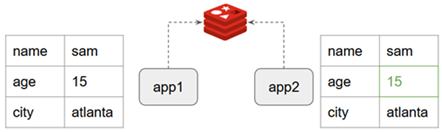

# Sección 04: Redisson - Curso Intensivo

---

## Introducción: Librerías de Redis para Java

Cuando trabajamos con `Redis` desde aplicaciones `Java`, existen varias bibliotecas cliente disponibles. Las más
destacadas son: `Jedis`, `Lettuce` y `Redisson`. A continuación, se presenta un resumen comparativo de sus principales
características.

### 1. Jedis

- ✅ Rápido en operaciones básicas.
- ❌ No es seguro para múltiples hilos (thread-unsafe). Cada hilo necesita su propia conexión.
- ❌ No es escalable para entornos modernos concurrentes.
- ❌ No soporta programación reactiva (reactive-streams).
- ⚠️ Obsoleto para aplicaciones modernas. Aunque sigue siendo funcional, su mantenimiento ha decaído y su enfoque está
  desactualizado frente a soluciones más modernas.
- 🔥 Conclusión: No se recomienda para nuevos proyectos.

### 2. Lettuce

- ✅ Escalable y seguro para múltiples hilos (basado en Netty).
- ✅ Compatible con programación reactiva (soporta reactive-streams).
- ✅ Compatible con Spring Data Redis.
  > Nota: No existe un ReactiveCrudRepository oficial para Redis, por lo tanto, se suelen usar operaciones reactivas
  personalizadas.
- ⚠️ API de bajo nivel, requiere escribir más código para tareas comunes.
- ➕ Puede coexistir con Redisson en un mismo proyecto, aunque:
    - En la mayoría de casos, usar ambos no es necesario.
    - Si tu proyecto requiere estructuras avanzadas y abstracciones de alto nivel, Redisson suele ser la mejor opción.

### 3. Redisson

- ✅ Escalable y compatible con programación reactiva (reactive-streams).
- ✅ Excelente nivel de abstracción. Simplifica el uso de estructuras de datos y patrones distribuidos.
- ✅ Compatible con Spring Data Redis.
- ✅ Gran compatibilidad con estructuras de datos de Redis, mejor que Lettuce en muchos casos.
- ✅ Excelente documentación y comunidad activa (más de 16k estrellas en GitHub).
- 🧠 Funcionalidades destacadas:
    - Mapas, colas, listas, locks distribuidos, semáforos, contadores atómicos, entre otros.
    - Soporte para objetos distribuidos con facilidad.
    - Manejo de cache local + cache Redis (modo híbrido).
- 🔥 Conclusión: Ideal para quienes desean aprovechar Redis al máximo sin lidiar con los detalles de bajo nivel.

## Recomendación general

- Si tu proyecto requiere control detallado, bajo consumo de recursos y ya estás usando Spring Data Redis, puedes optar
  por Lettuce.
- Si necesitas una API de alto nivel con múltiples abstracciones listas para usar, lo más conveniente es usar Redisson.
- Evita Jedis en nuevos desarrollos, a menos que tengas una razón muy específica para ello.

## Configuración del proyecto Java Maven

En este apartado crearemos un proyecto solo con `Java Maven` con nuestro `IntelliJ IDEA`. Luego, en el `pom.xml`
generalo le agregaremos
[las dependencias que nos proporcionó el tutor](https://github.com/vinsguru/redis-webflux/blob/master/redisson-playground/pom.xml).

Este proyecto llamado `redisson-playground` nos servirá para ir jugando con `Redission`, es decir ver cómo es que
funciona e ir introduciéndonos en el uso de esa librería.

````xml
<!--maven.compiler.source 21-->
<!--maven.compiler.target 21-->
<!--project.build.sourceEncoding-->
<!--redisson.version 3.47.0-->
<!--lombok.version 1.18.36-->
<!--junit.version 5.11.3-->
<dependencies>
    <dependency>
        <groupId>org.redisson</groupId>
        <artifactId>redisson</artifactId>
        <version>${redisson.version}</version>
    </dependency>
    <dependency>
        <groupId>org.projectlombok</groupId>
        <artifactId>lombok</artifactId>
        <version>${lombok.version}</version>
        <scope>provided</scope>
    </dependency>
    <dependency>
        <groupId>io.projectreactor</groupId>
        <artifactId>reactor-test</artifactId>
        <scope>test</scope>
    </dependency>
    <dependency>
        <groupId>org.junit.jupiter</groupId>
        <artifactId>junit-jupiter-engine</artifactId>
        <version>${junit.version}</version>
        <scope>test</scope>
    </dependency>
    <dependency>
        <groupId>ch.qos.logback</groupId>
        <artifactId>logback-classic</artifactId>
        <version>1.5.18</version>
    </dependency>
</dependencies>
````

## Redisson Client

Creamos la clase `RedissonConfig` con la configuración manual del `cliente Redisson`, utilizada para conectarse a una
instancia local de `Redis`. Dado que aún no estamos usando `Spring Boot`, aquí se hace la configuración `"a mano"`,
lo cual es útil para entender cómo funciona internamente `Redisson`.

````java
public class RedissonConfig {

    private RedissonClient redissonClient;

    public RedissonClient getClient() {
        if (Objects.isNull(this.redissonClient)) {
            Config config = new Config();
            config.useSingleServer()
                    .setAddress("redis://127.0.0.1:6379");
            this.redissonClient = Redisson.create(config);
        }
        return this.redissonClient;
    }

    public RedissonReactiveClient getReactiveClient() {
        return this.getClient().reactive();
    }
}
````

- Campo `private RedissonClient redissonClient`
    - Se declara una instancia privada de tipo `RedissonClient`, la cual es el cliente principal que usaremos para
      interactuar con `Redis`.
    - Esta instancia se inicializa perezosamente (`lazy initialization`), es decir, solo se crea cuando realmente se
      necesita.


- Método `getClient()`. Este método devuelve una instancia de `RedissonClient`. Su lógica es:
    - Si `redissonClient` aún no ha sido creado, lo inicializa:
        - Se crea una instancia de `Config`, que contiene la configuración de `Redisson`.
        - Se utiliza el modo de `servidor único` (`useSingleServer()`) porque estamos conectándonos a un `Redis local`.
        - La dirección se define como `redis://127.0.0.1:6379`, que es el puerto por defecto de `Redis` en `localhost`.
    - Se crea el cliente con `Redisson.create(config)`.
    - Finalmente, se retorna el cliente (`redissonClient`). Este patrón de inicialización evita que se creen múltiples
      instancias del cliente, lo cual es importante para conservar conexiones y evitar errores.


- Método `getReactiveClient()`. Este método devuelve una instancia de `RedissonReactiveClient`, que permite trabajar de
  `forma reactiva con Redis`:
    - Internamente, `Redisson` tiene soporte tanto para un `cliente imperativo (RedissonClient)` como para uno
      `reactivo (RedissonReactiveClient)`.
    - Este método simplemente obtiene el cliente imperativo y devuelve su versión reactiva.
    - Este `cliente reactivo` es compatible con `Project Reactor` (`Mono`, `Flux`), por lo que será útil cuando
      trabajemos con `Spring WebFlux`.

### ✅ Ventajas de esta clase

- Separa claramente la configuración de Redisson.
- Permite reutilizar el cliente sin crear nuevas conexiones innecesarias.
- Facilita el acceso tanto al cliente imperativo como al reactivo.
- Es un buen ejercicio para comprender la configuración sin depender de Spring Boot.

### ⚠️ Observaciones importantes

- Esta clase `no es thread-safe` si la vas a usar en entornos concurrentes. Aunque funciona bien en pruebas simples, en
  producción deberías garantizar que el cliente se cree una sola vez de manera segura (por ejemplo, usando un
  `singleton` adecuado o `synchronized` si no usas Spring).
- En entornos reales con múltiples nodos Redis o clústeres, se usaría otra variante de configuración como
  `useClusterServers()`, `useSentinelServers()`, etc.
- Cuando se pase a Spring Boot, esta configuración se podrá reemplazar por Beans gestionados por el contenedor,
  aprovechando inyección de dependencias y configuración centralizada.

### 📝 Resumen

| Método                | Descripción                                                                                                         |
|-----------------------|---------------------------------------------------------------------------------------------------------------------|
| `getClient()`         | Retorna una instancia única de `RedissonClient`, conectada a Redis local (`localhost:6379`). Si no existe, la crea. |
| `getReactiveClient()` | Retorna una instancia de `RedissonReactiveClient`, útil para programación reactiva con `Mono` y `Flux`.             |

## Base Test

Creamos una clase llamada `BaseTest` que será una clase abstracta de configuración común para todas las pruebas que
usen `Redisson`. Su objetivo es centralizar la lógica de creación y liberación del `cliente Redisson reactivo`
(`RedissonReactiveClient`), evitando repetir este código en cada clase de prueba.

````java

@TestInstance(TestInstance.Lifecycle.PER_CLASS)
public abstract class BaseTest {

    private final RedissonConfig redissonConfig = new RedissonConfig();
    protected RedissonReactiveClient client;

    @BeforeAll
    void beforeAll() {
        this.client = this.redissonConfig.getReactiveClient();
    }

    @AfterAll
    void afterAll() {
        this.redissonConfig.getClient().shutdown();
    }

    protected void sleep(long millis) {
        try {
            Thread.sleep(millis);
        } catch (InterruptedException e) {
            e.printStackTrace();
        }
    }
}
````

- `@TestInstance(TestInstance.Lifecycle.PER_CLASS)`
    - Por defecto, `JUnit 5` crea una nueva instancia de la clase de prueba por cada método de prueba. Eso implica que
      los métodos `@BeforeAll` y `@AfterAll` deben ser estáticos (`static`), ya que se ejecutan
      `antes y después de todos los tests`.
    - Al declarar esta anotación con `PER_CLASS`, `JUnit` usa una única instancia de la clase de prueba para todos los
      métodos, lo que permite que `@BeforeAll` y `@AfterAll` sean métodos de instancia (`no estáticos`).
  > ✅ Esto es útil cuando necesitas acceder a campos no estáticos o cuando prefieres una estructura más orientada a
  objetos.

- Campo `private final RedissonConfig redissonConfig`
    - Se crea una instancia de `RedissonConfig`, que es la clase previamente definida donde configuramos el cliente
      `Redisson` (`imperativo` y `reactivo`).
    - Esta instancia se usa para obtener el cliente reactivo.


- Campo `protected RedissonReactiveClient client`
    - Se define como protected para que esté accesible directamente desde cualquier clase que extienda de `BaseTest`.
    - Aquí se almacena el `cliente reactivo de Redisson`, que será usado en los tests para interactuar con Redis.


- Método anotado con `@BeforeAll`
    - Se ejecuta una sola vez antes de todos los tests de la clase hija.
    - Inicializa el cliente Redisson reactivo.


- Método anotado con `@AfterAll`
    - Se ejecuta una sola vez después de que todos los tests han finalizado.
    - Cierra correctamente el cliente Redisson.
  > ⚠️ Es importante liberar los recursos, ya que el cliente mantiene conexiones abiertas al servidor Redis. No
  cerrarlas puede provocar bloqueos o errores en pruebas posteriores.

### ✅ Ventajas de esta clase

- Evita duplicación de código en las clases de prueba.
- Permite inicializar y limpiar el cliente Redisson de manera centralizada.
- Facilita que las clases hijas solo se concentren en escribir las pruebas.
- Mejora la mantenibilidad del proyecto de pruebas.

### 📝 Resumen

| Elemento                        | Propósito                                                         |
|---------------------------------|-------------------------------------------------------------------|
| `@TestInstance(PER_CLASS)`      | Permite que `@BeforeAll` y `@AfterAll` sean métodos de instancia. |
| `BaseTest`                      | Clase abstracta base para compartir configuración entre tests.    |
| `RedissonReactiveClient client` | Cliente reactivo compartido en todas las pruebas.                 |
| `beforeAll()`                   | Inicializa el cliente una vez al iniciar la suite de tests.       |
| `afterAll()`                    | Cierra el cliente después de ejecutar todos los tests.            |

## 🧪 Key Value

Este apartado demuestra cómo usar `Redisson` de forma reactiva para trabajar con claves y valores simples, utilizando
la estructura de datos Redis llamada String.

`Redisson` proporciona la interfaz `RBucketReactive<T>` para manejar este tipo de operaciones.

````java

@Slf4j
class Lec01KeyValueTest extends BaseTest {

    @Test
    void keyValueAccessTest() {
        RBucketReactive<String> bucket = this.client.getBucket("user:1:name");
        Mono<Void> set = bucket.set("sam");
        Mono<Void> get = bucket.get()
                .doOnNext(s -> log.info("{}", s))
                .then();

        StepVerifier.create(set.concatWith(get))
                .verifyComplete();
    }
}
````

- `RBucketReactive<String> bucket = this.client.getBucket("user:1:name")`;
    - Se obtiene una instancia de `RBucketReactive`, que representa una clave tipo string en Redis (estructura String).
    - El nombre de la clave es `user:1:name`.
    - Se especifica que el valor será de tipo String.

      > 💡 Redis no tiene tipos fuertes, pero `Redisson` sí permite trabajar con tipos genéricos en Java para mayor
      seguridad.


- `Mono<Void> set = bucket.set("sam")`
    - Se prepara una operación reactiva para asignar el valor `"sam"` a la clave `user:1:name`.
    - No se ejecuta aún: recuerda que en programación reactiva, nada se ejecuta hasta que alguien lo suscribe (en este
      caso, `StepVerifier` lo hace).


- `Mono<Void> get = bucket.get()...`
    - Se prepara una operación reactiva para obtener el valor de la clave `user:1:name`.
    - Se usa `doOnNext(...)` para loggear el valor recuperado (`sam`).
    - Luego se encadena con `.then()` para convertir el flujo en `Mono<Void>`, indicando que no nos interesa devolver
      el valor, solo esperar que termine.


- `StepVerifier.create(set.concatWith(get)).verifyComplete()`
    - Se combinan ambas operaciones (`set` seguido de `get`) usando `concatWith(...)`.
    - `StepVerifier` ejecuta el flujo reactivo y verifica que ambas operaciones se completen sin error.
    - Si algo falla (por ejemplo, Redis no está corriendo), el test falla.

Antes de ejecutar el test verificamos que no hay claves aún en el servidor Redis.

````bash
127.0.0.1:6379> keys *
(empty array) 
````

Procedemos a ejecutar el test. Se imprime el valor `"sam"` desde el log gracias a `doOnNext(...)`.

````bash
12:22:39.961 [redisson-netty-1-6] INFO dev.magadiflo.test.Lec01KeyValueTest -- sam
````

Si volvemos al servidor de redis verificamos que:

- Redis muestra que la clave se ha guardado correctamente.
- El valor aparece codificado `("\x03sa\xed")` porque `Redisson` serializa los valores por defecto usando su propio
  mecanismo binario `(Codec)`, lo cual es totalmente normal.

````bash
127.0.0.1:6379> keys *
1) "user:1:name"
127.0.0.1:6379> get user:1:name
"\x03sa\xed" 
````

### ⚠️ Nota sobre el valor serializado

Por defecto, `Redisson` serializa los objetos usando un `codec` basado en `Kryo` o `Jackson`, lo cual hace que el valor
no se vea como texto plano en `Redis CLI`.

> 💡 Si deseas que los valores se guarden como texto plano, puedes cambiar el codec por uno como `StringCodec`, lo
> veremos más adelante.

### 📝 Resumen

| Elemento           | Descripción                                                         |
|--------------------|---------------------------------------------------------------------|
| `RBucketReactive`  | Representa una clave tipo String en Redis.                          |
| `.set("sam")`      | Guarda un valor asociado a la clave.                                |
| `.get()`           | Recupera el valor asociado a la clave.                              |
| `StepVerifier`     | Ejecuta y verifica que el flujo reactivo se complete correctamente. |
| Valor en Redis CLI | Puede aparecer codificado por el codec predeterminado.              |

## [Redisson Codec](https://redisson.pro/docs/data-and-services/data-serialization/)

Un `Codec` es el mecanismo que `Redisson` utiliza para serializar y deserializar los datos que se almacenan en `Redis`.
Por defecto, `Redisson` serializa los objetos en formato binario (por ejemplo, usando `Kryo`), lo cual no es legible
directamente desde la `CLI de Redis`.

Sin embargo, `Redisson` permite usar codecs alternativos, como `StringCodec`, para guardar datos como texto plano.

> 📘 Documentación
> oficial: [Redisson – Data Serialization](https://redisson.pro/docs/data-and-services/data-serialization/)

````java

@Slf4j
class Lec01KeyValueTest extends BaseTest {
    @Test
    void keyValueAccessTestStringCodec() {
        RBucketReactive<String> bucket = this.client.getBucket("user:1:name", StringCodec.INSTANCE);
        Mono<Void> set = bucket.set("sam");
        Mono<Void> get = bucket.get()
                .doOnNext(s -> log.info("{}", s))
                .then();

        StepVerifier.create(set.concatWith(get))
                .verifyComplete();
    }
}
````

`this.client.getBucket("user:1:name", StringCodec.INSTANCE)`

- Se obtiene una instancia de `RBucketReactive`, pero esta vez se especifica el uso de `StringCodec`.
- Esto indica que el valor será serializado y deserializado como texto plano.

> ✅ Esto no solo afecta cómo se lee en Java, sino cómo se guarda en Redis.

### 🖥️ Resultado del log

Si ejecutamos la prueba anterior, el valor "sam" se imprime correctamente desde Java. Aquí no hay diferencia con la
prueba anterior, ya que `Redisson` lo deserializa sin problemas en ambos casos.

````bash
12:51:57.328 [redisson-netty-1-6] INFO dev.magadiflo.test.Lec01KeyValueTest -- sam
````

### 📦 Revisión en Redis CLI

El cambio lo veremos cuando consultemos directamente en el servidor de redis.

- A diferencia del test anterior, ahora el valor es completamente legible en texto plano.
- Ya no aparece con caracteres binarios extraños como `\x03sa\xed`, porque no hay serialización binaria: `Redisson`
  simplemente guarda `"sam"` como una cadena.

````bash
127.0.0.1:6379> get user:1:name
"sam"
````

### ✅ ¿Cuándo usar StringCodec?

- Cuando quieres ver los valores de Redis directamente desde CLI o herramientas como RedisInsight.
- Cuando estás trabajando con datos simples (String, Integer, etc.) y no necesitas serializar objetos complejos.
- Cuando necesitas que Redis pueda interoperar fácilmente con otros lenguajes o herramientas que esperan valores en
  texto plano.

### ⚠️ Consideraciones

- El uso de StringCodec no es adecuado si necesitas guardar objetos Java complejos. Para eso, es mejor usar codecs como
  JsonJacksonCodec, KryoCodec, etc.
- Se puede establecer un codec por objeto individual (como hiciste aquí), o bien definir uno global al crear el cliente
  Redisson.

### 📝 Resumen

| Elemento                | Descripción                                                                   |
|-------------------------|-------------------------------------------------------------------------------|
| `Codec`                 | Define cómo se serializan/deserializan los datos en Redis.                    |
| `StringCodec`           | Guarda y lee los datos como texto plano, útil para claves simples y legibles. |
| Diferencia en Redis CLI | Con `StringCodec` ves valores legibles; sin él, verás datos binarios.         |
| Aplicación práctica     | Ideal para pruebas, depuración y claves simples (`String`).                   |

## Bucket Expiry

`Redis` permite definir un `tiempo de vida (TTL)` para una clave, de modo que expire automáticamente después de cierto
periodo. Esto es útil para escenarios como sesiones temporales, cachés, tokens de autenticación, etc. En este ejemplo,
vemos cómo aplicar expiración a una clave utilizando `Redisson` de forma reactiva con `RBucketReactive`.

### 📌 Ejemplo de expiración con RBucketReactive

````java

@Test
void keyValueExpiryTest() {
    RBucketReactive<String> bucket = this.client.getBucket("user:1:name", StringCodec.INSTANCE);

    // Establecemos el valor con una expiración de 10 segundos
    Mono<Void> set = bucket.set("sam", Duration.ofSeconds(10));

    Mono<Void> get = bucket.get()
            .doOnNext(s -> log.info("{}", s))
            .then();
    StepVerifier.create(set.concatWith(get))
            .verifyComplete();
}
````

### 🧪 Resultado en consola Redis CLI

````bash
127.0.0.1:6379> keys *
(empty array)
127.0.0.1:6379> keys *
1) "user:1:name"
127.0.0.1:6379> get user:1:name
"sam"
127.0.0.1:6379> get user:1:name
"sam"
127.0.0.1:6379> get user:1:name
"sam"

# Después de 10 segundos...
127.0.0.1:6379> get user:1:name
(nil)
127.0.0.1:6379> keys *
(empty array)
````

- El método `bucket.set(value, Duration)` permite guardar un valor y asignarle una duración tras la cual se eliminará
  automáticamente.
- En este caso, guardamos `"sam"` bajo la clave `"user:1:name"` con una expiración de `10 segundos`.
- La operación `bucket.get()` nos permite recuperar el valor antes de que expire. En este ejemplo, se accede a la clave
  varias veces antes de su expiración para comprobar que el valor persiste mientras esté dentro del TTL.
- Una vez transcurridos los 10 segundos, `Redis` elimina automáticamente la clave, lo que se comprueba al recibir
  `(nil)` en el get y ver que la lista de claves queda vacía.

### 📌 Ejemplo de extender la expiración de una clave

En Redis, además de definir una expiración al momento de crear la clave, también es posible modificar o extender su
tiempo de vida posteriormente. Esto es útil en escenarios donde una operación o interacción del usuario requiere
"renovar" el TTL de una clave ya existente, como por ejemplo: extender la duración de una sesión activa.

````java

@Test
void keyValueExtendExpiryTest() {
    RBucketReactive<String> bucket = this.client.getBucket("user:1:name", StringCodec.INSTANCE);

    // Guardamos la clave con una expiración inicial de 10 segundos
    Mono<Void> set = bucket.set("sam", Duration.ofSeconds(10));
    Mono<Void> get = bucket.get()
            .doOnNext(s -> log.info("{}", s))
            .then();
    StepVerifier.create(set.concatWith(get))
            .verifyComplete();

    // Esperamos 5 segundos antes de extender la expiración
    this.sleep(5000);

    // Extendemos el TTL a 60 segundos desde el momento actual
    Mono<Boolean> mono = bucket.expire(Duration.ofSeconds(60));
    StepVerifier.create(mono)
            .expectNext(true)
            .verifyComplete();
}
````

### 🧪 Resultado en consola Redis CLI

````bash
127.0.0.1:6379> keys *
(empty array)
127.0.0.1:6379> keys *
1) "user:1:name"
127.0.0.1:6379> ttl user:1:name
(integer) 6
127.0.0.1:6379> ttl user:1:name
(integer) 56
127.0.0.1:6379> ttl user:1:name
(integer) 52
127.0.0.1:6379> 
````

- Se define una clave `user:1:name` con un `TTL inicial` de `10 segundos`.
- Luego de 5 segundos (`sleep(5000)`), el tiempo restante es de aproximadamente 5 segundos.
- Al ejecutar `bucket.expire(Duration.ofSeconds(60))`, el `TTL se reinicia` y pasa a ser de `60 segundos` desde ese
  momento.
- El método `expire(...)` devuelve un `Mono<Boolean>`:
    - `true` si la operación fue exitosa y la expiración fue aplicada.
    - `false` si la clave no existe o no se pudo modificar el TTL.
- Se puede verificar la expiración de una clave desde `Redis CLI` con el comando `TTL <key>`, que devuelve el tiempo
  restante en segundos.

### 📌 Ejemplo al tiempo de expiración

Una vez que una clave tiene un TTL asignado, Redis (y por extensión, Redisson) permite consultar cuánto tiempo le queda
antes de expirar. Esto puede ser útil para propósitos de observabilidad, control de sesiones, métricas o lógica
condicional basada en la proximidad de expiración.

````java

@Test
void keyValueExtendExpiryTest() {
    RBucketReactive<String> bucket = this.client.getBucket("user:1:name", StringCodec.INSTANCE);
    Mono<Void> set = bucket.set("sam", Duration.ofSeconds(10));
    Mono<Void> get = bucket.get()
            .doOnNext(s -> log.info("{}", s))
            .then();
    StepVerifier.create(set.concatWith(get))
            .verifyComplete();

    // extendiendo el tiempo de vida
    this.sleep(5000);
    Mono<Boolean> mono = bucket.expire(Duration.ofSeconds(60));
    StepVerifier.create(mono)
            .expectNext(true)
            .verifyComplete();

    // Consultamos el tiempo restante antes de que expire
    Mono<Void> ttl = bucket.remainTimeToLive()
            .doOnNext(time -> log.info("{}", time))
            .then();
    StepVerifier.create(ttl)
            .verifyComplete();
}
````

### 🧪 Resultado en logs

````bash
10:51:01.147 [redisson-netty-1-10] INFO dev.magadiflo.test.Lec01KeyValueTest -- 59997
````

- El método `bucket.remainTimeToLive()` devuelve un `Mono<Long>` que representa el `tiempo restante en milisegundos`
  antes de que la clave expire.
- En este caso, como el TTL fue extendido a 60 segundos y se consulta inmediatamente después, el valor mostrado es
  cercano a 60,000 ms.
- Este valor puede ser útil para:
    - Mostrarle al usuario cuánto tiempo le queda en su sesión.
    - Decidir si renovar o invalidar una clave.
    - Registrar métricas para alertas o dashboards.

## Object Store

Hasta este punto, hemos trabajado con `valores simples` tipo cadena (`String`) en `Redis`. Sin embargo, `Redis` también
permite almacenar objetos Java reales, lo cual es muy útil para manejar datos estructurados como perfiles de usuario,
configuraciones, entidades, etc.

`Redisson` facilita este proceso mediante `serialización automática`, lo que nos permite guardar y recuperar objetos de
forma muy sencilla.

En este ejemplo, definimos un `record` llamado `Student` que representa un objeto de dominio:

````java
public record Student(String name, int age, String city) {
}
````

✅ Nota: Usar record en lugar de clases tradicionales es una práctica recomendada para modelos inmutables y simples
(DTOs).

### 📌 Ejemplo 1: guardar y leer un objeto desde Redis

````java

@Slf4j
class Lec02KeyValueObjectTest extends BaseTest {

    @Test
    void keyValueObjectTest() {
        Student studentToSave = new Student("martin", 36, "Lima");
        RBucketReactive<Student> bucket = this.client.getBucket("student:1");
        Mono<Void> set = bucket.set(studentToSave);
        Mono<Void> get = bucket.get()
                .doOnNext(student -> log.info("{}", student))
                .then();
        StepVerifier.create(set.concatWith(get))
                .verifyComplete();
    }
}
````

### 🧪 Resultado en logs

````bash
12:01:55.373 [redisson-netty-1-6] INFO dev.magadiflo.test.Lec02KeyValueObjectTest -- Student[name=martin, age=36, city=Lima]
````

### 🧪 Resultado en consola Redis CLI

Como se puede ver, el contenido de la clave `student:1` no es legible directamente. Esto es porque `Redisson` utiliza
un códec de serialización binaria por defecto para almacenar objetos complejos.

````bash
127.0.0.1:6379> keys *
(empty array)
127.0.0.1:6379> keys *
1) "student:1"
127.0.0.1:6379> get student:1
"\x01\x00dev.magadiflo.test.dto.Studen\xf4HLim\xe1marti\xee"
127.0.0.1:6379>
````

### 📘 Sobre los códecs de serialización

`Redisson` utiliza diferentes `Codecs (serializadores)` para transformar objetos Java en una representación que pueda
ser almacenada en Redis.

Por defecto, `Redisson` usa `org.redisson.codec.FstCodec`, pero también soporta otros códecs como:

- JsonJacksonCodec
- TypedJsonJacksonCodec
- Kryo5Codec
- SerializationCodec
- AvroJacksonCodec
- SmileJacksonCodec
- entre otros...

Puedes elegir uno personalizado según tus necesidades de legibilidad, rendimiento o compatibilidad con otros sistemas.

> 📚 Documentación oficial sobre Codecs:
> [Redisson – Data Serialization](https://redisson.pro/docs/data-and-services/data-serialization/)

### ✅ Consideraciones

- Redis no tiene estructura de objetos nativa. Toda la magia ocurre en el lado del cliente gracias a la serialización y
  deserialización automática que maneja Redisson.
- Si necesitas ver los datos de forma legible desde Redis CLI, puedes considerar usar un códec basado en JSON como
  `JsonJacksonCodec`.
- La clave `student:1` representa a un objeto completo, lo que significa que cualquier modificación al objeto requiere
  sobrescribirlo completamente.

### 📌 Ejemplo 2: almacenando objetos como JSON con JsonJacksonCodec

En el ejemplo anterior, vimos cómo guardar objetos Java en Redis, pero el contenido almacenado no era legible desde la
CLI debido a la serialización binaria por defecto.

En este nuevo ejemplo, usamos `JsonJacksonCodec`, un codec de `Redisson` que permite almacenar objetos como JSON plano,
lo cual facilita la lectura, depuración y compatibilidad con otros sistemas.

Creamos una clase `Teacher` con anotaciones de `Lombok` para reducir la verbosidad del código:

````java

@AllArgsConstructor
@NoArgsConstructor
@Builder
@Data
public class Teacher {
    private String name;
    private int age;
}
````

✅ Nota: Al usar `@Data`, se generan automáticamente `getters`, `setters`, `toString()`, `equals()` y `hashCode()`.

````java

@Test
void keyValueObjectTestJsonJacksonCodec() {
    Teacher teacherToSave = new Teacher("Gabriel", 52);
    RBucketReactive<Teacher> bucket = this.client.getBucket("teacher:1", JsonJacksonCodec.INSTANCE);
    Mono<Void> set = bucket.set(teacherToSave);
    Mono<Void> get = bucket.get()
            .doOnNext(teacher -> log.info("{}", teacher))
            .then();
    StepVerifier.create(set.concatWith(get))
            .verifyComplete();
}
````

### 🧪 Resultado en consola Redis CLI

Ahora el valor almacenado en Redis es texto JSON legible, lo que facilita su inspección o manipulación desde otras
herramientas o lenguajes.

````bash
127.0.0.1:6379> keys *
(empty array)
127.0.0.1:6379> keys *
1) "teacher:1"
127.0.0.1:6379> get teacher:1
"{\"@class\":\"dev.magadiflo.test.dto.Teacher\",\"age\":52,\"name\":\"Gabriel\"}"
````

### 🧪 Resultado en logs

````bash
12:25:00.393 [redisson-netty-1-6] INFO dev.magadiflo.test.Lec02KeyValueObjectTest -- Teacher(name=Gabriel, age=52) 
````

- `JsonJacksonCodec.INSTANCE` le indica a `Redisson` que debe serializar el objeto como JSON usando la biblioteca
  Jackson.
- Al recuperar el objeto, `Redisson` utiliza la propiedad `@class` incluida en el JSON para reconstruir correctamente
  la instancia original (`Teacher`).
- Este enfoque es excelente cuando queremos:
    - Inspeccionar los datos fácilmente.
    - Integrarnos con otros sistemas (por ejemplo, APIs REST, dashboards, etc.).
    - Mantener interoperabilidad entre microservicios escritos en diferentes lenguajes.

### 📌 Ejemplo 3: almacenando objetos como JSON limpio con TypedJsonJacksonCodec

A diferencia de `JsonJacksonCodec`, que incluye metadatos como `@class` en la serialización, el `TypedJsonJacksonCodec`
permite almacenar objetos en formato JSON más limpio, sin esa información adicional. Esto es especialmente útil cuando
se desea que el contenido sea fácilmente interpretable o compatible con otros sistemas que no manejan clases Java.

````java

@Test
void keyValueObjectTestJsonJacksonCodec2() {
    Teacher teacherToSave = new Teacher("Gabriel", 52);
    RBucketReactive<Teacher> bucket = this.client.getBucket("teacher:1", new TypedJsonJacksonCodec(Teacher.class));
    Mono<Void> set = bucket.set(teacherToSave);
    Mono<Void> get = bucket.get()
            .doOnNext(teacher -> log.info("{}", teacher))
            .then();
    StepVerifier.create(set.concatWith(get))
            .verifyComplete();
}
````

### 🧪 Resultado en consola Redis CLI

El contenido almacenado es ahora un JSON sin la propiedad `@class`, más limpio y fácilmente consumible por otros
lenguajes o sistemas externos.

````bash
127.0.0.1:6379> keys *
(empty array)
127.0.0.1:6379> keys *
1) "teacher:1"
127.0.0.1:6379> get teacher:1
"{\"age\":52,\"name\":\"Gabriel\"}"
````

### 🧪 Resultado en logs

````bash
12:36:26.203 [redisson-netty-1-6] INFO dev.magadiflo.test.Lec02KeyValueObjectTest -- Teacher(name=Gabriel, age=52)
````

- `TypedJsonJacksonCodec` es una variante de `JsonJacksonCodec` que omite la inclusión de metadatos de clase (`@class`)
  en el JSON.
- Al crear el codec con `new TypedJsonJacksonCodec(Teacher.class)`, `Redisson` ya sabe de antemano qué tipo de objeto
  deserializar, por lo tanto, no necesita anotar el tipo en el contenido.
- Esto produce un JSON más estándar, ideal si:
    - Redis es accedido por múltiples aplicaciones.
    - Se necesita interoperabilidad con APIs REST, microservicios o scripts externos.

### 📌 Ejemplo 4: usando record con TypedJsonJacksonCodec

En este ejemplo se combina la simplicidad de los record de Java con la serialización limpia y legible del
`TypedJsonJacksonCodec`, logrando un almacenamiento eficiente, legible y moderno en Redis.

Recordemos que anteriormente creamos el record Student

````java
public record Student(String name, int age, String city) {
}
````

✅ Los record son ideales para definir objetos inmutables y estructuras de datos simples, especialmente en escenarios
como el almacenamiento en caché o el uso de DTOs.

````java

@Test
void keyValueObjectTestTypedJsonJacksonCodec() {
    Student studentToSave = new Student("martin", 36, "Lima");

    // Creamos un bucket con TypedJsonJacksonCodec para serialización limpia sin @class
    RBucketReactive<Student> bucket = this.client.getBucket("student:1", new TypedJsonJacksonCodec(Student.class));
    Mono<Void> set = bucket.set(studentToSave);
    Mono<Void> get = bucket.get()
            .doOnNext(student -> log.info("{}", student))
            .then();
    StepVerifier.create(set.concatWith(get))
            .verifyComplete();
}
````

### 🧪 Resultado en consola Redis CLI

El objeto se serializa como JSON legible y sin el campo `@class`, gracias a `TypedJsonJacksonCodec`.

````bash
 127.0.0.1:6379> keys *
(empty array)
127.0.0.1:6379> keys *
1) "student:1"
127.0.0.1:6379> get student:1
"{\"age\":36,\"city\":\"Lima\",\"name\":\"martin\"}"
````

### 🧪 Resultado en logs

````bash
12:26:51.222 [redisson-netty-1-6] INFO dev.magadiflo.test.Lec02KeyValueObjectTest -- Student[name=martin, age=36, city=Lima]
````

- Se utiliza `TypedJsonJacksonCodec(Student.class)` para que Redisson sepa de antemano el tipo que debe deserializar.
- Esto elimina la necesidad de incluir metadatos adicionales en el JSON (como `@class`).
- El uso de record facilita aún más el modelo de datos, haciendo el código más limpio y conciso.

## 🔢 Number Store en Redis con Redisson

En la sección anterior del curso vimos cómo Redis permite realizar operaciones de incremento (`INCR`) y decremento
(`DECR`) directamente sobre claves cuyo valor sea numérico (aunque esté almacenado como una cadena de texto).

Por ejemplo, podíamos ejecutar en Redis CLI:

````bash
incr some_key      # Incrementa el valor actual en 1
decr some_key      # Decrementa el valor actual en 1 
````

Este tipo de operación es `atómica` y muy útil para contar accesos, visitas, votos, intentos fallidos, etc.

> Cuando decimos que una operación es `atómica`, significa que:
> - *🔐 Se ejecuta completamente o no se ejecuta, sin interferencia de otros hilos o procesos.*
> - *atómico = seguro en entornos concurrentes*

`Redisson` también nos permite realizar estas operaciones de forma reactiva a través de la clase `RAtomicLongReactive`.

````java

@Slf4j
class Lec03NumberTest extends BaseTest {
    @Test
    void keyValueIncreaseTest() {
        // Creamos una clave numérica reactiva
        RAtomicLongReactive atomicLong = this.client.getAtomicLong("user:1:visit");

        // Incrementamos la clave 30 veces, una vez por segundo
        Mono<Void> mono = Flux.range(1, 30)
                .delayElements(Duration.ofSeconds(1))
                .flatMap(i -> atomicLong.incrementAndGet()) // incremento atómico
                .doOnNext(i -> log.info("{}", i))
                .then();

        StepVerifier.create(mono)
                .verifyComplete();
    }
}
````

Si ejecutamos el test y nos vamos a la consola de redis-cli veremos que efectivamente se está incrementando la clave
`user:1:visit` de uno en uno.

### 🧪 Resultado en Redis CLI

Como se puede ver, la clave `user:1:visit` se incrementa correctamente con cada llamada, hasta llegar al valor esperado
de `30`.

````bash
127.0.0.1:6379> keys *
(empty array)
127.0.0.1:6379> keys *
1) "user:1:visit"
127.0.0.1:6379> get user:1:visit
"8"
127.0.0.1:6379> get user:1:visit
"9"
127.0.0.1:6379> get user:1:visit
"16"
127.0.0.1:6379> get user:1:visit
"17"
127.0.0.1:6379> get user:1:visit
"18"
127.0.0.1:6379> get user:1:visit
"30" 
````

### 🧠 Explicación

- `RAtomicLongReactive` es el equivalente en `Redisson` de un contador numérico reactivo.
- El método `incrementAndGet()` incrementa el valor actual en 1 y devuelve el nuevo valor.
- Las operaciones sobre este tipo de clave son atómicas y seguras para entornos concurrentes.
- El flujo `Flux.range(...)` simula múltiples operaciones de incremento, con un retraso de 1 segundo entre cada una.

## 🧺 Buckets como Map (usando `RBucketsReactive`)

En `Redis`, cada clave representa una entrada individual. Sin embargo, `Redisson` proporciona una forma práctica de
consultar `múltiples claves al mismo tiempo` y recibir los resultados en forma de un mapa (`Map<K, V>`), muy similar a
cómo trabajamos con estructuras tipo Map en Java.

Esto es útil cuando necesitas recuperar en conjunto varios valores distribuidos en claves distintas.

### 📌 Ejemplo: recuperar múltiples claves como mapa

````java

@Slf4j
class Lec04BucketAsMapTest extends BaseTest {
    @Test
    void bucketsAsMapTest() {
        Mono<Void> mono = this.client.getBuckets(StringCodec.INSTANCE)
                .get("user:1:name", "user:2:name", "user:3:name", "user:4:name") // clave 4 no existe
                .doOnNext(stringObjectMap -> log.info("{}", stringObjectMap))
                .then();

        StepVerifier.create(mono)
                .verifyComplete();
    }
}
````

### ⚙️ Preparación previa en Redis CLI

Antes de ejecutar el test, aseguramos que las claves `user:1:name`, `user:2:name` y `user:3:name` existan, pero
`dejamos intencionalmente la clave` `user:4:name` sin definir, para observar el comportamiento en caso de claves
inexistentes:

````bash
127.0.0.1:6379> keys *
(empty array)
127.0.0.1:6379> set user:1:name sam
OK
127.0.0.1:6379> set user:2:name jake
OK
127.0.0.1:6379> set user:3:name mike
OK
127.0.0.1:6379> keys *
1) "user:3:name"
2) "user:2:name"
3) "user:1:name"
127.0.0.1:6379> 
````

### 📜 Resultado en logs

````bash
11:11:41.884 [redisson-netty-1-2] INFO dev.magadiflo.test.Lec04BucketAsMapTest -- {user:1:name=sam, user:2:name=jake, user:3:name=mike}
````

### 🧠 Explicación

- `getBuckets(...)` devuelve una instancia de `RBucketsReactive`, que permite trabajar con múltiples buckets (`claves`)
  a la vez.
- El método `get(...)` acepta múltiples claves y devuelve un `Mono<Map<String, Object>>` con los pares `clave-valor`
  encontrados.
- Las claves que no existen simplemente no aparecen en el mapa resultante (no lanza excepción, ni incluye null).

## 🔔 Expired Event Listener en Redis con Redisson

`Redis` permite emitir notificaciones de eventos cuando ocurren cambios sobre las claves, como su creación, eliminación,
expiración, etc. Estas notificaciones se publican en canales especiales usando `Pub/Sub`.

Con `Redisson`, podemos `escuchar eventos de expiración` de claves específicas mediante listeners como
`ExpiredObjectListener`.

### 🎯 Objetivo del ejemplo

Queremos:

1. Establecer una clave (`user:1:name`) con un TTL de 10 segundos.
2. Escuchar cuándo esa clave expira usando un listener reactivo.
3. Imprimir un log cuando Redis notifique que la clave expiró.

### 📌 Ejemplo con Redisson

````java

@Slf4j
class Lec05EventListenerTest extends BaseTest {
    @Test
    void expiredEventTest() {
        RBucketReactive<String> bucket = this.client.getBucket("user:1:name", StringCodec.INSTANCE);

        // Establecer valor con TTL de 10 segundos
        Mono<Void> set = bucket.set("sam", Duration.ofSeconds(10));

        // Obtener el valor y mostrarlo
        Mono<Void> get = bucket.get()
                .doOnNext(value -> log.info("{}", value))
                .then();

        // Agregar listener de expiración
        Mono<Void> event = bucket.addListener(new ExpiredObjectListener() {
            @Override
            public void onExpired(String name) {
                log.info("Expiró: {}", name);
            }
        }).then();

        // Ejecutar en orden: set → get → attach listener
        StepVerifier.create(set.concatWith(get).concatWith(event))
                .verifyComplete();

        // Esperar suficiente tiempo para ver la expiración
        this.sleep(11_000);
    }
}

````

### 📜 Resultado esperado

````bash
11:57:47.595 [redisson-netty-1-6] INFO dev.magadiflo.test.Lec05EventListenerTest -- sam
11:57:56.849 [redisson-3-10] INFO dev.magadiflo.test.Lec05EventListenerTest -- Expiró: user:1:name 
````

### ⚙️ Habilitar notificaciones de expiración en Redis

Por defecto, `Redis` no emite eventos de expiración (ni otros eventos de keyspace), ya que pueden tener un costo en
rendimiento si se abusa de ellos. Para habilitarlos, podemos usar el comando
`config set notify-keyspace-events <código>` en el mismo servidor de redis.

En nuestro caso usaremos el siguiente comando.

````bash
127.0.0.1:6379> config set notify-keyspace-events AKE
OK 
````

✅ `AKE` es una combinación común que habilita lo necesario para trabajar con expiraciones.

Las notificaciones de eventos de espacio de claves están deshabilitadas por defecto, ya que, aunque no es muy sensato,
consumen recursos de la CPU. Se habilitan mediante `notify-keyspace-events` de `redis.conf` o mediante `CONFIG SET`
(nosotros usaremos el `CONFIG SET` ya que solo queremos jugar con redis y tenerlo temporalmente).

Al configurar el parámetro como una cadena vacía, se desactivan las notificaciones. Para habilitar esta función, se
utiliza una cadena no vacía, compuesta por varios caracteres, donde cada carácter tiene un significado especial según la
siguiente tabla:

| Código | Descripción                                                                                    |
|--------|------------------------------------------------------------------------------------------------|
| K      | Eventos de *keyspace*, publicados con el prefijo `__keyspace@<db>__`                           |
| E      | Eventos de *keyevent*, publicados con el prefijo `__keyevent@<db>__`                           |
| g      | Comandos genéricos (no específicos de tipo), como `DEL`, `EXPIRE`, `RENAME`, etc.              |
| $      | Comandos para claves de tipo *string*                                                          |
| l      | Comandos para listas (*list*)                                                                  |
| s      | Comandos para conjuntos (*set*)                                                                |
| h      | Comandos para *hashes*                                                                         |
| z      | Comandos para *sorted sets*                                                                    |
| t      | Comandos para *streams*                                                                        |
| d      | Eventos relacionados con tipos de claves definidos por módulos (*module key types*)            |
| x      | Eventos generados cuando una clave expira                                                      |
| e      | Eventos generados cuando una clave es expulsada (*evicted*) por `maxmemory`                    |
| m      | Eventos de *key miss* (cuando se accede a una clave inexistente)                               |
| n      | Eventos de creación de nueva clave (*new key events*) — Nota: no está incluido en la clase "A" |
| A      | Alias de "g$lshztxed", es decir, todos los eventos excepto "m" y "n"                           |

> Para ver más sobre los cambios en las claves y los valores de Redis en tiempo real visite la siguiente documentación
> [Redis keyspace notifications](https://redis.io/docs/latest/develop/pubsub/keyspace-notifications/)

### ✅ Consideraciones

- Este tipo de eventos no garantiza precisión de milisegundos. Redis evalúa expiraciones solo en intervalos.
- Redisson se suscribe internamente a los canales pub/sub de Redis para escuchar estos eventos.
- Este enfoque es útil para:
    - Cache eviction con acciones reactivas.
    - Auditoría o logging de eventos en Redis.
    - Coordinación entre microservicios cuando una clave vence.

## 🗑️ Deleted Event Listener en Redis con Redisson

Además de las notificaciones por expiración, Redis también puede emitir eventos cuando una clave es
`eliminada explícitamente` (por ejemplo, usando `DEL`). `Redisson` nos permite reaccionar a estos eventos mediante el
listener `DeletedObjectListener`.

Esto es útil en sistemas donde se desea:

- Auditar eliminaciones.
- Desencadenar lógica adicional tras una limpieza de claves.
- Sincronizar otros procesos o microservicios cuando se elimina una entrada en Redis.

### 📌 Ejemplo con DeletedObjectListener

````java

@Test
void deletedEventTest() {
    RBucketReactive<String> bucket = this.client.getBucket("user:1:name", StringCodec.INSTANCE);
    Mono<Void> set = bucket.set("sam");
    Mono<Void> get = bucket.get()
            .doOnNext(value -> log.info("{}", value))
            .then();

    // Agregar listener para evento de eliminación
    Mono<Void> event = bucket.addListener(new DeletedObjectListener() {
        @Override
        public void onDeleted(String name) {
            log.info("Se eliminó: {}", name);
        }
    }).then();

    StepVerifier.create(set.concatWith(get).concatWith(event))
            .verifyComplete();

    // extendiendo el tiempo de vida
    this.sleep(60_000);
}
````

### 🧪 Comandos en Redis CLI

````bash
127.0.0.1:6379> keys *
(empty array)
127.0.0.1:6379> keys *
1) "user:1:name"
127.0.0.1:6379> get user:1:name
"sam"
127.0.0.1:6379> del user:1:name
(integer) 1
127.0.0.1:6379> keys *
(empty array)
127.0.0.1:6379>
````

### 📜 Resultado en consola

````bash
12:18:48.857 [redisson-netty-1-6] INFO dev.magadiflo.test.Lec05EventListenerTest -- sam
12:19:34.126 [redisson-3-10] INFO dev.magadiflo.test.Lec05EventListenerTest -- Se eliminó: user:1:name
````

### ⚙️ Configuración necesaria: notificaciones activadas

Al igual que con las notificaciones de expiración, Redis no emite eventos de eliminación por defecto. Debemos habilitar
las keyspace notifications para que Redisson los capture:

````bash
127.0.0.1:6379> CONFIG SET notify-keyspace-events AKE
OK
````

### 🧠 Explicación técnica

- El método `addListener(...)` suscribe internamente al cliente a eventos Redis `__keyevent@<db>__:del`.
- Una vez que la clave es eliminada desde cualquier cliente, `Redisson` detecta el evento y ejecuta el listener.
- Esto funciona incluso si la eliminación no fue realizada por el mismo proceso que registró el listener.

## 🗺️ Map – Parte 1: Almacenando campos tipo hash en Redis

`Redis` permite representar estructuras similares a un `Map<String, String>` de Java a través del tipo de dato `Hash`.

`Redisson` proporciona una interfaz llamada `RMapReactive<K, V>` para trabajar con estos hashes de Redis en modo
reactivo, facilitando operaciones como `put`, `get`, `remove`, entre otras.

### 📌 Ejemplo con RMapReactive

````java

@Slf4j
class Lec06MapTest extends BaseTest {
    @Test
    void mapTest1() {
        // Obtenemos un mapa reactivo con clave "user:1"
        RMapReactive<String, String> map = this.client.getMap("user:1", StringCodec.INSTANCE);

        // Insertamos campos en el mapa
        Mono<String> name = map.put("name", "sam");
        Mono<String> age = map.put("age", "36");
        Mono<String> city = map.put("city", "Lima");

        // Ejecutamos y verificamos
        StepVerifier.create(name.concatWith(age).concatWith(city).then())
                .verifyComplete();
    }
}
````

### 📜 Resultado en Redis CLI

````bash
127.0.0.1:6379> keys *
(empty array)
127.0.0.1:6379> keys *
1) "user:1"
127.0.0.1:6379> get user:1
(error) WRONGTYPE Operation against a key holding the wrong kind of value
127.0.0.1:6379> type user:1
hash
127.0.0.1:6379> hgetall user:1
1) "name"
2) "sam"
3) "age"
4) "36"
5) "city"
6) "Lima"
127.0.0.1:6379> hget user:1 age
"36"
127.0.0.1:6379> 
````

### 🧠 Explicación técnica

- Redis almacena `user:1` como un tipo `hash`, ideal para representar objetos planos con múltiples atributos.
- La operación `getMap(...)` de `Redisson` se mapea directamente a este tipo de datos.
- El uso de `StringCodec.INSTANCE` asegura que tanto claves como valores se serialicen como strings.
- El error (`WRONGTYPE`) al usar `get user:1` ocurre porque `GET` solo funciona con claves tipo string, no con hashes.

### 📌 Ejemplo con RMapReactive y un Java Map

En este segundo ejemplo trabajamos con estructuras tipo mapa (hash) en Redis. Ahora veremos cómo insertar
múltiples pares clave-valor de una sola vez usando el método `putAll(...)` de `RMapReactive`.

````java

@Test
void mapTest2() {
    // Obtenemos el mapa reactivo asociado a la clave "user:2"
    RMapReactive<String, String> map = this.client.getMap("user:2", StringCodec.INSTANCE);

    // Creamos un mapa estándar de Java
    Map<String, String> javaMap = Map.of(
            "name", "jake",
            "age", "40",
            "city", "miami"
    );

    // Insertamos todas las entradas en Redis de una sola vez
    StepVerifier.create(map.putAll(javaMap).then())
            .verifyComplete();
}
````

### 📜 Resultado en Redis CLI

````bash
127.0.0.1:6379> keys *
(empty array)
127.0.0.1:6379> keys *
1) "user:2"
127.0.0.1:6379> type user:2
hash
127.0.0.1:6379> hgetall user:2
1) "city"
2) "miami"
3) "name"
4) "jake"
5) "age"
6) "40"
127.0.0.1:6379> hget user:2 name
"jake"
127.0.0.1:6379> 
````

📌 El orden de los campos en un hash Redis no está garantizado, por lo que puede variar en cada consulta.

### 🧠 Explicación técnica

- `RMapReactive#putAll(Map<K, V>)` permite insertar varias entradas en una sola operación, lo cual es más eficiente que
  hacer múltiples `put(...)` individuales.
- Internamente, `Redisson` convierte esta operación en múltiples comandos `HSET` hacia Redis.
- `Redis` almacena los datos en la clave `user:2` usando el tipo hash, ideal para representar estructuras de tipo
  objeto.

## 🗺️ Map – Parte 2: Almacenando objetos como valores en un hash

Hasta ahora hemos utilizado `RMapReactive` con cadenas simples como valores. En esta sección damos un paso más y
`almacenamos objetos Java reales` como valores del mapa en Redis, manteniendo claves simples (números enteros en este
caso).

Gracias a `Redisson` y su sistema de codecs, podemos serializar automáticamente objetos en formato JSON para que sean
almacenados dentro de un `hash Redis`.

### 🎯 Objetivo del ejemplo

1. Usar un `RMapReactive<Integer, Student>` para representar un mapa de estudiantes.
2. Serializar los valores (`Student`) en formato JSON usando `TypedJsonJacksonCodec`.
3. Almacenar múltiples registros en Redis bajo una misma clave principal (`users`) como tipo `hash`.

### 📌 Ejemplo

Primero, recordemos el record `Student`:

````java
public record Student(String name, int age, String city) {
}

````

Ahora, el test que inserta los estudiantes en Redis:

````java

@Test
void mapTest3() {
    // Definimos el codec para serializar clave Integer y valor Student como JSON
    TypedJsonJacksonCodec codec = new TypedJsonJacksonCodec(Integer.class, Student.class);

    // Creamos un mapa reactivo bajo la clave "users"
    RMapReactive<Integer, Student> map = this.client.getMap("users", codec);

    // Creamos los estudiantes
    Student student1 = new Student("Milagros", 19, "Lima");
    Student student2 = new Student("Kiara", 24, "Rumisapa");

    // Almacenamos cada entrada
    Mono<Student> mono1 = map.put(1, student1);
    Mono<Student> mono2 = map.put(2, student2);

    StepVerifier.create(mono1.concatWith(mono2).then())
            .verifyComplete();
}
````

### 📜 Resultado en Redis CLI

`Observación`: Aunque las claves del mapa son enteros (`Integer`), `Redis` internamente los convierte a cadenas
(`"1"`, `"2"`), ya que `todo en Redis se almacena como texto`.

````bash
127.0.0.1:6379> keys *
(empty array)
127.0.0.1:6379> keys *
1) "users"
127.0.0.1:6379> type users
hash
127.0.0.1:6379> hget users 1
"{\"age\":19,\"city\":\"Lima\",\"name\":\"Milagros\"}"
127.0.0.1:6379> hget users 2
"{\"age\":24,\"city\":\"Rumisapa\",\"name\":\"Kiara\"}"
127.0.0.1:6379> hgetall users
1) "1"
2) "{\"age\":19,\"city\":\"Lima\",\"name\":\"Milagros\"}"
3) "2"
4) "{\"age\":24,\"city\":\"Rumisapa\",\"name\":\"Kiara\"}"
````

### 🧠 Explicación técnica

- El `TypedJsonJacksonCodec` nos permite:
    - Especificar el tipo de clave (Integer) y el tipo de valor (Student).
    - Serializar automáticamente los valores como JSON antes de almacenarlos.
    - Deserializar correctamente los valores cuando los obtenemos.
- Redis representa internamente esta estructura como un hash, donde:
    - La clave principal ("users") agrupa el conjunto.
    - Cada entrada (field) es una subclave ("1", "2", etc.).
    - Cada valor es un JSON serializado.

## Map Cache: Almacenando datos con expiración por entrada

El `Map Cache` es una estructura de datos especial que combina las funcionalidades de un Map con las capacidades de
expiración típicas de una caché. Es útil cuando queremos mantener múltiples valores asociados a una sola clave, pero
controlando de forma individual el tiempo de vida de cada entrada.

### 🎯 Objetivo del ejemplo

- Crear un `RMapCacheReactive<Integer, Student>` llamado `"users:cache"`.
- Insertar dos estudiantes con tiempos de expiración distintos (5 y 10 segundos).
- Observar cómo cada entrada expira de manera independiente.
- Consultar las entradas antes y después de su expiración.

````java

@Slf4j
class Lec07MapCacheTest extends BaseTest {

    @Test
    void mapCacheTest() {
        // Codec que indica que las claves son Integer y los valores Student, en formato JSON
        TypedJsonJacksonCodec codec = new TypedJsonJacksonCodec(Integer.class, Student.class);

        // Obtenemos un mapa con expiración (cache) en Redis
        RMapCacheReactive<Integer, Student> mapCache = this.client.getMapCache("users:cache", codec);

        // Creamos los estudiantes
        Student student1 = new Student("Milagros", 19, "Lima");
        Student student2 = new Student("Kiara", 24, "Rumisapa");

        // Insertamos los estudiantes con distintos TTL (tiempo de vida)
        Mono<Student> studentMono1 = mapCache.put(1, student1, 5, TimeUnit.SECONDS);
        Mono<Student> studentMono2 = mapCache.put(2, student2, 10, TimeUnit.SECONDS);

        StepVerifier.create(studentMono1.concatWith(studentMono2).then())
                .verifyComplete();

        // Esperamos 3 segundos y consultamos
        this.sleep(3_000);
        mapCache.get(1)
                .doOnNext(this::print1)
                .subscribe();
        mapCache.get(2)
                .doOnNext(this::print2)
                .subscribe();

        // Esperamos otros 3 segundos y volvemos a consultar
        this.sleep(3_000);
        mapCache.get(1)
                .doOnNext(this::print1)
                .subscribe();                // Ya debería haber expirado
        mapCache.get(2)
                .doOnNext(this::print2)
                .subscribe();                // Debería seguir disponible
    }

    private void print1(Student student) {
        log.info("student 1: {}", student);
    }

    private void print2(Student student) {
        log.info("student 2: {}", student);
    }
}
````

### 📜 Resultado en consola

El estudiante 1 no se imprime en la segunda consulta, porque ya había expirado tras 6 segundos.

````bash
10:55:35.037 [redisson-netty-1-22] INFO dev.magadiflo.test.Lec07MapCacheTest -- student 2: Student[name=Kiara, age=24, city=Rumisapa]
10:55:35.037 [redisson-netty-1-20] INFO dev.magadiflo.test.Lec07MapCacheTest -- student 1: Student[name=Milagros, age=19, city=Lima]

10:55:38.021 [redisson-netty-1-1] INFO dev.magadiflo.test.Lec07MapCacheTest -- student 2: Student[name=Kiara, age=24, city=Rumisapa] 
````

### 🛠️ Contenido en Redis CLI

`Redis` crea una clave auxiliar (`redisson__timeout__set:{users:cache}`) que `Redisson` usa internamente para manejar
la expiración de las entradas del mapa.

````bash
127.0.0.1:6379> keys *
(empty array)
127.0.0.1:6379> keys *
1) "users:cache"
2) "redisson__timeout__set:{users:cache}"
127.0.0.1:6379> hgetall users:cache
1) "1"
2) "\x00\x00\x00\x00\x00\x00\x00\x00*\x00\x00\x00\x00\x00\x00\x00{\"age\":19,\"city\":\"Lima\",\"name\":\"Milagros\"}"
3) "2"
4) "\x00\x00\x00\x00\x00\x00\x00\x00+\x00\x00\x00\x00\x00\x00\x00{\"age\":24,\"city\":\"Rumisapa\",\"name\":\"Kiara\"}" 
````

### ❗ ¿Por qué siguen apareciendo las claves si ya pasaron más de 5 o 10 segundos?

`Redisson mantiene un hilo o scheduler` que elimina las entradas expiradas de forma periódica, `no instantánea`.
Algunas razones por las que podrías seguir viendo las claves momentáneamente:

1. Todavía no ha pasado suficiente tiempo.
2. Redis eliminó el valor, pero no aún el campo del hash.
3. El hilo de expiración de Redisson aún no ejecuta la limpieza.
4. Estás viendo una versión antigua porque Redis no ha hecho limpieza de claves inactivas.

### 🧠 Explicación técnica

- `RMapCacheReactive` es una interfaz especializada de `Redisson` que permite asignar tiempos de expiración por cada
  entrada del mapa.
- A diferencia de `RMapReactive`, donde los valores persisten hasta que se borra la clave principal, aquí cada entrada
  puede expirar de forma independiente.
- Los valores se serializan en JSON (gracias al `TypedJsonJacksonCodec`) y se almacenan bajo un hash.
- `Redisson` maneja internamente una estructura de control de tiempo para eliminar automáticamente los valores cuando
  expiran.

### 🧠 Conclusión

- Lo que ves son valores serializados con metadatos de `Redisson`, no JSON plano.
- Las entradas expiradas `sí se eliminan`, pero `no es inmediato ni visible en Redis CLI al instante`.
- `Redisson` maneja la expiración de entradas de `MapCache` por sí mismo, no Redis directamente.

## 🧩 Local Cached Map - Parte 1: Sincronización de caché entre memoria local y Redis

### 🎯 ¿Qué es un `RLocalCachedMap`?

Es una estructura de datos de `Redisson` que combina:

- ✅ La persistencia y consistencia de `Redis` (`almacenamiento remoto`).
- ⚡ La velocidad de acceso en `memoria local` (`caché cliente-side`).

Esto permite tener datos en `memoria local (RAM)` de tu aplicación para acceso rápido, mientras se mantiene
`sincronizado con Redis`. Es útil especialmente en entornos distribuidos o microservicios.

### 🧪 Código explicado

````java

@Slf4j
class Lec08LocalCacheMapTest extends BaseTest {

    private RLocalCachedMap<Integer, Student> studentsMap;

    @Override
    @BeforeAll
    void beforeAll() {
        // Se crea un cliente Redisson como lo vienes haciendo
        RedissonConfig redissonConfig = new RedissonConfig();
        RedissonClient redissonClient = redissonConfig.getClient();

        // Se configuran las opciones del mapa con caché local
        LocalCachedMapOptions<Integer, Student> mapOptions = LocalCachedMapOptions.<Integer, Student>name("students")
                .codec(new TypedJsonJacksonCodec(Integer.class, Student.class))
                .syncStrategy(LocalCachedMapOptions.SyncStrategy.UPDATE)
                .reconnectionStrategy(LocalCachedMapOptions.ReconnectionStrategy.CLEAR);

        // Se inicializa el RLocalCachedMap con las opciones anteriores
        this.studentsMap = redissonClient.getLocalCachedMap(mapOptions);
    }

    @Test
    void mapCacheTest() {
        // TODO. Implement later
    }
}
````

🔧 Parámetros usados en las opciones del mapa (`LocalCachedMapOptions`):

- `name("students")`: nombre del mapa compartido en Redis.
- `codec(...)`: define cómo se serializan claves y valores (en este caso JSON con claves `Integer` y valores `Student`).
- `syncStrategy(UPDATE)`: esta estrategia indica que cuando se actualiza el mapa remoto, `Redisson` actualiza
  automáticamente el `caché local` en otros nodos.
- `reconnectionStrategy(CLEAR)`: si un nodo pierde conexión con Redis, su caché local se borra para evitar datos
  desincronizados.

### 📌 Nota importante

En este ejemplo `no se utiliza el cliente reactivo de Redisson`, a diferencia de otros ejemplos anteriores.
Esto se debe a que `RLocalCachedMap` no tiene una versión reactiva, por lo tanto, se debe trabajar con el cliente
clásico (`RedissonClient`) y no con `RedissonReactiveClient`.

> 🔧 Por eso, en lugar de usar `this.client`, se crea una nueva instancia de `RedissonClient` usando
> `redissonConfig.getClient()`.

### 🧠 ¿Qué beneficios tiene este enfoque?

| Beneficio                    | Explicación                                                                |
|------------------------------|----------------------------------------------------------------------------|
| 🔥 Acceso rápido             | Se accede a los datos desde memoria local, sin ir a Redis en cada lectura. |
| 🔁 Sincronización automática | Cambios en Redis se reflejan en la caché local de todos los nodos.         |
| 🧹 Reintento seguro          | Si Redis se cae, el caché local se borra para evitar datos obsoletos.      |

### 📌 Casos de uso reales

- Microservicios que comparten datos en Redis, pero necesitan leer frecuentemente.
- Reducción de latencia para lectura de configuraciones o catálogos.
- Aplicaciones que se ejecutan en clusters (varias instancias del mismo servicio).

## Local Cached Map - Parte 2: Pruebas de sincronización local

En esta segunda parte, se simula el comportamiento de un `RLocalCachedMap` en un entorno distribuido, es decir, como si
tuviéramos dos instancias distintas de una misma aplicación que comparten la misma clave en Redis, pero con caché local
activado.

Para ello, se implementan dos métodos de prueba que `simulan dos servidores de aplicación distintos`:

### 📦 Método `appServer1()`: Simula un servidor leyendo periódicamente

````java

@Slf4j
class Lec08LocalCacheMapTest extends BaseTest {
    private RLocalCachedMap<Integer, Student> studentsMap;

    /* code */
    @Test
    void appServer1() {
        Student student1 = new Student("Milagros", 19, "Lima");
        Student student2 = new Student("Kiara", 24, "Rumisapa");

        this.studentsMap.put(1, student1);
        this.studentsMap.put(2, student2);

        Flux.interval(Duration.ofSeconds(1))
                .doOnNext(i -> log.info("{} => {}", i, this.studentsMap.get(1)))
                .subscribe();
        sleep(600_000);
    }
}
````

### 🔍 ¿Qué hace?

- Inserta 2 registros en el mapa local con clave 1 y 2.
- Cada segundo, consulta desde la `caché local` el valor de la clave 1 (`studentsMap.get(1)`).
- Muestra ese valor en consola indefinidamente durante 10 minutos (600_000 ms), sin ir a Redis cada vez.

> 🧠 `Importante`: Este acceso repetido es rápido porque no va a Redis, sino a la memoria local del proceso Java.

### 🛠️ Método appServer2(): Simula un segundo servidor actualizando valores

````java

@Slf4j
class Lec08LocalCacheMapTest extends BaseTest {
    private RLocalCachedMap<Integer, Student> studentsMap;

    /* code */
    @Test
    void appServer2() {
        Student student1 = new Student("Milagros Díaz", 19, "Lima/Callao");
        this.studentsMap.put(1, student1);
    }
}
````

### 🔍 ¿Qué hace?

- Simula que otro servidor modifica el valor de la clave 1 desde otra instancia.
- Este cambio se propaga automáticamente a los demás clientes que usan el mismo `LocalCachedMap`, gracias a la
  estrategia de sincronización configurada `.syncStrategy(LocalCachedMapOptions.SyncStrategy.UPDATE)`.

> Esto indica que cuando una entrada se actualiza en Redis, se actualizan los caches locales de todos los nodos que usan
> ese mapa.

### 🎯 Comportamiento esperado

- Primero ejecutas `appServer1()`. Este llena la caché local con valores y empieza a imprimir cada segundo
  `studentsMap.get(1)`.
- Luego ejecutas `appServer2()`, que actualiza el valor de la clave 1.
- Inmediatamente, en la consola del primer test (`appServer1()`), deberías empezar a ver reflejado el nuevo valor
  (`Milagros Díaz, Lima/Callao`) sin necesidad de que la app vaya a Redis.

### 📌 Nota

Este comportamiento es posible gracias a las siguientes estrategias definidas en LocalCachedMapOptions:

````bash
.syncStrategy(LocalCachedMapOptions.SyncStrategy.UPDATE)
.reconnectionStrategy(LocalCachedMapOptions.ReconnectionStrategy.CLEAR);
````

| Configuración                | Significado                                                           |
|------------------------------|-----------------------------------------------------------------------|
| `SyncStrategy.UPDATE`        | Actualiza las cachés locales cuando una clave es modificada en Redis. |
| `ReconnectionStrategy.CLEAR` | Si el cliente se desconecta de Redis, borra su caché local.           |

### Ejemplo 1: Comprobando `syncStrategy(UPDATE)`

En este ejemplo queremos validar el comportamiento de sincronización entre múltiples instancias (o nodos) del cliente
Redisson cuando usamos la estrategia `SyncStrategy.UPDATE` en un `RLocalCachedMap`.

📌 `Recordemos`: esta estrategia indica que cada vez que un cliente actualiza un valor en el mapa distribuido,
los demás clientes que tienen ese valor en caché local deben actualizarlo también.

🔧 ¿Qué hicimos?

1. Ejecutamos el método de prueba `appServer1()`, que simula un servidor accediendo repetidamente al valor con clave 1
   en el mapa `studentsMap`, imprimiéndolo cada segundo.
2. Después de unos segundos (en nuestro caso justo antes de que llegue al log número 33), ejecutamos el método
   `appServer2()`, que modifica el estudiante con ID 1 (es decir, actualiza su nombre y ciudad).
3. Observamos cómo esa actualización se refleja inmediatamente en la salida del `appServer1()` sin necesidad de
   reiniciar o recargar el mapa local.

📋 Resultado observado:

````bash
10:28:15.856 [parallel-1] INFO dev.magadiflo.test.Lec08LocalCacheMapTest -- 0 => Student[name=Milagros, age=19, city=Lima]
10:28:16.855 [parallel-1] INFO dev.magadiflo.test.Lec08LocalCacheMapTest -- 1 => Student[name=Milagros, age=19, city=Lima]
10:28:17.855 [parallel-1] INFO dev.magadiflo.test.Lec08LocalCacheMapTest -- 2 => Student[name=Milagros, age=19, city=Lima]
10:28:18.849 [parallel-1] INFO dev.magadiflo.test.Lec08LocalCacheMapTest -- 3 => Student[name=Milagros, age=19, city=Lima]
...
10:28:45.840 [parallel-1] INFO dev.magadiflo.test.Lec08LocalCacheMapTest -- 30 => Student[name=Milagros, age=19, city=Lima]
10:28:46.851 [parallel-1] INFO dev.magadiflo.test.Lec08LocalCacheMapTest -- 31 => Student[name=Milagros, age=19, city=Lima]
10:28:47.847 [parallel-1] INFO dev.magadiflo.test.Lec08LocalCacheMapTest -- 32 => Student[name=Milagros, age=19, city=Lima]
10:28:48.853 [parallel-1] INFO dev.magadiflo.test.Lec08LocalCacheMapTest -- 33 => Student[name=Milagros Díaz, age=19, city=Lima/Callao]
10:28:49.854 [parallel-1] INFO dev.magadiflo.test.Lec08LocalCacheMapTest -- 34 => Student[name=Milagros Díaz, age=19, city=Lima/Callao]
10:28:50.849 [parallel-1] INFO dev.magadiflo.test.Lec08LocalCacheMapTest -- 35 => Student[name=Milagros Díaz, age=19, city=Lima/Callao]
...
````

Como se muestra, en el log número 33 aparece el nuevo valor, reflejando el efecto inmediato de la sincronización.

### 📡 Verificación en Redis:

En el servidor Redis también vemos la actualización del valor correspondiente a la `clave 1`, lo que confirma que:

- Redis recibió y almacenó el nuevo valor.
- Redisson propagó la actualización a todos los clientes con caché local sincronizada.

````bash
127.0.0.1:6379> keys *
(empty array)
127.0.0.1:6379> keys *
1) "students"
127.0.0.1:6379> type students
hash
127.0.0.1:6379> hgetall students
1) "1"
2) "{\"age\":19,\"city\":\"Lima\",\"name\":\"Milagros\"}"
3) "2"
4) "{\"age\":24,\"city\":\"Rumisapa\",\"name\":\"Kiara\"}"
127.0.0.1:6379> hgetall students
1) "1"
2) "{\"age\":19,\"city\":\"Lima/Callao\",\"name\":\"Milagros D\xc3\xadaz\"}"
3) "2"
4) "{\"age\":24,\"city\":\"Rumisapa\",\"name\":\"Kiara\"}" 
````

### ✅ Conclusión

> Este ejemplo demuestra cómo `SyncStrategy.UPDATE` asegura que los cambios realizados por un cliente se propaguen de
> forma inmediata a los demás clientes con caché local. Así, todos mantienen una visión consistente de los datos sin
> sacrificar el rendimiento que ofrece el acceso local.

### Ejemplo 2: Comprobando `reconnectionStrategy(CLEAR)`

En este ejemplo, simularemos una interrupción temporal de Redis y observaremos cómo se comporta el `LocalCachedMap` con
la estrategia de reconexión `CLEAR`. Para mejorar la resiliencia del cliente ante fallos de conexión, configuramos las
opciones del mapa con reintentos automáticos.

````java

@Slf4j
class Lec08LocalCacheMapTest extends BaseTest {

    private RLocalCachedMap<Integer, Student> studentsMap;

    @Override
    @BeforeAll
    void beforeAll() {
        RedissonConfig redissonConfig = new RedissonConfig();
        RedissonClient redissonClient = redissonConfig.getClient();

        // Configurar retry en las opciones del mapa
        LocalCachedMapOptions<Integer, Student> mapOptions = LocalCachedMapOptions.<Integer, Student>name("students")
                .codec(new TypedJsonJacksonCodec(Integer.class, Student.class))
                .syncStrategy(LocalCachedMapOptions.SyncStrategy.UPDATE)
                .reconnectionStrategy(LocalCachedMapOptions.ReconnectionStrategy.CLEAR)
                .retryAttempts(3)                           // Número de reintentos ante fallo
                .retryInterval(Duration.ofMillis(1500));    // Intervalo entre reintentos

        this.studentsMap = redissonClient.getLocalCachedMap(mapOptions);
    }

    @Test
    void appServer1() {/*code*/}

    @Test
    void appServer2() {/*code*/}
}
````

¿Por qué agregamos `retryAttempts` y `retryInterval`?

- 🔁 `Más oportunidades`: Si una operación de lectura (como HGET) falla, Redisson intentará repetirla automáticamente
  hasta 3 veces.
- ⏳ `Tiempos de espera entre reintentos`: El intervalo de `1500 milisegundos` entre intentos permite que Redis tenga
  tiempo para recuperarse.
- 🧱 `Mayor robustez`: Esto reduce la probabilidad de errores causados por reconexiones fallidas o cortes momentáneos.

Para iniciar con la prueba primero aseguramos que el contenedor de Redis está activo:

````bash
$ docker container ls -a
CONTAINER ID   IMAGE                                 COMMAND                  CREATED         STATUS                      PORTS                                         NAMES
c4ba1e9867f8   redis:8.0.3-alpine                    "docker-entrypoint.s…"   9 minutes ago   Up 9 minutes                0.0.0.0:6379->6379/tcp, [::]:6379->6379/tcp   c-redis 
````

Luego ejecutamos el método `appServer1()` que imprime cada segundo el valor de la clave con ID 1. Observamos que el
valor se muestra correctamente desde el caché local:

````bash
13:05:26.220 [parallel-1] INFO dev.magadiflo.test.Lec08LocalCacheMapTest -- 0 => Student[name=Milagros, age=19, city=Lima]
13:05:27.230 [parallel-1] INFO dev.magadiflo.test.Lec08LocalCacheMapTest -- 1 => Student[name=Milagros, age=19, city=Lima]
13:05:28.228 [parallel-1] INFO dev.magadiflo.test.Lec08LocalCacheMapTest -- 2 => Student[name=Milagros, age=19, city=Lima]
13:05:29.228 [parallel-1] INFO dev.magadiflo.test.Lec08LocalCacheMapTest -- 3 => Student[name=Milagros, age=19, city=Lima]
... 
````

A continuación, simulamos una caída del servidor Redis deteniendo el contenedor:

````bash
D:\programming\spring\01.udemy\03.vinoth_selvaraj\reactive-redis-masterclass (feature/section-4)
$ docker compose -f ./docker/compose.yml down                                                   
[+] Running 2/2                                                                                 
 ✔ Container c-redis       Removed                                                              
 ✔ Network docker_default  Removed                                                               
````

Verificamos que el contenedor de Redis ya no está en ejecución:

````bash
$ docker container ls -a
CONTAINER ID   IMAGE                                 COMMAND                  CREATED      STATUS                      PORTS     NAMES
````

Continuamos con la prueba del comportamiento de `reconnectionStrategy(CLEAR)`. Después de detener Redis, el método
`appServer1()` continúa en ejecución, en este punto:

- Redisson detecta la desconexión y empieza a lanzar intentos de reconexión periódicos.
- El valor sigue devolviéndose desde el caché local, ya que aún no se ha producido una reconexión exitosa que active la
  estrategia CLEAR.
- Aunque Redis está caído, la aplicación sigue funcionando normalmente gracias al caché local.
- Internamente, Redisson sigue intentando reconectarse.
- Aún no se ha activado la estrategia CLEAR, ya que esta se ejecuta solo cuando se logra reconectar exitosamente al
  servidor Redis.

````bash
...
13:05:44.975 [redisson-netty-1-21] DEBUG org.redisson.client.RedisConnection -- Connection created [addr=redis://127.0.0.1:6379,127.0.0.1/127.0.0.1:6379]
13:05:44.975 [redisson-netty-1-19] DEBUG org.redisson.client.RedisConnection -- Connection created [addr=redis://127.0.0.1:6379,127.0.0.1/127.0.0.1:6379]
13:05:44.975 [redisson-netty-1-20] DEBUG org.redisson.client.RedisConnection -- Connection created [addr=redis://127.0.0.1:6379,127.0.0.1/127.0.0.1:6379]
13:05:45.218 [parallel-1] INFO dev.magadiflo.test.Lec08LocalCacheMapTest -- 19 => Student[name=Milagros, age=19, city=Lima]
13:05:46.222 [parallel-1] INFO dev.magadiflo.test.Lec08LocalCacheMapTest -- 20 => Student[name=Milagros, age=19, city=Lima]
13:05:47.223 [parallel-1] INFO dev.magadiflo.test.Lec08LocalCacheMapTest -- 21 => Student[name=Milagros, age=19, city=Lima]
13:05:48.222 [parallel-1] INFO dev.magadiflo.test.Lec08LocalCacheMapTest -- 22 => Student[name=Milagros, age=19, city=Lima]
13:05:49.223 [parallel-1] INFO dev.magadiflo.test.Lec08LocalCacheMapTest -- 23 => Student[name=Milagros, age=19, city=Lima]
13:05:50.226 [parallel-1] INFO dev.magadiflo.test.Lec08LocalCacheMapTest -- 24 => Student[name=Milagros, age=19, city=Lima]
13:05:51.224 [parallel-1] INFO dev.magadiflo.test.Lec08LocalCacheMapTest -- 25 => Student[name=Milagros, age=19, city=Lima]
13:05:52.224 [parallel-1] INFO dev.magadiflo.test.Lec08LocalCacheMapTest -- 26 => Student[name=Milagros, age=19, city=Lima]
13:05:53.175 [redisson-timer-4-1] DEBUG org.redisson.client.handler.ConnectionWatchdog -- reconnecting RedisPubSubConnection@940920491 [redisClient=[addr=redis://127.0.0.1:6379,127.0.0.1/127.0.0.1:6379], channel=[id: 0x9f3ab364, L:/127.0.0.1:53524 ! R:127.0.0.1/127.0.0.1:6379], currentCommand=null, usage=0] to 127.0.0.1/127.0.0.1:6379 
13:05:53.176 [redisson-timer-4-1] DEBUG org.redisson.client.handler.ConnectionWatchdog -- reconnecting RedisConnection@1868270663 [redisClient=[addr=redis://127.0.0.1:6379,127.0.0.1/127.0.0.1:6379], channel=[id: 0x3d225266, L:/127.0.0.1:53534 ! R:127.0.0.1/127.0.0.1:6379], currentCommand=null, usage=0] to 127.0.0.1/127.0.0.1:6379 
13:05:53.177 [redisson-netty-1-22] DEBUG org.redisson.client.RedisConnection -- Connection created [addr=redis://127.0.0.1:6379,127.0.0.1/127.0.0.1:6379]
...
````

Después de varios intentos de reconexión fallidos, procedemos a levantar nuevamente el servidor Redis para simular que
el sistema vuelve a estar disponible:

````bash
D:\programming\spring\01.udemy\03.vinoth_selvaraj\reactive-redis-masterclass (feature/section-4)
$ docker compose -f ./docker/compose.yml up -d                                                  
[+] Running 2/2                                                                                 
 ✔ Network docker_default  Created                                                              
 ✔ Container c-redis       Started                                                                                                                                                                                                                                                                   0.0s  ✔ Container c-redis       Started 
````

Una vez que Redis vuelve a estar disponible, Redisson logra reconectarse exitosamente, como se muestra en los logs:

````bash
13:05:54.278 [redisson-timer-4-1] DEBUG org.redisson.client.handler.ConnectionWatchdog -- reconnecting RedisConnection@496240575 [redisClient=[addr=redis://127.0.0.1:6379,127.0.0.1/127.0.0.1:6379], channel=[id: 0x95927de8, L:/127.0.0.1:53541 ! R:127.0.0.1/127.0.0.1:6379], currentCommand=null, usage=0] to 127.0.0.1/127.0.0.1:6379 
13:05:54.278 [redisson-timer-4-1] DEBUG org.redisson.client.handler.ConnectionWatchdog -- reconnecting RedisConnection@1184399219 [redisClient=[addr=redis://127.0.0.1:6379,127.0.0.1/127.0.0.1:6379], channel=[id: 0x5730e63b, L:/127.0.0.1:53530 ! R:127.0.0.1/127.0.0.1:6379], currentCommand=null, usage=0] to 127.0.0.1/127.0.0.1:6379 
13:05:54.278 [redisson-netty-1-13] DEBUG org.redisson.client.RedisConnection -- Connection created [addr=redis://127.0.0.1:6379,127.0.0.1/127.0.0.1:6379]
13:05:54.278 [redisson-netty-1-14] DEBUG org.redisson.client.RedisConnection -- Connection created [addr=redis://127.0.0.1:6379,127.0.0.1/127.0.0.1:6379]
13:05:54.281 [redisson-netty-1-14] DEBUG org.redisson.client.handler.ConnectionWatchdog -- RedisConnection@1184399219 [redisClient=[addr=redis://127.0.0.1:6379,127.0.0.1/127.0.0.1:6379], channel=[id: 0x5730e63b, L:/127.0.0.1:53530 ! R:127.0.0.1/127.0.0.1:6379], currentCommand=null, usage=0] connected to 127.0.0.1/127.0.0.1:6379, command: null
13:05:54.281 [redisson-netty-1-13] DEBUG org.redisson.client.handler.ConnectionWatchdog -- RedisConnection@496240575 [redisClient=[addr=redis://127.0.0.1:6379,127.0.0.1/127.0.0.1:6379], channel=[id: 0x95927de8, L:/127.0.0.1:53541 ! R:127.0.0.1/127.0.0.1:6379], currentCommand=null, usage=0] connected to 127.0.0.1/127.0.0.1:6379, command: null
13:05:54.775 [redisson-timer-4-1] DEBUG org.redisson.command.RedisExecutor -- connection released for command: (HGET), params: [students, PooledUnsafeDirectByteBuf(ridx: 0, widx: 1, cap: 256)] from slot NodeSource [slot=0, addr=null, redisClient=null, redirect=null, entry=null] using connection RedisConnection@1443279644 [redisClient=[addr=redis://127.0.0.1:6379,127.0.0.1/127.0.0.1:6379], channel=[id: 0x3c1254cb, L:/127.0.0.1:53596 - R:127.0.0.1/127.0.0.1:6379], currentCommand=null, usage=0]
13:05:54.775 [redisson-timer-4-1] DEBUG org.redisson.command.RedisExecutor -- attempt 1 for command: (HGET), params: [students, PooledUnsafeDirectByteBuf(ridx: 0, widx: 1, cap: 256)] to NodeSource [slot=0, addr=null, redisClient=null, redirect=null, entry=null]
13:05:54.775 [redisson-timer-4-1] DEBUG org.redisson.command.RedisExecutor -- acquired connection for command: (HGET), params: [students, PooledUnsafeDirectByteBuf(ridx: 0, widx: 1, cap: 256)] from slot NodeSource [slot=0, addr=null, redisClient=null, redirect=null, entry=null] using node 127.0.0.1/127.0.0.1:6379... RedisConnection@1184399219 [redisClient=[addr=redis://127.0.0.1:6379,127.0.0.1/127.0.0.1:6379], channel=[id: 0x17d96763, L:/127.0.0.1:53812 - R:127.0.0.1/127.0.0.1:6379], currentCommand=null, usage=1]
13:05:54.776 [redisson-netty-1-14] DEBUG org.redisson.command.RedisExecutor -- connection released for command: (HGET), params: [students, PooledUnsafeDirectByteBuf(ridx: 0, widx: 1, cap: 256)] from slot NodeSource [slot=0, addr=null, redisClient=null, redirect=null, entry=null] using connection RedisConnection@1184399219 [redisClient=[addr=redis://127.0.0.1:6379,127.0.0.1/127.0.0.1:6379], channel=[id: 0x17d96763, L:/127.0.0.1:53812 - R:127.0.0.1/127.0.0.1:6379], currentCommand=CommandData [command=(HGET), params: [students, PooledUnsafeDirectByteBuf(ridx: 0, widx: 1, cap: 256)], promise: java.util.concurrent.CompletableFuture@30af3379[Completed normally], codec=org.redisson.codec.TypedJsonJacksonCodec], usage=0]
13:05:54.777 [parallel-1] INFO dev.magadiflo.test.Lec08LocalCacheMapTest -- 27 => null
13:05:54.778 [parallel-1] DEBUG org.redisson.command.RedisExecutor -- acquired connection for command: (HGET), params: [students, PooledUnsafeDirectByteBuf(ridx: 0, widx: 1, cap: 256)] from slot NodeSource [slot=0, addr=null, redisClient=null, redirect=null, entry=null] using node 127.0.0.1/127.0.0.1:6379... RedisConnection@1808026305 [redisClient=[addr=redis://127.0.0.1:6379,127.0.0.1/127.0.0.1:6379], channel=[id: 0x471826bd, L:/127.0.0.1:53810 - R:127.0.0.1/127.0.0.1:6379], currentCommand=null, usage=1]
13:05:54.779 [redisson-netty-1-12] DEBUG org.redisson.command.RedisExecutor -- connection released for command: (HGET), params: [students, PooledUnsafeDirectByteBuf(ridx: 0, widx: 1, cap: 256)] from slot NodeSource [slot=0, addr=null, redisClient=null, redirect=null, entry=null] using connection RedisConnection@1808026305 [redisClient=[addr=redis://127.0.0.1:6379,127.0.0.1/127.0.0.1:6379], channel=[id: 0x471826bd, L:/127.0.0.1:53810 - R:127.0.0.1/127.0.0.1:6379], currentCommand=CommandData [command=(HGET), params: [students, PooledUnsafeDirectByteBuf(ridx: 0, widx: 1, cap: 256)], promise: java.util.concurrent.CompletableFuture@399031bb[Completed normally], codec=org.redisson.codec.TypedJsonJacksonCodec], usage=0]
13:05:54.779 [parallel-1] INFO dev.magadiflo.test.Lec08LocalCacheMapTest -- 28 => null
13:05:55.225 [parallel-1] DEBUG org.redisson.command.RedisExecutor -- acquired connection for command: (HGET), params: [students, PooledUnsafeDirectByteBuf(ridx: 0, widx: 1, cap: 256)] from slot NodeSource [slot=0, addr=null, redisClient=null, redirect=null, entry=null] using node 127.0.0.1/127.0.0.1:6379... RedisConnection@1302413591 [redisClient=[addr=redis://127.0.0.1:6379,127.0.0.1/127.0.0.1:6379], channel=[id: 0x8bcdec47, L:/127.0.0.1:53594 - R:127.0.0.1/127.0.0.1:6379], currentCommand=null, usage=1]
13:05:55.226 [redisson-netty-1-28] DEBUG org.redisson.command.RedisExecutor -- connection released for command: (HGET), params: [students, PooledUnsafeDirectByteBuf(ridx: 0, widx: 1, cap: 256)] from slot NodeSource [slot=0, addr=null, redisClient=null, redirect=null, entry=null] using connection RedisConnection@1302413591 [redisClient=[addr=redis://127.0.0.1:6379,127.0.0.1/127.0.0.1:6379], channel=[id: 0x8bcdec47, L:/127.0.0.1:53594 - R:127.0.0.1/127.0.0.1:6379], currentCommand=CommandData [command=(HGET), params: [students, PooledUnsafeDirectByteBuf(ridx: 0, widx: 1, cap: 256)], promise: java.util.concurrent.CompletableFuture@1e55471b[Completed normally], codec=org.redisson.codec.TypedJsonJacksonCodec], usage=0]
13:05:55.226 [parallel-1] INFO dev.magadiflo.test.Lec08LocalCacheMapTest -- 29 => null
13:05:56.227 [parallel-1] DEBUG org.redisson.command.RedisExecutor -- acquired connection for command: (HGET), params: [students, PooledUnsafeDirectByteBuf(ridx: 0, widx: 1, cap: 256)] from slot NodeSource [slot=0, addr=null, redisClient=null, redirect=null, entry=null] using node 127.0.0.1/127.0.0.1:6379... RedisConnection@162337975 [redisClient=[addr=redis://127.0.0.1:6379,127.0.0.1/127.0.0.1:6379], channel=[id: 0xf271b2f6, L:/127.0.0.1:53804 - R:127.0.0.1/127.0.0.1:6379], currentCommand=null, usage=1]
13:05:56.229 [redisson-netty-1-6] DEBUG org.redisson.command.RedisExecutor -- connection released for command: (HGET), params: [students, PooledUnsafeDirectByteBuf(ridx: 0, widx: 1, cap: 256)] from slot NodeSource [slot=0, addr=null, redisClient=null, redirect=null, entry=null] using connection RedisConnection@162337975 [redisClient=[addr=redis://127.0.0.1:6379,127.0.0.1/127.0.0.1:6379], channel=[id: 0xf271b2f6, L:/127.0.0.1:53804 - R:127.0.0.1/127.0.0.1:6379], currentCommand=CommandData [command=(HGET), params: [students, PooledUnsafeDirectByteBuf(ridx: 0, widx: 1, cap: 256)], promise: java.util.concurrent.CompletableFuture@7c74a4d7[Completed normally], codec=org.redisson.codec.TypedJsonJacksonCodec], usage=0]
13:05:56.230 [parallel-1] INFO dev.magadiflo.test.Lec08LocalCacheMapTest -- 30 => null
13:05:57.228 [parallel-1] DEBUG org.redisson.command.RedisExecutor -- acquired connection for command: (HGET), params: [students, PooledUnsafeDirectByteBuf(ridx: 0, widx: 1, cap: 256)] from slot NodeSource [slot=0, addr=null, redisClient=null, redirect=null, entry=null] using node 127.0.0.1/127.0.0.1:6379... RedisConnection@1868270663 [redisClient=[addr=redis://127.0.0.1:6379,127.0.0.1/127.0.0.1:6379], channel=[id: 0xc760ef3d, L:/127.0.0.1:53589 - R:127.0.0.1/127.0.0.1:6379], currentCommand=null, usage=1]
13:05:57.230 [redisson-netty-1-23] DEBUG org.redisson.command.RedisExecutor -- connection released for command: (HGET), params: [students, PooledUnsafeDirectByteBuf(ridx: 0, widx: 1, cap: 256)] from slot NodeSource [slot=0, addr=null, redisClient=null, redirect=null, entry=null] using connection RedisConnection@1868270663 [redisClient=[addr=redis://127.0.0.1:6379,127.0.0.1/127.0.0.1:6379], channel=[id: 0xc760ef3d, L:/127.0.0.1:53589 - R:127.0.0.1/127.0.0.1:6379], currentCommand=CommandData [command=(HGET), params: [students, PooledUnsafeDirectByteBuf(ridx: 0, widx: 1, cap: 256)], promise: java.util.concurrent.CompletableFuture@69b18ec4[Completed normally], codec=org.redisson.codec.TypedJsonJacksonCodec], usage=0]
13:05:57.231 [parallel-1] INFO dev.magadiflo.test.Lec08LocalCacheMapTest -- 31 => null
... 
````

A partir de ese momento, las operaciones get(...) continúan ejecutándose sin errores, pero esta vez los resultados son
`null`:

````bash
13:05:54.777 [parallel-1] INFO dev.magadiflo.test.Lec08LocalCacheMapTest -- 27 => null
13:05:54.779 [parallel-1] INFO dev.magadiflo.test.Lec08LocalCacheMapTest -- 28 => null
...
````

Esto demuestra que:

- La reconexión fue exitosa
- El caché local fue borrado automáticamente gracias a la estrategia `reconnectionStrategy(CLEAR)`
- Como ya no hay datos en Redis (y el caché fue limpiado), el valor retornado por `.get(1)` es `null`

### Por qué funcionaron los retry attempts:

1. `Primer intento exitoso`: Esta vez el HGET no falló como antes
2. `Conexiones estables`: Los retry attempts dieron tiempo suficiente para que las conexiones se estabilizaran
3. `Ejecución de CLEAR strategy`: Al poder conectarse exitosamente a Redis, la estrategia `ReconnectionStrategy.CLEAR`
   se ejecutó correctamente, limpiando el cache local
4. `Operación sincronizada`: Redis devolvió `null` (porque los datos no existen en Redis) y el cache local se sincronizó

La diferencia clave:

- `Sin retry attempts`: El primer HGET fallaba → no se ejecutaba la estrategia CLEAR → cache local mantenía los datos
- `Con retry attempts`: El HGET se reintenta hasta conseguir una conexión estable → estrategia CLEAR se ejecuta → cache
  local se limpia correctamente

### 🎯 Conclusión final:

Esta prueba demuestra de forma clara el funcionamiento de la estrategia CLEAR al reconectarse. Cuando Redisson recupera
la conexión con Redis, limpia la caché local para evitar inconsistencias. Esto asegura que las lecturas posteriores no
entreguen datos obsoletos y se mantenga la coherencia entre el cliente y el servidor.

## 🧠 Local Cached Map como Config Push

Este enfoque utiliza un `LocalCachedMap` de `Redisson` no solo para acelerar el acceso a datos, sino también como un
mecanismo de distribución de configuraciones (`config push`) en una arquitectura distribuida. Aquí te explico
detalladamente:

### 📌 ¿Cuál es la idea principal?

En una aplicación distribuida con múltiples instancias (por ejemplo, varios microservicios corriendo), a veces queremos
actualizar una configuración (como una propiedad del sistema, umbral de alertas, flags, etc.) y que todas las instancias
reciban ese cambio en tiempo real, sin tener que reiniciar.

🔄 En lugar de usar un servidor de configuración tradicional con polling, el `LocalCachedMap` nos permite:

- Guardar las configuraciones en Redis.
- Usar el caché local para acceso rápido.
- Propagar automáticamente los cambios a otras instancias cuando se actualiza una clave.



### 🧩 ¿Cómo ayuda LocalCachedMap?

`Redisson` provee una sincronización automática entre instancias a través de estrategias como:

- `UPDATE`: cuando una instancia actualiza una entrada, las demás reciben el cambio y actualizan sus cachés locales.
- `INVALIDATE`: las demás invalidan su caché local para esa entrada y la vuelven a obtener de Redis cuando la necesiten.

📌 Esto significa que puedes usar un mapa en caché local como si fuera un sistema de “configuración en vivo”.

### 🧪 Ejemplo típico de uso

Imagina que tienes una clave en Redis que representa una configuración:

````bash
configMap.put("service.enabled", "true"); 
````

- Esta clave se almacena en Redis.
- Cada microservicio tiene un `LocalCachedMap` conectado a esta clave.
- Cuando actualizas `service.enabled` a `false`, Redisson propaga ese cambio automáticamente a todas las instancias
  gracias a la estrategia de sincronización.

Así, todas las instancias reciben ese cambio y lo aplican al instante, sin reiniciar.

### ✅ Beneficios

- `Tiempo real`: los cambios se reflejan inmediatamente en otras instancias.
- `Evita reinicios`: puedes cambiar configuraciones dinámicamente.
- `Menor latencia`: el caché local da acceso rápido.
- `Escalabilidad`: ideal para sistemas distribuidos.

### 📌 En resumen

> Usar `LocalCachedMap` como `“Config Push”` permite que una instancia que actualiza una configuración en Redis propague
> automáticamente ese cambio a todas las demás instancias en tiempo real. Esto evita reinicios, mejora la consistencia y
> reduce la latencia en sistemas distribuidos.

## Uso de listas (RListReactive) en Redisson

Este ejemplo demuestra cómo insertar valores en una lista Redis de forma reactiva utilizando `Redisson` y verificar su
tamaño al final.

````java

@Slf4j
class Lec09ListQueueStackTest extends BaseTest {

    @Test
    void listTest() {
        RListReactive<Long> list = this.client.getList("number-input", LongCodec.INSTANCE);
        Mono<Void> monoListAdd = Flux.range(1, 10)
                .map(Long::valueOf)
                .flatMap(list::add)
                .then();

        StepVerifier.create(monoListAdd)
                .verifyComplete();

        StepVerifier.create(list.size())
                .expectNext(10)
                .verifyComplete();
    }
}
````

### Explicación del código:

- `RListReactive<Long>`: Representa una lista de Redis con operaciones reactivas.
- `Flux.range(1, 10)`: Genera números del 1 al 10.
- `.map(Long::valueOf)`: Convierte cada número a Long.
- `.flatMap(list::add)`: Inserta cada número en la lista de forma no secuencial, es decir, en paralelo.
- `.then()`: Devuelve un `Mono<Void>` que se completa cuando todos los elementos han sido añadidos.

### Consideración importante sobre el orden:

En programación reactiva, el método `flatMap(...)` lanza múltiples publishers simultáneamente, por lo que no se
garantiza el orden de ejecución. Redis podría recibir primero el 2 y luego el 1, dependiendo del scheduler y del
estado de la red o CPU.

➡️ Si deseas `preservar el orden de inserción`, puedes usar `concatMap(...)` en lugar de `flatMap(...)`, ya que este
último es concurrente.

````bash
127.0.0.1:6379> keys *
(empty array)
127.0.0.1:6379> keys *
1) "number-input"
127.0.0.1:6379> type number-input
list
127.0.0.1:6379> lrange number-input 0 -1
 1) "1"
 2) "2"
 3) "3"
 4) "4"
 5) "5"
 6) "6"
 7) "7"
 8) "8"
 9) "9"
10) "10"
````

En este caso, los valores se almacenaron en orden, pero esto es circunstancial. Si ejecutas varias veces, podría
cambiar. El orden correcto no está garantizado cuando se usa `flatMap`.

### 🧪 Ejemplo complementario: Inserción ordenada en lista con `addAll(...)`

En este ejemplo buscamos insertar todos los elementos en una lista Redis en el mismo orden en que los generamos,
evitando así el comportamiento no determinista que puede surgir con `flatMap(...)`.

````java

@Test
void listTestAll() {
    RListReactive<Long> list = this.client.getList("number-input", LongCodec.INSTANCE);

    List<Long> longList = LongStream.rangeClosed(1, 10)
            .boxed().toList();

    StepVerifier.create(list.addAll(longList).then())
            .verifyComplete();

    StepVerifier.create(list.size())
            .expectNext(10)
            .verifyComplete();
}
````

### Explicación detallada

- `LongStream.rangeClosed(1, 10)`: Genera un stream de long del 1 al 10, incluyendo ambos extremos.
- `.boxed().toList()`: Convierte el stream en una lista de objetos Long.
- `list.addAll(longList)`: Inserta todos los elementos en orden dentro de la lista Redis.
- `.then()`: Espera a que se complete la operación y retorna un `Mono<Void>`.

> ⚠️ A diferencia de `flatMap`, el método `addAll(...)` es una operación única y atómica para todos los valores.
> Redisson garantiza que la lista mantendrá el orden exacto de la colección proporcionada.

````bash
127.0.0.1:6379> keys *
(empty array)
127.0.0.1:6379> keys *
1) "number-input"
127.0.0.1:6379> lrange number-input 0 -1
 1) "1"
 2) "2"
 3) "3"
 4) "4"
 5) "5"
 6) "6"
 7) "7"
 8) "8"
 9) "9"
10) "10" 
````

> 💡 En esta ocasión, Redis muestra todos los elementos correctamente y en orden. Esto ocurre de forma confiable y
> predecible gracias al uso de `addAll(...)`.

## 🧪 Cola con RQueueReactive

En este test, reutilizamos la lista Redis `number-input` del ejemplo anterior, pero esta vez accedemos a ella usando la
interfaz de cola, es decir, con comportamiento `FIFO`.

Recordemos que tenemos en redis la siguiente lista:

````bash
127.0.0.1:6379> lrange number-input 0 -1
 1) "1"
 2) "2"
 3) "3"
 4) "4"
 5) "5"
 6) "6"
 7) "7"
 8) "8"
 9) "9"
10) "10" 
````

Ahora, lo que haremos será que la lista con el que trabajamos en el apartado anterior se comporte como una cola.

````java

@Test
void queueTest() {
    RQueueReactive<Long> queue = this.client.getQueue("number-input", LongCodec.INSTANCE);
    Mono<Void> queuePoll = queue.poll() // elimina el primero ("1")
            .repeat(3)                  // repite 3 veces más (total: 4 elementos eliminados)
            .doOnNext(value -> log.info("{}", value))
            .then();
    StepVerifier.create(queuePoll)
            .verifyComplete();

    StepVerifier.create(queue.size())
            .expectNext(6)
            .verifyComplete();
}
````

### Explicación paso a paso:

- `this.client.getQueue(...)`: Se obtiene la estructura de datos como una cola reactiva (`RQueueReactive`).
  Internamente, sigue siendo una lista en `Redis`.
- `queue.poll()`: Recupera y elimina el primer elemento de la cola (inicio de la lista).
- `.repeat(3)`: Repite la operación poll() tres veces adicionales (total de 4 eliminaciones).
- `.doOnNext(...)`: Imprime en el log los elementos extraídos.
- `.then()`: Indica que se espera que todas las operaciones se completen.

Luego de ejecutar el test anterior, Redis ha eliminado los primeros 4 elementos ("1", "2", "3" y "4"), conservando los
6 restantes.

````bash
127.0.0.1:6379> lrange number-input 0 -1
1) "5"
2) "6"
3) "7"
4) "8"
5) "9"
6) "10" 
````

### Comentario adicional:

- Aunque en Redis sigue siendo una lista, al acceder con `getQueue(...)` usamos una abstracción de cola, lo que cambia
  el comportamiento de los métodos como `poll()` (que elimina desde el inicio, a diferencia de una pila, que eliminaría
  desde el final).
- Este patrón es útil para simular colas de tareas, procesamiento en orden, mensajería simple, etc.

## Pila con RDequeReactive

En esta sección utilizamos la estructura de datos `RDequeReactive` que representa una `doble cola` reactiva en Redisson.
Aunque conceptualmente queremos trabajar con una `pila`, `Redisson` recomienda el uso de `Deque (Double-Ended Queue)`
en lugar de la clase `Stack` de `Java`, ya que esta última es obsoleta y no apta para entornos concurrentes o modernos.

Una pila se comporta con la estrategia `LIFO (Last In, First Out)`, es decir, el último elemento insertado será el
primero en salir. Para simular este comportamiento, usamos el método `pollLast()`, que elimina el último elemento de la
lista.

````java

@Test
void stackTest() { //stack en java es obsoleto, deberíamos usar en su reemplazo el Deque
    RDequeReactive<Long> deque = this.client.getDeque("number-input", LongCodec.INSTANCE);
    Mono<Void> dequePollLast = deque.pollLast()     // Elimina el último elemento
            .repeat(3)                              // Se repite 3 veces más (total 4 elementos)
            .doOnNext(value -> log.info("{}", value))
            .then();
    StepVerifier.create(dequePollLast)
            .verifyComplete();

    StepVerifier.create(deque.size())
            .expectNext(2)
            .verifyComplete();
}
````

### Qué hace este test?

- Accede a la lista `number-input`, reutilizada desde el ejemplo de la cola.
- Obtiene 4 elementos desde el final (con `pollLast()` y `.repeat(3)`).
- Imprime los valores eliminados para ver qué se está extrayendo de la pila.
- Verifica que la lista ahora contiene solo 2 elementos.

````bash
127.0.0.1:6379> lrange number-input 0 -1
1) "5"
2) "6" 
````

### Análisis

- Se eliminaron los últimos 4 elementos: "10", "9", "8", y "7", en ese orden.
- Esto confirma el comportamiento LIFO, ya que pollLast() siempre toma el último elemento disponible.
- Quedaron los elementos "5" y "6" al inicio de la lista, respetando el orden en que fueron insertados.

### Notas importantes

- 🔁 Usar `.repeat(3)` después de `pollLast()` ejecuta el publisher original 3 veces más, totalizando 4 extracciones.
- 🧠 Esta estructura se comporta como una pila pura si solo usamos los métodos push, pollLast, y peekLast.
- ⚠️ Redis en sí no tiene una estructura de pila específica, pero gracias a las listas (LIST) y a la API de Redisson (
  RDeque), podemos simular ese comportamiento perfectamente.

## Message Queue

En este ejemplo trabajamos con una cola bloqueante usando `RBlockingDequeReactive`, la versión reactiva de la estructura
`RBlockingDeque` de `Redisson`. Esta estructura se comporta como una `message queue`, ideal para sistemas donde
múltiples productores y consumidores interactúan de manera asíncrona y segura.

````java

@Slf4j
class Lec10MessageQueueTest extends BaseTest {
    private RBlockingDequeReactive<Long> msgQueue;

    @BeforeAll
    void beforeAllLec10() {
        this.msgQueue = this.client.getBlockingDeque("message-queue", LongCodec.INSTANCE);
    }
}
````

### Explicación

- `RBlockingDequeReactive<Long>`: Representa una cola doblemente terminada bloqueante (blocking deque) que opera de
  forma reactiva.
- `getBlockingDeque(...)`: Se obtiene una referencia reactiva a la cola bloqueante de Redis, utilizando como clave
  `message-queue` y codificando los datos como Long.
- `LongCodec.INSTANCE`: Se usa para serializar y deserializar correctamente los valores tipo Long.

Esta cola bloqueante puede ser utilizada en escenarios de comunicación `productor-consumidor`, donde:

- El productor inserta mensajes en la cola.
- El consumidor espera de forma bloqueante (sin hacer polling activo) hasta que haya datos disponibles.

### Productor–Consumidor con RBlockingDequeReactive

A continuación, se simula una cola de mensajes con dos consumidores y un productor. El flujo se basa en el principio de
colas bloqueantes, donde los consumidores esperan hasta que haya datos disponibles, sin necesidad de hacer polling
activo.

### 👤 Consumidor 1

````java

@Test
void consumer1() {
    this.msgQueue.takeElements()
            .doOnNext(i -> log.info("Consumer 1: {}", i))
            .doOnError(throwable -> log.error("Error 1: {}", throwable.getMessage()))
            .subscribe();

    this.sleep(600_000);
}
````

- `takeElements()`: Devuelve un `Flux` que permanece `suscrito indefinidamente`, esperando mensajes en la cola.
- `doOnNext(...)`: Imprime cada valor recibido.
- `subscribe()`: Se inicia la suscripción para que comience a escuchar elementos.
- `sleep(...)`: Detiene el hilo actual durante 10 minutos, permitiendo mantener el test en ejecución mientras llegan
  mensajes.

### 👤 Consumidor 2

````java

@Test
void consumer2() {
    this.msgQueue.takeElements()
            .doOnNext(i -> log.info("Consumer 2: {}", i))
            .doOnError(throwable -> log.error("Error 2: {}", throwable.getMessage()))
            .subscribe();

    this.sleep(600_000);
}
````

Este consumidor es igual al anterior. Ambos estarán escuchando en paralelo y recibirán mensajes conforme estén
disponibles. Como `Redis` es `single-threaded`, y `Redisson` distribuye elementos entre múltiples consumidores, los
mensajes se repartirán entre los dos.

### 🛠 Productor

````java

@Test
void producer() {
    Mono<Void> mono = Flux.range(1, 100)
            .delayElements(Duration.ofMillis(500))
            .doOnNext(i -> log.info("Elemento a ser agregado: {}", i))
            .map(Long::valueOf)
            .flatMap(i -> this.msgQueue.add(i))
            .then();

    StepVerifier.create(mono)
            .verifyComplete();
}
````

- `Flux.range(1, 100)`: Genera 100 elementos.
- `delayElements(Duration.ofMillis(500))`: Cada elemento se emite con un retardo de 500 ms, simulando un flujo
  constante.
- `.flatMap(i -> this.msgQueue.add(i))`: Inserta los elementos en la cola reactiva de Redis.
- `StepVerifier`: Verifica que el `Mono` final se complete exitosamente.

### 🔄 Comportamiento esperado

- Ambos consumidores estarán esperando mensajes.
- A medida que el productor inserta elementos, se distribuirán entre los consumidores de forma alterna o intercalada
  (no necesariamente en orden estricto), dependiendo de cuál consumidor esté listo para consumir.
- Redis garantiza FIFO, pero como hay varios consumidores, el orden global no es predecible entre ellos, solo dentro del
  canal de cada uno.

### 🔄 Ejecución y resultados observados

### 🧪 Productor

En consola, se observa cómo el productor genera y agrega elementos secuencialmente cada 500 ms:

````bash
12:44:38.399 [parallel-1] INFO dev.magadiflo.test.Lec10MessageQueueTest -- Elemento a ser agregado: 1
12:44:38.925 [parallel-2] INFO dev.magadiflo.test.Lec10MessageQueueTest -- Elemento a ser agregado: 2
12:44:39.439 [parallel-3] INFO dev.magadiflo.test.Lec10MessageQueueTest -- Elemento a ser agregado: 3
12:44:39.951 [parallel-4] INFO dev.magadiflo.test.Lec10MessageQueueTest -- Elemento a ser agregado: 4
12:44:40.464 [parallel-5] INFO dev.magadiflo.test.Lec10MessageQueueTest -- Elemento a ser agregado: 5
12:44:40.973 [parallel-6] INFO dev.magadiflo.test.Lec10MessageQueueTest -- Elemento a ser agregado: 6
12:44:41.481 [parallel-7] INFO dev.magadiflo.test.Lec10MessageQueueTest -- Elemento a ser agregado: 7
12:44:41.993 [parallel-8] INFO dev.magadiflo.test.Lec10MessageQueueTest -- Elemento a ser agregado: 8
...
````

Estos mensajes indican que cada número fue insertado en la cola `message-queue`, que es una estructura de tipo
`RBlockingDequeReactive`, es decir, una doble cola bloqueante reactiva.

### 👥 Consumidores

### Consumer 1

````bash
...
12:44:49.676 [redisson-netty-1-14] INFO dev.magadiflo.test.Lec10MessageQueueTest -- Consumer 1: 23
12:44:50.696 [redisson-netty-1-16] INFO dev.magadiflo.test.Lec10MessageQueueTest -- Consumer 1: 25
12:44:51.722 [redisson-netty-1-18] INFO dev.magadiflo.test.Lec10MessageQueueTest -- Consumer 1: 27
12:44:52.748 [redisson-netty-1-2] INFO dev.magadiflo.test.Lec10MessageQueueTest -- Consumer 1: 29
12:44:53.774 [redisson-netty-1-6] INFO dev.magadiflo.test.Lec10MessageQueueTest -- Consumer 1: 31
12:44:54.796 [redisson-netty-1-8] INFO dev.magadiflo.test.Lec10MessageQueueTest -- Consumer 1: 33
... 
````

### Consumer 2

````bash
...
12:44:49.167 [redisson-netty-1-2] INFO dev.magadiflo.test.Lec10MessageQueueTest -- Consumer 2: 22
12:44:50.189 [redisson-netty-1-6] INFO dev.magadiflo.test.Lec10MessageQueueTest -- Consumer 2: 24
12:44:51.209 [redisson-netty-1-8] INFO dev.magadiflo.test.Lec10MessageQueueTest -- Consumer 2: 26
12:44:52.239 [redisson-netty-1-10] INFO dev.magadiflo.test.Lec10MessageQueueTest -- Consumer 2: 28
12:44:53.263 [redisson-netty-1-12] INFO dev.magadiflo.test.Lec10MessageQueueTest -- Consumer 2: 30
12:44:54.284 [redisson-netty-1-14] INFO dev.magadiflo.test.Lec10MessageQueueTest -- Consumer 2: 32
12:44:55.311 [redisson-netty-1-16] INFO dev.magadiflo.test.Lec10MessageQueueTest -- Consumer 2: 34
...
````

Ambos consumidores `procesan los mensajes de forma intercalada y concurrente`, gracias al método `takeElements()` que
bloquea reactivamente hasta que haya elementos disponibles.

### 🎯 Comportamiento observado

- Redis actúa como intermediario, almacenando los mensajes enviados por el productor en una cola compartida
  (`message-queue`).
- Los consumidores se suscriben reactivamente y procesan los elementos conforme llegan.
- La distribución de mensajes entre los consumidores no es determinista, pero en este caso se alterna de forma bastante
  equilibrada:
    - Consumer 2: 22, 24, 26, 28, ...
    - Consumer 1: 23, 25, 27, 29, ...
- Esta alternancia ocurre porque ambos consumidores están activos y disponibles al mismo tiempo, compitiendo por los
  mensajes.
- Redis garantiza FIFO (first-in, first-out), pero al haber múltiples consumidores sus timings pueden diferir, generando
  intercalado en la salida.

### ✅ Conclusión

Este ejemplo es una simulación clara del `patrón Message Queue` con múltiples consumidores, donde Redis funciona como
sistema de cola distribuida, `Redisson` como cliente no bloqueante y reactivo, y los consumidores como suscriptores que
procesan mensajes en tiempo real.

## 🧠 ¿Qué es HyperLogLog?

`HyperLogLog` es una estructura de datos probabilística que nos permite contar elementos únicos (cardinalidad) de forma
eficiente en memoria, incluso cuando trabajamos con grandes volúmenes de datos.

-❗ No guarda los elementos agregados.

- ✅ Devuelve una `estimación aproximada` de cuántos elementos distintos ha visto.
- 📉 Usa muy poca memoria: alrededor de 12 KB para almacenar hasta millones de elementos únicos.

🔍 Aplicaciones comunes:

- Contar usuarios únicos que visitaron una página.
- Cuántas IP únicas accedieron a un servidor.
- Número de productos únicos visitados.

🔬 ¿Cómo funciona internamente?

- Aplica funciones hash a los elementos.
- Usa los bits más significativos del hash para asignarlos a "buckets".
- Cuenta la longitud de la secuencia de ceros en los bits menos significativos.
- A partir de eso, estima la cantidad de elementos únicos.

La precisión es aceptable para muchas aplicaciones analíticas. Redis garantiza un error de aproximadamente 0.81%.

````java

@Slf4j
class Lec11HyperLogLogTest extends BaseTest {
    @Test
    void count() {
        //1. Declaración del HyperLogLog
        RHyperLogLogReactive<Long> counter = this.client.getHyperLogLog("user:visits", LongCodec.INSTANCE);

        //2. Generación de datos simulados
        List<Long> list1 = LongStream.rangeClosed(1, 25_000).boxed().toList();
        List<Long> list2 = LongStream.rangeClosed(25_001, 50_000).boxed().toList();
        List<Long> list3 = LongStream.rangeClosed(50_000, 75_000).boxed().toList();
        List<Long> list4 = LongStream.rangeClosed(75_001, 100_000).boxed().toList();

        //3. Agregado de elementos en HyperLogLog
        Mono<Void> mono = Flux.just(list1, list2, list3, list4)
                .flatMap(counter::addAll)
                .then();

        //4. Verificación con StepVerifier
        StepVerifier.create(mono)
                .verifyComplete();

        //5. Contar elementos únicos estimados
        counter.count()
                .doOnNext(i -> log.info("{}", i))
                .subscribe();
    }
}
````

1. Declaración del HyperLogLog
    - Se obtiene una referencia a una estructura `HyperLogLog` reactiva en Redis con la clave `user:visits`.
    - Esta estructura se encargará de contar la cantidad estimada de valores únicos insertados.

2. Generación de datos simulados
    - Se simulan 100,000 valores únicos, divididos en 4 listas:
        - list1: del 1 al 25,000
        - list2: del 25,001 al 50,000
        - list3: del 50,001 al 75,000
        - list4: del 75,001 al 100,000
    - Estas listas simulan visitas únicas de usuarios a una página, por ejemplo.

3. Agregado de elementos en HyperLogLog
    - Se agregan los elementos al counter usando `flatMap(counter::addAll)`.
    - Cada llamada `addAll(...)` añade los elementos de una lista al contador probabilístico.

4. Verificación con `StepVerifier`. Se verifica que todos los elementos hayan sido agregados sin errores.

5. Contar elementos únicos estimados
    - Se obtiene el conteo estimado de valores únicos.
    - El resultado esperado está cerca de 100,000, pero no exactamente (por ser una estructura probabilística).

### 📌 ¿Cuándo usar HyperLogLog?

Es ideal cuando necesitas:

- Contar muchos elementos únicos (millones o más).
- No necesitas conocer los valores exactos, solo cuántos son distintos.
- Quieres ahorrar memoria al máximo.

### 📋 Ejemplo de uso real

🌐 "Cuántos usuarios únicos han visitado una web en el último mes" No importa quiénes fueron exactamente, solo la
cantidad distinta.

## 📨 Redis - Pub/Sub (Publicación/Suscripción)

### 🔎 ¿Qué es Pub/Sub?

El patrón `Publish/Subscribe (Publicar/Suscribirse)` permite que múltiples consumidores `("suscriptores")` escuchen
mensajes que son enviados `("publicados")` a un canal específico.

- ✅ Desacopla al emisor del receptor.
- ✅ Ideal para eventos en tiempo real, como chats, notificaciones, colas temporales, etc.
- ❌ Redis no almacena los mensajes: si un suscriptor no está conectado, pierde el mensaje.

### 🧪 Ejemplo explicado paso a paso

````java

@Slf4j
class Lec12PubSubTest extends BaseTest {

    @Test
    void subscriber1() {
        RTopicReactive topic = this.client.getTopic("slack-room", StringCodec.INSTANCE);
        topic.getMessages(String.class)
                .doOnError(throwable -> log.error(throwable.getMessage()))
                .doOnNext(message -> log.info("sub1: {}", message))
                .subscribe();

        this.sleep(600_000);
    }

    @Test
    void subscriber2() {
        RTopicReactive topic = this.client.getTopic("slack-room", StringCodec.INSTANCE);
        topic.getMessages(String.class)
                .doOnError(throwable -> log.error(throwable.getMessage()))
                .doOnNext(message -> log.info("sub2: {}", message))
                .subscribe();

        this.sleep(600_000);
    }
}
````

1. Suscriptores (`subscriber1()` y `subscriber2()`). Ambos métodos hacen lo mismo: se suscriben al canal `slack-room` y
   escuchan mensajes en tiempo real.
    - `RTopicReactive`: Representa el canal al que nos suscribimos.
    - `getMessages(String.class)`: Devuelve un `Flux<String>` con todos los mensajes que se publiquen en tiempo real.
    - `subscribe()`: Inicia la suscripción, y el `doOnNext(...)` imprime los mensajes conforme llegan.


2. Publicación de mensajes desde Redis CLI

````bash
127.0.0.1:6379> publish slack-room hola
(integer) 2
127.0.0.1:6379> publish slack-room "Hola, cómo están?"
(integer) 2
127.0.0.1:6379>
````

- El comando `publish` envía mensajes al canal `slack-room`.
- El número (integer) 2 indica cuántos suscriptores recibieron el mensaje (en este caso, ambos).

3. Resultado esperado en consola

````bash
11:43:57.483 [redisson-3-10] INFO dev.magadiflo.test.Lec12PubSubTest -- sub1: hola
11:45:32.496 [redisson-3-11] INFO dev.magadiflo.test.Lec12PubSubTest -- sub1: Hola, cómo están?
````

````bash
11:43:57.483 [redisson-3-10] INFO dev.magadiflo.test.Lec12PubSubTest -- sub2: hola
11:45:32.497 [redisson-3-11] INFO dev.magadiflo.test.Lec12PubSubTest -- sub2: Hola, cómo están?
````

Ambos suscriptores reciben los mismos mensajes, exactamente cuando se publican.

### 🧠 Consideraciones importantes

- Redis no guarda historial de mensajes.
    - Si un mensaje se publica y no hay suscriptores conectados, el mensaje se pierde.
- Redis `Pub/Sub` no es confiable para colas persistentes. Para eso, usar estructuras como:
    - Redis Streams
    - Redis Lists con BRPOP
    - Mensajería dedicada como RabbitMQ, Kafka, etc.

📌 Importante
> En `Redisson` usamos el término `topic` (tema), pero internamente `Redis` lo trata como un `canal` de
`publicación/suscripción` (`channel`). Ambos representan lo mismo: el identificador lógico al que los suscriptores se
> conectan y donde los mensajes se publican.

## Pub/Sub Pattern

El patrón `Pub/Sub` con patrón (`pattern topic`) permite a un suscriptor escuchar múltiples topics que coincidan con un
patrón de nombre (por ejemplo, con comodines como `*`), en lugar de estar suscrito a un único topic específico.

````java

@Slf4j
class Lec12PubSubTest extends BaseTest {

    @Test
    void subscriber1() {
        RTopicReactive topic = this.client.getTopic("slack-room-1", StringCodec.INSTANCE);
        topic.getMessages(String.class)
                .doOnError(throwable -> log.error(throwable.getMessage()))
                .doOnNext(message -> log.info("sub1: {}", message))
                .subscribe();

        this.sleep(600_000);
    }

    @Test
    void subscriber2() {
        RTopicReactive topic = this.client.getTopic("slack-room-2", StringCodec.INSTANCE);
        topic.getMessages(String.class)
                .doOnError(throwable -> log.error(throwable.getMessage()))
                .doOnNext(message -> log.info("sub2: {}", message))
                .subscribe();

        this.sleep(600_000);
    }

    @Test
    void subscriber3() {
        RPatternTopicReactive patternTopic = this.client.getPatternTopic("slack-room-*", StringCodec.INSTANCE);
        patternTopic.addListener(String.class, (pattern, topic, msg) -> {
                    log.info("sub3: {}: {}: {}", pattern, topic, msg);
                })
                .subscribe();
        this.sleep(600_000);
    }
}
````

1. Suscriptores individuales
    - El `subscriber1()` solo recibirá mensajes publicados en `slack-room-1`.
    - Lo mismo ocurre con `subscriber2()`, que escucha exclusivamente `slack-room-2`.

2. Suscriptor con patrón. Aquí se crea un suscriptor que escucha cualquier topic que empiece con `slack-room-`, sin
   necesidad de saber todos los nombres exactos de antemano. Este tipo de suscriptor es ideal cuando:
    - Hay muchos topics con una estructura común.
    - No sabemos exactamente cuántos topics existirán.
    - Queremos centralizar el manejo de mensajes similares.

````bash
127.0.0.1:6379> publish slack-room-1 "Hola, cómo están?"
(integer) 2
127.0.0.1:6379> publish slack-room-2 "Reunión a las 3pm"
(integer) 2
127.0.0.1:6379>
````

````bash
12:17:11.348 [redisson-3-10] INFO dev.magadiflo.test.Lec12PubSubTest -- sub1: Hola, cómo están?
````

````bash
12:17:52.556 [redisson-3-10] INFO dev.magadiflo.test.Lec12PubSubTest -- sub2: Reunión a las 3pm
````

````bash
12:17:11.349 [redisson-3-10] INFO dev.magadiflo.test.Lec12PubSubTest -- sub3: slack-room-*: slack-room-1: Hola, cómo están?
12:17:52.555 [redisson-3-11] INFO dev.magadiflo.test.Lec12PubSubTest -- sub3: slack-room-*: slack-room-2: Reunión a las 3pm
````

### 🧵 Resultado observado en consola

| Acción en Redis CLI                 | Lo recibe `subscriber1` | `subscriber2` | `subscriber3` (pattern) |
|-------------------------------------|-------------------------|---------------|-------------------------|
| `publish slack-room-1 "Hola..."`    | ✅                       | ❌             | ✅                       |
| `publish slack-room-2 "Reunión..."` | ❌                       | ✅             | ✅                       |

Esto valida el comportamiento esperado: los listeners individuales escuchan sus topics exactos, mientras que el listener
con patrón capta todos los que coincidan.

## Batch/Redis Pipeline

En `Redis`, un pipeline es una técnica que permite enviar múltiples comandos al servidor `de forma agrupada`, sin
esperar una respuesta para cada uno antes de enviar el siguiente. Esto reduce significativamente la latencia de red y
mejora el rendimiento cuando necesitas ejecutar muchas operaciones a la vez.

`Redisson` soporta esta funcionalidad mediante el objeto `RBatchReactive`, que permite construir operaciones reactivas
en lote y luego ejecutarlas juntas.

### Ejemplo 01

Este ejemplo demuestra cómo usar `RBatchReactive` para ejecutar múltiples operaciones en Redis de forma eficiente usando
un solo request (batch o pipeline):

````java

@Slf4j
class Lec13BatchTest extends BaseTest {
    @Test
    void batchTest() {
        RBatchReactive batch = this.client.createBatch(BatchOptions.defaults());
        RListReactive<Long> list = batch.getList("numbers-list", LongCodec.INSTANCE);
        RSetReactive<Long> set = batch.getSet("numbers-set", LongCodec.INSTANCE);

        LongStream.rangeClosed(1, 20_000)
                .forEach(value -> {
                    list.add(value);
                    set.add(value);
                });

        StepVerifier.create(batch.execute().then())
                .verifyComplete();
    }
}
````

- `RBatchReactive batch = this.client.createBatch(...)`. Se crea un batch con opciones por defecto. Redisson agrupa las
  operaciones que se realicen a través de este objeto, evitando múltiples viajes de red.


- `batch.getList(...) y batch.getSet(...)`. Se accede a dos estructuras en Redis dentro del contexto del batch: una
  lista (`numbers-list`) y un conjunto (`numbers-set`). Aunque parezcan listas y sets normales, estas son versiones
  ligadas al batch, es decir, no ejecutan nada de inmediato.


- `LongStream.rangeClosed(1, 20_000)`. Genera los números del 1 al 20,000. Cada número se agrega tanto a la lista como
  al conjunto.


- `list.add(...) y set.add(...)`. Las operaciones se registran en el batch pero no se envían aún a Redis. Redisson se
  encarga de acumularlas internamente.


- `batch.execute().then()`. Finalmente, se ejecuta el batch. Esto envía todas las operaciones en un solo request al
  servidor Redis. `then()` ignora el resultado y solo se asegura que se haya completado.


- `StepVerifier.create(...).verifyComplete()`. Se utiliza para verificar de forma reactiva que todo se ejecutó
  correctamente y sin errores.

### 🔍 Verificación desde Redis CLI

````bash
127.0.0.1:6379> keys *
1) "numbers-set"
2) "numbers-list"
127.0.0.1:6379> llen numbers-list
(integer) 20000
127.0.0.1:6379> scard numbers-set
(integer) 20000
````

Esto demuestra que se agregaron correctamente los 20,000 elementos tanto en la lista como en el conjunto, con una sola
operación en lote.

### Ejemplo 02

Este segundo ejemplo amplía la escala anterior y demuestra las ventajas de `RBatchReactive` al insertar una gran
cantidad de datos: `500,000` elementos.

````java
//La ejecución le tomó 6.709 segundos aprox.
@Test
void batchTest2() {
    RBatchReactive batch = this.client.createBatch(BatchOptions.defaults());
    RListReactive<Long> list = batch.getList("numbers-list", LongCodec.INSTANCE);
    RSetReactive<Long> set = batch.getSet("numbers-set", LongCodec.INSTANCE);

    LongStream.rangeClosed(1, 500_000)
            .forEach(value -> {
                list.add(value);
                set.add(value);
            });

    StepVerifier.create(batch.execute().then())
            .verifyComplete();

}
````

- Se crean una lista y un conjunto asociados al batch.
- Cada número del 1 al 500,000 se agrega tanto a la lista (`RListReactive`) como al conjunto (`RSetReactive`), pero las
  operaciones `se acumulan dentro del batch sin ejecutarse de inmediato`.
- Finalmente, se ejecuta el batch con `batch.execute()`, que envía todos los comandos acumulados en una única operación.

> 🕒 El tiempo de ejecución fue `6.7 segundos`, lo cual es significativamente rápido considerando el volumen de datos.

````bash
127.0.0.1:6379> keys *
(empty array)
127.0.0.1:6379> keys *
1) "numbers-set"
2) "numbers-list"
127.0.0.1:6379> llen numbers-list
(integer) 500000
127.0.0.1:6379> scard numbers-set
(integer) 500000
127.0.0.1:6379>
````

### 📉 Comparación: Enfoque regular sin batch

Este test realiza exactamente las mismas inserciones que el batch anterior, pero sin utilizar batch. En cambio, cada
inserción se envía como una operación independiente hacia Redis a través de la red:

````java
//La ejecución le tomó 1 minuto 36 segundos
@Test
void regularTest() {
    RListReactive<Long> list = this.client.getList("numbers-list", LongCodec.INSTANCE);
    RSetReactive<Long> set = this.client.getSet("numbers-set", LongCodec.INSTANCE);

    Mono<Void> mono = Flux.range(1, 500_000)
            .map(Long::valueOf)
            .flatMap(i -> list.add(i).then(set.add(i)))
            .then();
    StepVerifier.create(mono)
            .verifyComplete();
}
````

- Se utiliza `Flux.range(1, 500_000)` para generar los valores.
- Por cada número se ejecutan dos comandos: `list.add(...)` y `set.add(...)`.
- Esto significa que un millón de operaciones `(500k x 2)` fueron enviadas individualmente.

> 🕒 El tiempo total de ejecución fue de `1 minuto 36 segundos`, lo que demuestra el gran impacto negativo del enfoque
> tradicional en comparación con el uso de `batch/pipeline`.

````bash
127.0.0.1:6379> keys *
(empty array)
127.0.0.1:6379> keys *
1) "numbers-set"
2) "numbers-list"
127.0.0.1:6379> llen numbers-list
(integer) 500000
127.0.0.1:6379> scard numbers-set
(integer) 500000
127.0.0.1:6379> 
````

### Conclusión

El uso de `RBatchReactive` con Redisson es ideal cuando se requiere insertar o modificar una gran cantidad de datos en
Redis de forma eficiente, ya que reduce drásticamente la latencia provocada por múltiples viajes de red.

| Enfoque             | Tiempo aprox. | Operaciones individuales | Comentario                         |
|---------------------|---------------|--------------------------|------------------------------------|
| `RBatchReactive`    | 6.7 seg       | 1                        | Muy eficiente, 1 solo viaje de red |
| Regular (`flatMap`) | 96 seg        | 1,000,000                | Muy lento, muchas llamadas         |
