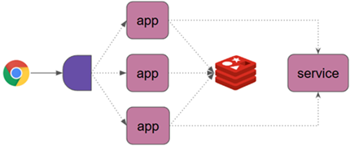
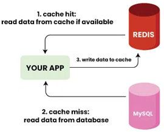

# Sección 05: Spring WebFlux Caching

---

## Introducción

En esta sección aprenderemos a integrar `Spring WebFlux` con `Redis` para implementar mecanismos de `caché` de manera
reactiva. Antes de entrar al código, analizaremos el `caso de uso principal` que resolveremos mediante caching.

## Caso de uso 1: Caching

El uso de caché con Redis puede aportar beneficios significativos al rendimiento de una aplicación reactiva. Entre los
motivos más comunes para aplicar caching, destacan los siguientes:

- `Reducir la carga en la base de datos`. Evita ejecutar múltiples veces la misma consulta, al almacenar temporalmente
  los resultados.


- `Disminuir el número de llamadas de red`. Las respuestas de servicios externos (como APIs REST) pueden almacenarse
  para reducir latencia y dependencia.


- `Evitar la repetición de tareas costosas`. Resultados de operaciones complejas (como cálculos o agregaciones
  intensivas) pueden ser almacenados para su reutilización.


- `Mejorar el rendimiento general`. Al servir respuestas desde memoria en lugar de fuentes lentas como una base de
  datos, se incrementa la velocidad de respuesta.


- `Optimizar la experiencia del usuario`. Menor tiempo de espera y mayor fluidez en la interacción con la aplicación.

## Proyecto: `redis-spring` - Dependencias iniciales

````xml
<!--Spring Boot 3.5.4-->
<!--Java 21-->
<dependencies>
    <dependency>
        <groupId>org.springframework.boot</groupId>
        <artifactId>spring-boot-starter-data-redis-reactive</artifactId>
    </dependency>
    <dependency>
        <groupId>org.springframework.boot</groupId>
        <artifactId>spring-boot-starter-webflux</artifactId>
    </dependency>

    <dependency>
        <groupId>org.projectlombok</groupId>
        <artifactId>lombok</artifactId>
        <optional>true</optional>
    </dependency>
    <dependency>
        <groupId>org.springframework.boot</groupId>
        <artifactId>spring-boot-starter-test</artifactId>
        <scope>test</scope>
    </dependency>
    <dependency>
        <groupId>io.projectreactor</groupId>
        <artifactId>reactor-test</artifactId>
        <scope>test</scope>
    </dependency>
</dependencies>
````

## ¿Qué son Spring Data Redis y Redisson?

### Spring Data Redis

`Spring Data Redis` es un módulo del ecosistema `Spring Data` que permite interactuar fácilmente con `Redis` desde
aplicaciones Spring Boot, tanto en modo `imperativo` como `reactivo`.

Este módulo no es un cliente en sí mismo, sino una abstracción que se apoya en clientes Redis de bajo nivel como:

- `Lettuce` (por defecto desde `Spring Boot 2.x`): Cliente no bloqueante y compatible con programación reactiva
  (basado en Netty).
- `Jedis`: Cliente más antiguo, basado en IO bloqueante.

Características principales:

- Integración nativa con Spring Boot (auto-configuración, plantillas, soporte de repositorios, etc.)
- Soporte para operaciones simples de clave-valor, estructuras de datos (hashes, sets, listas, etc.)
- Soporte reactivo mediante clases como `ReactiveRedisTemplate`
- Utiliza las mismas convenciones del ecosistema `Spring` (inyección de dependencias, `@EnableRedisRepositories`, etc.)

🔸 Ideal para tareas sencillas de cacheo, contadores, sesiones, y almacenamiento básico.

### Redisson

`Redisson` es un cliente Java para `Redis` completamente independiente, que implementa muchas estructuras y mecanismos
distribuidos avanzados sobre `Redis`.

A diferencia de `Spring Data Redis`, `Redisson` no necesita `Spring` para funcionar, aunque se integra bien con él.

Características destacadas:

- Compatible con modo síncrono, asíncrono, reactivo y corutinas (Kotlin)
- Amplio soporte para estructuras de datos distribuidas:
    - `RMap`, `RList`, `RSet`, `RQueue`, `RLock`, `RSemaphore`, `RTopic`, `RRateLimiter`, etc.
- Implementación propia sobre Redis, muy optimizada para concurrencia
- Soporte para operaciones atómicas, transaccionales y locks distribuidos

🔸 Ideal para aplicaciones distribuidas o de alta concurrencia, donde se requiere más que simples operaciones
CRUD sobre Redis.

## Prueba con Spring Data Redis (Reactivo)

````java

@Slf4j
@SpringBootTest
class RedisSpringApplicationTests {

    @Autowired
    private ReactiveStringRedisTemplate template;

    @RepeatedTest(3)
    void springDataRedisTest(RepetitionInfo info) {
        ReactiveValueOperations<String, String> valueOperations = this.template.opsForValue();

        //¿Cuánto tiempo se tarja en ejecutar este bloque?
        long before = System.currentTimeMillis();

        Mono<Void> mono = Flux.range(1, 500_000)
                .flatMap(i -> valueOperations.increment("user:1:visit"))
                .then();
        StepVerifier.create(mono)
                .verifyComplete();

        long after = System.currentTimeMillis();
        log.info("Repetition: {}/{} - Total time: {}ms", info.getCurrentRepetition(), info.getTotalRepetitions(), (after - before));
    }
}
````

**Dónde**

- Inyectamos un bean de tipo `ReactiveStringRedisTemplate`, una clase proporcionada por `Spring Data Redis` que nos
  permite realizar operaciones reactivas sobre Redis con claves y valores tipo String.
- Esta plantilla se basa en `Lettuce` como cliente por debajo y en el modelo `Reactor` para programación no bloqueante.
- `RepetitionInfo` es un `parámetro que se inyecta automáticamente` por `JUnit 5` cuando se usa la anotación
  `@RepeatedTest`. Este objeto proporciona información sobre la iteración actual de la prueba que se está repitiendo.
- A través del método `opsForValue()` obtenemos un componente que permite realizar operaciones específicas sobre
  `valores simples (tipo String)` en Redis.
- Este componente reactivo (`ReactiveValueOperations`) expone métodos como `get()`, `set()`, `increment()`, etc.
- Generamos un `Flux` de 500,000 elementos (del 1 al 500,000).
- Por cada elemento, se ejecuta una operación `increment()` sobre la clave `user:1:visit`.
    - Redis incrementará el valor almacenado (inicialmente nulo o 0).
- El método `.then()` transforma el `Flux` en un `Mono<Void>`, indicando que solo nos interesa saber cuándo la ejecución
  haya finalizado.

> 🔍 `Nota`: Utilizamos `@RepeatedTest(3)` para ejecutar la prueba tres veces consecutivas. En general,
> la `primera ejecución suele ser más lenta` debido a la inicialización del contexto o calentamiento de JIT. Las
> siguientes repeticiones nos dan una medición más representativa del rendimiento sostenido.

Observemos la consola del ide el siguiente resultado.

````bash
2025-07-28T12:52:22.207-05:00  INFO 18504 --- [redis-spring] [           main] d.m.r.RedisSpringApplicationTests        : Repetition: 1/3 - Total time: 24748ms
2025-07-28T12:52:44.938-05:00  INFO 18504 --- [redis-spring] [           main] d.m.r.RedisSpringApplicationTests        : Repetition: 2/3 - Total time: 22709ms
2025-07-28T12:53:07.188-05:00  INFO 18504 --- [redis-spring] [           main] d.m.r.RedisSpringApplicationTests        : Repetition: 3/3 - Total time: 22244ms
````

> 📝 `Nota`: Esta prueba se ejecutó con la dependencia `spring-boot-starter-data-redis-reactive`, por lo tanto
> `ReactiveStringRedisTemplate` usó internamente el cliente `Lettuce`. Más adelante, al cambiar la configuración
> para usar `Redisson`, este comportamiento se modificará automáticamente.

## Modifica dependencias para trabajar con Redisson

Para evaluar el rendimiento de `Redisson` en lugar de `Spring Data Redis`, realizamos algunos cambios en las
dependencias y ejecutamos pruebas equivalentes.

Primero, reemplazamos la dependencia de `spring-boot-starter-data-redis-reactive` por `redisson-spring-boot-starter`.

````xml

<dependencies>
    <!--
      No es necesario incluir 'spring-boot-starter-data-redis-reactive',
      ya que 'redisson-spring-boot-starter' provee 'spring-boot-starter-data-redis' (modo bloqueante)
      y 'spring-boot-starter-webflux' habilita el entorno reactivo.
  
      Spring Boot detectará automáticamente 'RedissonConnectionFactory' como la implementación
      de 'ReactiveRedisConnectionFactory', permitiendo el uso de ReactiveStringRedisTemplate
      sin necesidad del cliente Lettuce.
  -->
    <!--
      <dependency>
          <groupId>org.springframework.boot</groupId>
          <artifactId>spring-boot-starter-data-redis-reactive</artifactId>
      </dependency>
    -->

    <!-- Dependencia activa: Redisson Starter -->
    <dependency>
        <groupId>org.redisson</groupId>
        <artifactId>redisson-spring-boot-starter</artifactId>
        <version>3.50.0</version>
        <exclusions>
            <!-- Excluimos dependencias innecesarias para evitar conflictos -->
            <exclusion>
                <groupId>org.springframework.boot</groupId>
                <artifactId>spring-boot-starter-web</artifactId>
            </exclusion>
            <exclusion>
                <groupId>org.springframework.boot</groupId>
                <artifactId>spring-boot-starter-aop</artifactId>
            </exclusion>
        </exclusions>
    </dependency>
</dependencies>
````

En este proyecto, no es necesario incluir la dependencia `spring-boot-starter-data-redis-reactive`, ya que:

- `redisson-spring-boot-starter` incluye `spring-boot-starter-data-redis` (modo bloqueante).
- `spring-boot-starter-webflux` habilita el entorno reactivo.
- `Spring Boot` detecta automáticamente la clase `RedissonConnectionFactory` (proporcionada por `Redisson`) y la
  utiliza como implementación de `ReactiveRedisConnectionFactory`.

Esto permite que `ReactiveStringRedisTemplate` funcione correctamente sin necesidad de `Lettuce` ni de la dependencia
`spring-boot-starter-data-redis-reactive`.

✅ Esto ha sido verificado personalmente en un test que imprime el tipo de conexión, arrojando:

````bash
Connection Factory class: org.redisson.spring.data.connection.RedissonConnectionFactory 
````

Por lo tanto, si volvemos a ejecutar el código anterior, lo cual recordamos a continuación:

````java

@Slf4j
@SpringBootTest
class RedisSpringApplicationTests {

    @Autowired
    private ReactiveStringRedisTemplate template;

    @RepeatedTest(3)
    void springDataRedisTest(RepetitionInfo info) {
        ReactiveValueOperations<String, String> valueOperations = this.template.opsForValue();

        //¿Cuánto tiempo se tarja en ejecutar este bloque?
        long before = System.currentTimeMillis();

        Mono<Void> mono = Flux.range(1, 500_000)
                .flatMap(i -> valueOperations.increment("user:1:visit"))
                .then();
        StepVerifier.create(mono)
                .verifyComplete();

        long after = System.currentTimeMillis();
        log.info("Repetition: {}/{} - Total time: {}ms", info.getCurrentRepetition(), info.getTotalRepetitions(), (after - before));
    }
}
````

Obtendremos el siguiente resultado en consola. Sin embargo, debemos notar que ya no estamos trabajando con
`Lettuce` (el cliente por defecto en `spring-boot-starter-data-redis-reactive`), sino con la implementación
proporcionada por `Redisson`:

````bash
2025-07-28T13:14:33.851-05:00  INFO 7848 --- [redis-spring] [           main] d.m.r.RedisSpringApplicationTests        : Repetition: 1/3 - Total time: 25380ms
2025-07-28T13:14:56.774-05:00  INFO 7848 --- [redis-spring] [           main] d.m.r.RedisSpringApplicationTests        : Repetition: 2/3 - Total time: 22897ms
2025-07-28T13:15:18.841-05:00  INFO 7848 --- [redis-spring] [           main] d.m.r.RedisSpringApplicationTests        : Repetition: 3/3 - Total time: 22060ms 
````

> 📝 `Nota importante`: Aunque el código de prueba no ha cambiado, el cliente subyacente sí lo ha hecho. Al eliminar
> la dependencia `spring-boot-starter-data-redis-reactive` y utilizar en su lugar `redisson-spring-boot-starter`,
> el bean `ReactiveStringRedisTemplate` ya no utiliza `Lettuce` (como era por defecto), sino que es respaldado por
> `RedissonConnectionFactory`.
>
> Este cambio ocurre automáticamente gracias a la autoconfiguración de `Spring Boot`, que detecta la nueva
> `ConnectionFactory` proporcionada por `Redisson` y la aplica a todos los componentes dependientes, incluyendo
> `ReactiveStringRedisTemplate`.

✅ Este resultado servirá como punto de comparación frente al uso de la API `RedissonReactiveClient`, que veremos a
continuación. Aunque ambos enfoques utilizan internamente `Redisson` como cliente, aquí estamos contrastando el
rendimiento entre dos formas distintas de interactuar con `Redis` de forma reactiva.

## Prueba con Redisson (Reactivo)

Creamos un nuevo test utilizando el cliente reactivo de Redisson `RedissonReactiveClient`.

````java

@Slf4j
@SpringBootTest
class RedisSpringApplicationTests {

    @Autowired
    private RedissonReactiveClient client;

    @RepeatedTest(3)
    void redissonTest(RepetitionInfo info) {
        RAtomicLongReactive atomicLong = this.client.getAtomicLong("user:2:visit");

        //¿Cuánto tiempo se tarja en ejecutar este bloque?
        long before = System.currentTimeMillis();
        Mono<Void> mono = Flux.range(1, 500_000)
                .flatMap(i -> atomicLong.incrementAndGet())
                .then();
        StepVerifier.create(mono)
                .verifyComplete();
        long after = System.currentTimeMillis();
        log.info("Repetition= {}/{} - Total time= {}ms", info.getCurrentRepetition(), info.getTotalRepetitions(), (after - before));
    }
}
````

**Dónde**

- `RedissonReactiveClient`: Es el cliente reactivo proporcionado por `Redisson`, capaz de acceder a múltiples
  estructuras distribuidas.
- `client.getAtomicLong("user:2:visit")`: Devuelve un objeto `RAtomicLongReactive`, que representa un contador de tipo
  long almacenado en Redis.
- `.incrementAndGet()`: Incrementa el valor actual y devuelve el nuevo valor, de forma reactiva.
- Igual que antes, generamos `500,000` operaciones de incremento con `Flux.range(...).flatMap(...)`.

> ☑️ El uso de `StepVerifier` garantiza que el flujo se complete correctamente, y medimos el tiempo total de ejecución
> usando `System.currentTimeMillis()`.

Ejecutamos 3 veces el test y vemos en consola el siguiente resultado

````bash
2025-07-28T13:21:38.355-05:00  INFO 12164 --- [redis-spring] [           main] d.m.r.RedisSpringApplicationTests        : Repetition= 1/3 - Total time= 23836ms
2025-07-28T13:21:58.538-05:00  INFO 12164 --- [redis-spring] [           main] d.m.r.RedisSpringApplicationTests        : Repetition= 2/3 - Total time= 20162ms
2025-07-28T13:22:18.903-05:00  INFO 12164 --- [redis-spring] [           main] d.m.r.RedisSpringApplicationTests        : Repetition= 3/3 - Total time= 20359ms
````

> 📊 Aunque no es una diferencia abismal, la API `RedissonReactiveClient` mostró mejores tiempos promedio en las
> repeticiones 2 y 3, que son las más representativas.
>
> Esto sugiere que, para operaciones masivas como incrementos secuenciales, la API nativa de Redisson puede ofrecer un
> rendimiento ligeramente superior respecto a `ReactiveStringRedisTemplate`, aun cuando ambas comparten el mismo cliente
> subyacente (`Redisson`)

## Conclusión

Con base en las pruebas realizadas:

- La API `ReactiveStringRedisTemplate` (parte de `Spring Data Redis`) presentó tiempos de ejecución ligeramente
  superiores (es decir, más lentos).
    - Esto se mantuvo tanto cuando utilizó `Lettuce` como cliente (al inicio), como cuando pasó a usar `Redisson` como
      backend (tras modificar las dependencias). Es decir, el menor rendimiento está asociado al enfoque de la API, no
      solo al cliente.
- No ofrece integración directa con `ReactiveCrudRepository`, lo que limita su uso como repositorio reactivo
  completo en aplicaciones Spring.
- La API `RedissonReactiveClient` mostró un leve mejor rendimiento en operaciones intensivas como incrementos, y
  además proporciona un conjunto más amplio de estructuras distribuidas y primitivas reactivas (colas, locks, maps,
  etc.).

> 💡 Para aplicaciones reactivas que requieren mayor rendimiento, concurrencia distribuida o estructuras de datos
> avanzadas, `Redisson` representa una alternativa más robusta, flexible y lista para escenarios exigentes.

### ✅ Spring Boot 3.5.4 + Java 21

Con las últimas versiones de Spring y Java:

- `Spring Data Redis` (basado en `Lettuce`) ha mejorado en compatibilidad con `Reactor 3.6+`, y también tiene mejor
  gestión de conexiones.
- Sin embargo, `Redisson` aún es preferido cuando se requieren:
    - Operaciones distribuidas (locks, semáforos, etc.)
    - Estructuras de datos complejas (listas, colas, mapas multivalorados, etc.)
    - Un rendimiento más predecible bajo carga intensiva

Por tanto, si bien `Spring Data Redis` es suficiente para tareas simples (como caching, sesiones, contadores),
`Redisson` sigue siendo una opción más potente y escalable para escenarios más exigentes.

## Cache Aside Pattern

El `patrón Cache Aside` (también conocido como `Lazy Loading`) es uno de los patrones más comunes para implementar
almacenamiento en caché con `Redis`. Su propósito es claro:
`reducir la carga sobre las bases de datos o servicios externos` almacenando los resultados de operaciones costosas
para su reutilización posterior.

### 🧠 ¿Cuándo aplicarlo?

Este patrón es útil principalmente en los siguientes casos:

- Cuando necesitamos cachear respuestas generadas dinámicamente.
- Para reducir la carga sobre bases de datos en operaciones de lectura frecuente.
- Para disminuir llamadas a APIs externas o servicios de terceros.

### 🤔 ¿Por qué no usar solo caché en memoria dentro de cada instancia?

Porque esto genera múltiples problemas en arquitecturas distribuidas:

- `Desperdicio de memoria`: cada instancia de la aplicación mantiene su propia copia en caché, lo que es ineficiente.
- `Falta de sincronización`: las instancias no comparten el estado de la caché, por lo que pueden tener versiones
  inconsistentes de los datos.

### 🚀 ¿Cómo Redis nos ayuda?

La idea es simple: permitir que una instancia haga el trabajo pesado, y que todas las demás lo reutilicen. Veamos cómo
funciona con un ejemplo:

1. Un usuario realiza una solicitud a la aplicación.
2. El `Load Balancer` redirige la petición a una instancia disponible.
3. Esa instancia procesa la solicitud, consultando una base de datos o un servicio externo.
4. Antes de retornar la respuesta, guarda el resultado en Redis con una clave.
5. Las próximas solicitudes que lleguen a cualquier instancia pueden consultar directamente `Redis` usando esa clave,
   evitando repetir el trabajo.



> 📌 `Redis` actúa como una caché compartida entre todas las instancias.

### 🧭 Flujo del patrón Cache Aside

Este flujo ilustra los pasos típicos del patrón:

1. Consultar primero `Redis` con la clave correspondiente.
2. Si no se encuentra (cache miss):
    - Consultar la fuente de datos original (base de datos, API, cálculo, etc.).
3. Guardar el resultado en `Redis` para futuras peticiones.
4. Retornar la respuesta al cliente.



Este enfoque permite que `Redis` actúe como un almacenamiento de lectura rápida y compartida, eliminando la necesidad
de duplicar lógica o almacenamiento entre múltiples instancias de la aplicación.

## Fibonacci Service

Como punto de partida, creamos un servicio muy sencillo que calcula el valor de la secuencia de `Fibonacci` para un
índice dado. Este ejemplo será la base para aplicar luego un `patrón de caché con Redis`.


### Lógica del servicio

````java

@Slf4j
@Service
public class FibService {
    public int getFib(int index) {
        log.info("Calculando fib para índice: {}", index);
        int fib = this.fib(index);
        log.info("Cálculo obtenido: {}", fib);
        return fib;
    }

    // Intencional 2^N, usamos recursividad intencionalmente,
    // este es el peor algoritmo, lo hacemos para que se tarde en calcular
    private int fib(int index) {
        if (index < 2) return index;
        return fib(index - 1) + fib(index - 2);
    }
}
````

- Usamos un algoritmo recursivo puro, sin optimizaciones.
- Este algoritmo tiene complejidad exponencial `(O(2^n))`, lo cual provoca un alto costo computacional, especialmente
  en índices altos.
- Lo hacemos intencionalmente para simular una operación costosa, que se pueda beneficiar del uso de `cache`.

### Exponiendo el servicio por API REST

````java

@RequiredArgsConstructor
@RestController
@RequestMapping(path = "/api/v1/fib")
public class FibController {

    private final FibService fibService;

    @GetMapping(path = "/{index}")
    public Mono<ResponseEntity<Integer>> getFib(@PathVariable int index) {
        return Mono.fromSupplier(() -> ResponseEntity.ok(this.fibService.getFib(index)));
    }

}
````

- El endpoint `/api/v1/fib/{index}` permite calcular el `n-ésimo` número de `Fibonacci`.
- Retorna una respuesta `200 OK` con el resultado.
- El uso de `Mono.fromSupplier(...)` garantiza que el cálculo se ejecute de forma perezosa y no bloqueante, aunque el
  algoritmo en sí no es reactivo internamente (usa recursividad tradicional).

### 🧪 Prueba 1: Índice pequeño

Realizamos una prueba de cálculo con un índice moderado `(6)`, el cual debería responder en tiempo aceptable:

````bash
$ curl -v http://localhost:8080/api/v1/fib/6 | jq
>
< HTTP/1.1 200 OK
< Content-Type: application/json
< Content-Length: 1
<
8
````

Log en consola:

````bash
INFO 18588 --- [redis-spring] [ctor-http-nio-3] d.m.redis.app.fib.service.FibService     : Calculando fib para índice: 6
INFO 18588 --- [redis-spring] [ctor-http-nio-3] d.m.redis.app.fib.service.FibService     : Cálculo obtenido: 8
````

### 🧪 Prueba 2: Índice elevado

Al solicitar el valor para `index=48`, el sistema tarda varios segundos en responder debido a la complejidad del
algoritmo:

````bash
$ curl -v http://localhost:8080/api/v1/fib/48 | jq
>
< HTTP/1.1 200 OK
< Content-Type: application/json
< Content-Length: 9
<
--:--:--  0:00:17 --:--:--
512559680
````

Log en consola:

````bash
INFO 18588 --- [redis-spring] [ctor-http-nio-5] d.m.redis.app.fib.service.FibService     : Calculando fib para índice: 48
INFO 18588 --- [redis-spring] [ctor-http-nio-5] d.m.redis.app.fib.service.FibService     : Cálculo obtenido: 512559680
````

Tiempo de respuesta aproximado: `17 segundos`.

🧠 Observación
> Este escenario simula una operación costosa que se repite innecesariamente si múltiples usuarios solicitan el mismo
> índice. Justamente aquí es donde aplicaremos un patrón de cacheo para evitar cálculos redundantes, mejorar la
> eficiencia y reducir la carga del sistema.

## Uso de `@Cacheable` – Parte 1

Para mejorar el rendimiento de operaciones costosas (como cálculos intensivos o consultas externas), podemos aprovechar
el `sistema de cacheo automático` que proporciona `Spring` usando `Redis como backend`. En este ejemplo, cachearemos
los resultados de la función de Fibonacci.

### 🛠 Configuración de Spring Boot con Cache y Redisson

Primero, activamos el mecanismo de cacheo en la aplicación usando la anotación `@EnableCaching` en la clase principal:

````java

@EnableCaching
@SpringBootApplication
public class RedisSpringApplication {
    public static void main(String[] args) {
        SpringApplication.run(RedisSpringApplication.class, args);
    }
}
````

- `@EnableCaching`: Habilita la infraestructura de cacheo en Spring. Esto permite utilizar anotaciones como
  `@Cacheable`, `@CachePut`, y `@CacheEvict`.
- Esta configuración es compatible con múltiples proveedores de caché, pero en este caso usaremos `Redis` a través de
  `Redisson`.

Luego, definimos un `CacheManager` basado en `Redisson`:

````java

@Configuration
public class RedissonCacheConfig {
    @Bean
    public CacheManager cacheManager(RedissonClient redissonClient) {
        return new RedissonSpringCacheManager(redissonClient);
    }
}
````

- `RedissonSpringCacheManager`: Implementa la interfaz `org.springframework.cache.CacheManager` usando `Redisson`.
  Gestiona las operaciones de cacheo sobre `Redis`.
- Este bean se integrará automáticamente con Spring al detectar `@Cacheable`, y almacenará los datos en `Redis`.

Finalmente, anotamos el método costoso que queremos cachear con `@Cacheable`:

````java

@Slf4j
@Service
public class FibService {

    @Cacheable(cacheNames = "math:fib")
    public int getFib(int index) {
        log.info("Calculando fib para índice: {}", index);
        int fib = this.fib(index);
        log.info("Cálculo obtenido: {}", fib);
        return fib;
    }

    // Intencionalmente lento (complejidad O(2^N))
    private int fib(int index) {
        if (index < 2) return index;
        return fib(index - 1) + fib(index - 2);
    }
}
````

- `@Cacheable(cacheNames = "math:fib")`: Indica que el resultado del método `getFib(index)` debe almacenarse en una
  caché llamada `math:fib`.
    - Si se invoca el método nuevamente con el mismo argumento `index`, Spring retornará el valor desde `Redis` sin
      ejecutar el método.
- El valor se almacena como un `Hash` en `Redis` bajo la clave `math:fib` y con el `index` como subclave interna.

### 🚀 Pruebas de comportamiento con @Cacheable

En el apartado anterior incorporamos anotaciones de `Spring` para implementar el `patrón Cache Aside` de forma
`declarativa`, y así evitar recalcular resultados costosos como el de la serie de Fibonacci.

> 📌 En este apartado observaremos cómo Spring `almacena automáticamente en Redis` los resultados retornados por el
> servicio, acelerando drásticamente las respuestas subsecuentes.

### Primera solicitud

Realizamos una primera solicitud al endpoint `/api/v1/fib/48`, que calcula el valor de Fibonacci para el índice `48`.

````bash
$ curl -v http://localhost:8080/api/v1/fib/48 | jq
>
< HTTP/1.1 200 OK
< Content-Type: application/json
< Content-Length: 9
<
--:--:--  0:00:17 --:--:--
512559680
````

- La respuesta tarda aproximadamente `17 segundos`, lo cual es esperado debido a la implementación recursiva
  ineficiente (complejidad exponencial `O(2^n)`).
- En la consola del IDE podemos ver los logs generados por el método del servicio:

````bash
d.m.redis.app.fib.service.FibService     : Calculando fib para índice: 48
d.m.redis.app.fib.service.FibService     : Cálculo obtenido: 512559680
````

🧠 Importante: Aquí se ejecuta todo el cálculo real, ya que no hay ningún valor almacenado aún en caché.

### Segunda solicitud

Inmediatamente después, repetimos la misma solicitud:

````bash
$ curl -v http://localhost:8080/api/v1/fib/48 | jq
>
< HTTP/1.1 200 OK
< Content-Type: application/json
< Content-Length: 9
<
--:--:-- --:--:-- --:--:--
512559680
````

- La respuesta ahora es `instantánea`.
- En la consola del IDE no se imprimen los logs de cálculo, lo que indica que el método `getFib(...)` no fue ejecutado.

✅ Spring interceptó la llamada y retornó directamente el valor desde la caché, evitando el cómputo.

### Inspección en Redis CLI

Luego de estar realizando varias solicitudes al endpoint, vamos a consultar mediante la consola de redis los valores
almacenados. En ese sentido, el resultado que observamos a continuación nos hace confirmar que las respuestas han
sido almacenadas automáticamente en `Redis` bajo una clave:

````bash
127.0.0.1:6379> keys *
(empty array)
127.0.0.1:6379> keys *
127.0.0.1:6379> keys *
1) "math:fib"
127.0.0.1:6379> type math:fib
hash
127.0.0.1:6379> hgetall math:fib
1) "\x02\n"
2) "\x02\n"
3) "\x02Z"
4) "\x02\x84\xfe\xa9\xba\b"
5) "\x02`"
6) "\x02\x80\xa9\xe8\xe8\x03"
127.0.0.1:6379> 
````

> ⚠️ Observación: Los datos se encuentran serializados en formato binario. Spring utiliza por defecto una serialización
> binaria (basada en Java Serialization) para almacenar objetos complejos.

Más adelante aprenderemos cómo personalizar esta serialización para hacerla más legible o interoperable (por ejemplo,
usando JSON).

## Uso de `@Cacheable` – Parte 2

Vamos a modificar nuestro método de cálculo de Fibonacci para que reciba un parámetro adicional. Este nuevo parámetro
no afectará el resultado del cálculo, pero nos servirá para explorar cómo funciona la `caché con múltiples argumentos`.

````java

@Slf4j
@Service
public class FibService {

    @Cacheable(cacheNames = "math:fib", key = "#index")
    public int getFib(int index, String name) {
        log.info("Calculando fib para índice: {} , nombre: {}", index, name);
        int fib = this.fib(index);
        log.info("Cálculo obtenido: {}", fib);
        return fib;
    }

    private int fib(int index) { /*code*/ }
}
````

En el controlador también actualizamos el endpoint para aceptar ambos parámetros:

````java

@GetMapping(path = "/{index}/{name}")
public Mono<ResponseEntity<Integer>> getFib(@PathVariable int index, @PathVariable String name) {
    return Mono.fromSupplier(() -> ResponseEntity.ok(this.fibService.getFib(index, name)));
}
````

### 🧪 Primera prueba: nueva combinación de argumentos

Realizamos una primera solicitud con el índice `48` y el nombre `sam`:

````bash
$ curl -v http://localhost:8080/api/v1/fib/48/sam | jq
>
< HTTP/1.1 200 OK
< Content-Type: application/json
< Content-Length: 9
<
--:--:--  0:00:17 --:--:--
512559680
````

En los logs vemos claramente que el método fue ejecutado:

````bash
d.m.redis.app.fib.service.FibService     : Calculando fib para índice: 48 , nombre: sam
d.m.redis.app.fib.service.FibService     : Cálculo obtenido: 512559680 
````

### 🧪 Segunda prueba: solo cambia el nombre

Ahora repetimos la solicitud, pero cambiamos únicamente el nombre:

````bash
$ curl -v http://localhost:8080/api/v1/fib/48/jake | jq
>
< HTTP/1.1 200 OK
< Content-Type: application/json
< Content-Length: 9
<
--:--:--  0:00:19 --:--:--
512559680
````

También en este caso el método fue ejecutado nuevamente:

````bash
d.m.redis.app.fib.service.FibService     : Calculando fib para índice: 48 , nombre: jake
d.m.redis.app.fib.service.FibService     : Cálculo obtenido: 512559680
````

### 🤔 ¿Por qué se ejecuta otra vez?

El método `getFib(...)` ahora tiene dos parámetros:

````java

@Cacheable(cacheNames = "math:fib")
public int getFib(int index, String name) {/*code*/}
````

Como `no se especificó explícitamente una clave de caché`, Spring utilizará por defecto todos los parámetros del método
para generar una clave compuesta. Por lo tanto, aunque el índice sea el mismo (`48`), el parámetro `name` es distinto
en cada solicitud, lo que genera `claves diferentes` y fuerza el recálculo.

### ✅ Prueba de que se almacena por combinación exacta

Si repetimos la solicitud con los mismos parámetros que ya fueron ejecutados (por ejemplo, `index = 48` y
`name = "jake"`), esta vez el resultado se recupera desde `Redis` al instante:

````bash
$ curl -v http://localhost:8080/api/v1/fib/48/jake | jq
>
< HTTP/1.1 200 OK
< Content-Type: application/json
< Content-Length: 9
<
--:--:-- --:--:-- --:--:--
512559680 
````

Y los logs del método no aparecen, lo cual confirma que no se volvió a ejecutar, sino que el valor fue obtenido desde
la caché.

### 🧾 Conclusión

El `cacheName` (`math:fib`) define la región donde se almacenan las entradas en Redis, pero la clave específica
generada depende de los parámetros del método.

- Si usamos varios parámetros, Spring los considera todos al generar la clave.
- Por eso, aunque el resultado del cálculo sea el mismo, la caché no lo reutiliza si los argumentos difieren.
- En este punto, podemos optimizar el comportamiento indicando explícitamente cuál parámetro usar como clave (por
  ejemplo, `@Cacheable(..., key = "#index"))`, lo cual veremos a continuación.

### 🎯 Mejorando el comportamiento del cacheo con `key = "#index"`

Anteriormente, observamos que al agregar un segundo parámetro (`name`) al método `getFib(...)`, `Spring` consideraba
toda la combinación de argumentos para generar la key del caché. Esto implicaba que, aunque el valor de index fuera
el mismo, un cambio en el nombre causaba que el método se volviera a ejecutar y recalculara el resultado.

Sin embargo, en nuestro escenario, `el parámetro name no influye en el resultado del cálculo`, por lo que podemos
optimizar el comportamiento de la caché indicándole a Spring que `solo utilice index como clave de cacheo`. Para ello,
usamos el atributo `key` dentro de la anotación `@Cacheable`:

````java

@Cacheable(cacheNames = "math:fib", key = "#index")
public int getFib(int index, String name) {
    log.info("Calculando fib para índice: {} , nombre: {}", index, name);
    int fib = this.fib(index);
    log.info("Cálculo obtenido: {}", fib);
    return fib;
}
````

### 🧪 Comprobación práctica

1. `Limpiar el contenido de Redis`. Antes de probar la mejora, vaciamos el caché ejecutando el siguiente comando desde
   Redis CLI:
    ````bash
    $ flushdb
    ````
2. `Primera solicitud – se ejecuta el cálculo`. Al invocar por primera vez el endpoint con `index=48` y `name=sam`,
   `Redis` no tiene la key almacenada, por lo tanto, el método se ejecuta y tarda los esperados 18 segundos:
    ````bash
    $ curl -v http://localhost:8080/api/v1/fib/48/sam | jq
    >
    < HTTP/1.1 200 OK
    < Content-Type: application/json
    < Content-Length: 9
    <
    --:--:--  0:00:18 --:--:--
    512559680
    ````
   Log del cálculo en consola:
    ````bash
    d.m.redis.app.fib.service.FibService     : Calculando fib para índice: 48 , nombre: sam
    d.m.redis.app.fib.service.FibService     : Cálculo obtenido: 512559680
    ````
3. `Segunda solicitud – cache hit`. Si volvemos a invocar el endpoint, pero ahora cambiamos solo el nombre (`index=48`,
   `name=jake`), el resultado será retornado inmediatamente desde Redis. El método `no se ejecuta nuevamente`,
   demostrando que la clave generada depende únicamente de index:
    ````bash
    $ curl -v http://localhost:8080/api/v1/fib/48/jake | jq
    --:--:-- --:--:-- --:--:--
    512559680
    ````

> ✅ Gracias al uso de `key = "#index"`, conseguimos que Spring reutilice el valor almacenado para cualquier invocación
> cuyo índice sea el mismo, sin importar los demás parámetros. Esto reduce cálculos innecesarios y mejora
> significativamente el rendimiento.

## 🧹Uso de `@CacheEvict` para limpiar caché

En este apartado, aprenderemos a eliminar entradas específicas de Redis utilizando la anotación `@CacheEvict`,
lo cual es especialmente útil cuando los datos almacenados en caché deben invalidarse o actualizarse.

> 📌 Como primer paso, eliminaremos el parámetro `name` del método `getFib(...)`, ya que fue introducido únicamente con
> fines demostrativos en el apartado anterior.

1. Modificación del servicio

Agregamos un nuevo método `clearCache(...)` anotado con `@CacheEvict`. Este método nos permite eliminar una clave
específica del hash `math:fib` en Redis, utilizando el mismo criterio de `key` que usamos para almacenar
(`key = "#index"`).

````java

@Slf4j
@Service
public class FibService {

    @Cacheable(cacheNames = "math:fib", key = "#index")
    public int getFib(int index) {
        log.info("Calculando fib para índice: {}", index);
        int fib = this.fib(index);
        log.info("Cálculo obtenido: {}", fib);
        return fib;
    }

    @CacheEvict(cacheNames = "math:fib", key = "#index")
    public void clearCache(int index) {
        log.info("Limpiando hash key");

    }

    private int fib(int index) {/*code*/}
}
````

2. Actualización del controlador

Exponemos un nuevo endpoint para acceder al método `clearCache(...)`. Este endpoint permitirá eliminar una entrada
específica del cache vía HTTP GET.

````java

@RequiredArgsConstructor
@RestController
@RequestMapping(path = "/api/v1/fib")
public class FibController {

    private final FibService fibService;

    @GetMapping(path = "/{index}")
    public Mono<ResponseEntity<Integer>> getFib(@PathVariable int index) {
        return Mono.fromSupplier(() -> ResponseEntity.ok(this.fibService.getFib(index)));
    }

    @GetMapping(path = "/{index}/clear")
    public Mono<ResponseEntity<Void>> clear(@PathVariable int index) {
        return Mono.fromSupplier(() -> {
            this.fibService.clearCache(index);
            return ResponseEntity.noContent().build();
        });
    }

}
````

### 🧪 Pruebas

1. Limpiamos Redis ejecutando `flushdb`.
2. Ejecutamos una solicitud con `index=48`. Como es la primera vez, el cálculo se realiza normalmente
   (tarda `~17 segundos`).
    ````bash
    $ curl -v http://localhost:8080/api/v1/fib/48 | jq
    >
    < HTTP/1.1 200 OK
    < Content-Type: application/json
    < Content-Length: 9
    <
    --:--:--  0:00:17 --:--:--
    512559680
    ````
   Logs:
    ````bash
    d.m.redis.app.fib.service.FibService     : Calculando fib para índice: 48
    d.m.redis.app.fib.service.FibService     : Cálculo obtenido: 512559680 
    ````

3. Hacemos la misma solicitud por segunda vez. El resultado se devuelve al instante gracias a Redis:
    ````bash
    $ curl -v http://localhost:8080/api/v1/fib/48 | jq
    >
    < HTTP/1.1 200 OK
    < Content-Type: application/json
    < Content-Length: 9
    <
    --:--:-- --:--:-- --:--:--
    512559680
    ````
4. Validamos en Redis que el hash `math:fib` contiene la entrada cacheada:
    ````bash
    127.0.0.1:6379> keys *
    (empty array)
    127.0.0.1:6379> keys *
    1) "math:fib"
    127.0.0.1:6379> hgetall math:fib
    1) "\x02`"
    2) "\x02\x80\xa9\xe8\xe8\x03"
    127.0.0.1:6379> 
    ````

✅ Hasta este punto, se mantiene el comportamiento esperado usando `@Cacheable` para almacenar resultados.

### ✅ Verificación del comportamiento de @CacheEvict

````bash
$ curl -v http://localhost:8080/api/v1/fib/48/clear | jq
>
< HTTP/1.1 204 No Content
````

Vemos que la petición se ejecuta correctamente, incluso el log del método `clearCache(int index)` se ejecuta sin
problemas.

````bash
d.m.redis.app.fib.service.FibService     : Limpiando hash key 
````

Ahora, si consultamos en redis, vemos que ya no tenemos ningún registro almacenado.

````bash
127.0.0.1:6379> keys *
(empty array) 
````

Con esto comprobamos que hemos limpiado el valor del `key = "#index"` asociado al hash `math:fib` correctamente. Ahora,
si volvemos a hacer la petición para calcular el fibonacci con el `index=48`, el método se volverá a ejecutar.

````bash
$ curl -v http://localhost:8080/api/v1/fib/48 | jq
>
< HTTP/1.1 200 OK
< Content-Type: application/json
< Content-Length: 9
<
--:--:--  0:00:17 --:--:--
512559680
````

Como pudimos observar:

- La llamada al endpoint `/api/v1/fib/48/clear` activa el método `clearCache(int index)`, el cual está anotado con
  `@CacheEvict`.
- Esta anotación indica a Spring que debe eliminar la entrada correspondiente al `índice 48` dentro del `hash`
  `math:fib` almacenado en Redis.
- La respuesta 204 No Content confirma que la operación se realizó exitosamente.
- Al verificar en Redis CLI, vemos que la key `math:fib` ha sido eliminada del almacenamiento.
- Como consecuencia, la siguiente vez que se solicita `/fib/48`, el sistema no encuentra el valor en caché, por lo que
  vuelve a ejecutar el cálculo completo de Fibonacci.

> 🧠 `Conclusión`: La anotación `@CacheEvict` nos permite `invalidar de forma puntual` y declarativa
> `entradas específicas de la caché`, lo que es especialmente útil cuando los datos han cambiado y es necesario
> refrescar el contenido en Redis.

## 🕒 Evicción programada de caché (@Scheduled + @CacheEvict)

En este apartado implementaremos una estrategia automática para limpiar periódicamente la caché de Redis usando las
anotaciones `@Scheduled` y `@CacheEvict`.

El objetivo será eliminar todas las entradas del caché `math:fib` cada cierto intervalo de tiempo (`10 segundos`), sin
necesidad de que un cliente realice una solicitud directa para limpiar manualmente.

````java

@Slf4j
@Service
public class FibService {

    @Cacheable(cacheNames = "math:fib", key = "#index")
    public int getFib(int index) {
        log.info("Calculando fib para índice: {}", index);
        int fib = this.fib(index);
        log.info("Cálculo obtenido: {}", fib);
        return fib;
    }

    @CacheEvict(cacheNames = "math:fib", key = "#index")
    public void clearCache(int index) {
        log.info("Limpiando hash key");

    }

    // Cada 10 segundos que limpie todas las entradas del math:fib
    @Scheduled(fixedRate = 10_000)
    @CacheEvict(cacheNames = "math:fib", allEntries = true)
    public void clearCache() {
        log.info("Limpiando todas las keys del math:fib");

    }

    private int fib(int index) {/*code*/}
}
````

**Dónde**

- `@Cacheable(...)`: Indica que el resultado del método `getFib(...)` se almacenará en el caché con nombre `math:fib`,
  usando como clave el valor de index.
- `@CacheEvict(key = "#index")`: Método para eliminar solo una entrada específica del hash `math:fib`.
- `@Scheduled(fixedRate = 10_000)`: Indica que el método se ejecutará cada 10 segundos, sin importar cuánto tiempo
  demore.
- `@CacheEvict(allEntries = true)`: Borra todas las entradas asociadas al caché `math:fib`.

🔁 La combinación de `@Scheduled` y `@CacheEvict` permite que esta limpieza ocurra automáticamente de forma periódica.

Para que el `@Scheduled` funcione, debes habilitar la programación de tareas en la clase principal:

````java

@EnableCaching
@EnableScheduling
@SpringBootApplication
public class RedisSpringApplication {
    public static void main(String[] args) {
        SpringApplication.run(RedisSpringApplication.class, args);
    }
}
````

- `@EnableCaching`: Activa el soporte de caché en la aplicación Spring (ya lo veníamos usando).
- `@EnableScheduling`: Habilita el procesamiento de tareas programadas como `@Scheduled`.

### 🧪 Ejecución y verificación

Si levantamos la aplicación y observamos la consola, veremos que el método `clearCache()` se ejecuta automáticamente
cada 10 segundos:

````bash
d.m.redis.app.fib.service.FibService     : Limpiando todas las keys del math:fib
d.m.redis.app.fib.service.FibService     : Limpiando todas las keys del math:fib
d.m.redis.app.fib.service.FibService     : Limpiando todas las keys del math:fib
...
````

Además, si consultamos Redis en esos momentos, veremos que la clave `math:fib` es eliminada:

````bash
127.0.0.1:6379> keys *
1) "math:fib"
127.0.0.1:6379> keys *
(empty array)
127.0.0.1:6379> 
````

### ✅ Conclusión

Este enfoque es útil cuando:

- Queremos evitar acumulación innecesaria de datos en caché.
- Los datos almacenados tienen una vida útil corta o son muy dinámicos.
- No necesitamos granularidad en la limpieza (es decir, no nos interesa borrar entradas específicas, sino todo el caché
  asociado).

> 💡 `Tip`: Esta estrategia también puede ser combinada con `TTL (tiempo de vida por entrada)` para tener un control
> más fino del ciclo de vida del caché.
