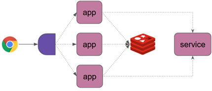
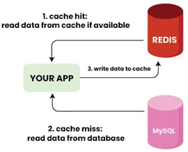
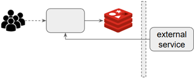
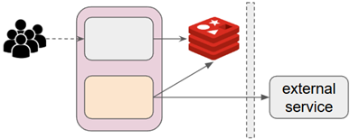

# Sección 05: Spring WebFlux Caching

---

## Introducción

En esta sección aprenderemos a integrar `Spring WebFlux` con `Redis` para implementar mecanismos de `caché` de manera
reactiva. Antes de entrar al código, analizaremos el `caso de uso principal` que resolveremos mediante caching.

## Caso de uso 1: Caching

El uso de caché con Redis puede aportar beneficios significativos al rendimiento de una aplicación reactiva. Entre los
motivos más comunes para aplicar caching, destacan los siguientes:

- `Reducir la carga en la base de datos`. Evita ejecutar múltiples veces la misma consulta, al almacenar temporalmente
  los resultados.


- `Disminuir el número de llamadas de red`. Las respuestas de servicios externos (como APIs REST) pueden almacenarse
  para reducir latencia y dependencia.


- `Evitar la repetición de tareas costosas`. Resultados de operaciones complejas (como cálculos o agregaciones
  intensivas) pueden ser almacenados para su reutilización.


- `Mejorar el rendimiento general`. Al servir respuestas desde memoria en lugar de fuentes lentas como una base de
  datos, se incrementa la velocidad de respuesta.


- `Optimizar la experiencia del usuario`. Menor tiempo de espera y mayor fluidez en la interacción con la aplicación.

## Proyecto: `redis-spring` - Dependencias iniciales

````xml
<!--Spring Boot 3.5.4-->
<!--Java 21-->
<dependencies>
    <dependency>
        <groupId>org.springframework.boot</groupId>
        <artifactId>spring-boot-starter-data-redis-reactive</artifactId>
    </dependency>
    <dependency>
        <groupId>org.springframework.boot</groupId>
        <artifactId>spring-boot-starter-webflux</artifactId>
    </dependency>

    <dependency>
        <groupId>org.projectlombok</groupId>
        <artifactId>lombok</artifactId>
        <optional>true</optional>
    </dependency>
    <dependency>
        <groupId>org.springframework.boot</groupId>
        <artifactId>spring-boot-starter-test</artifactId>
        <scope>test</scope>
    </dependency>
    <dependency>
        <groupId>io.projectreactor</groupId>
        <artifactId>reactor-test</artifactId>
        <scope>test</scope>
    </dependency>
</dependencies>
````

## ¿Qué son Spring Data Redis y Redisson?

### Spring Data Redis

`Spring Data Redis` es un módulo del ecosistema `Spring Data` que permite interactuar fácilmente con `Redis` desde
aplicaciones Spring Boot, tanto en modo `imperativo` como `reactivo`.

Este módulo no es un cliente en sí mismo, sino una abstracción que se apoya en clientes Redis de bajo nivel como:

- `Lettuce` (por defecto desde `Spring Boot 2.x`): Cliente no bloqueante y compatible con programación reactiva (basado
  en Netty).
- `Jedis`: Cliente más antiguo, basado en IO bloqueante.

Características principales:

- Integración nativa con Spring Boot (auto-configuración, plantillas, soporte de repositorios, etc.)
- Soporte para operaciones simples de clave-valor, estructuras de datos (hashes, sets, listas, etc.)
- Soporte reactivo mediante clases como `ReactiveRedisTemplate`
- Utiliza las mismas convenciones del ecosistema `Spring` (inyección de dependencias, `@EnableRedisRepositories`, etc.)

🔸 Ideal para tareas sencillas de cacheo, contadores, sesiones, y almacenamiento básico.

### Redisson

`Redisson` es un cliente Java para `Redis` completamente independiente, que implementa muchas estructuras y mecanismos
distribuidos avanzados sobre `Redis`.

A diferencia de `Spring Data Redis`, `Redisson` no necesita `Spring` para funcionar, aunque se integra bien con él.

Características destacadas:

- Compatible con modo síncrono, asíncrono, reactivo y corutinas (Kotlin)
- Amplio soporte para estructuras de datos distribuidas:
    - `RMap`, `RList`, `RSet`, `RQueue`, `RLock`, `RSemaphore`, `RTopic`, `RRateLimiter`, etc.
- Implementación propia sobre Redis, muy optimizada para concurrencia
- Soporte para operaciones atómicas, transaccionales y locks distribuidos

🔸 Ideal para aplicaciones distribuidas o de alta concurrencia, donde se requiere más que simples operaciones
CRUD sobre Redis.

## Prueba con Spring Data Redis (Reactivo)

````java

@Slf4j
@SpringBootTest
class RedisSpringApplicationTests {

    @Autowired
    private ReactiveStringRedisTemplate template;

    @RepeatedTest(3)
    void springDataRedisTest(RepetitionInfo info) {
        ReactiveValueOperations<String, String> valueOperations = this.template.opsForValue();

        //¿Cuánto tiempo se tarja en ejecutar este bloque?
        long before = System.currentTimeMillis();

        Mono<Void> mono = Flux.range(1, 500_000)
                .flatMap(i -> valueOperations.increment("user:1:visit"))
                .then();
        StepVerifier.create(mono)
                .verifyComplete();

        long after = System.currentTimeMillis();
        log.info("Repetition: {}/{} - Total time: {}ms", info.getCurrentRepetition(), info.getTotalRepetitions(), (after - before));
    }
}
````

**Dónde**

- Inyectamos un bean de tipo `ReactiveStringRedisTemplate`, una clase proporcionada por `Spring Data Redis` que nos
  permite realizar operaciones reactivas sobre Redis con claves y valores tipo String.
- Esta plantilla se basa en `Lettuce` como cliente por debajo y en el modelo `Reactor` para programación no bloqueante.
- `RepetitionInfo` es un `parámetro que se inyecta automáticamente` por `JUnit 5` cuando se usa la anotación
  `@RepeatedTest`. Este objeto proporciona información sobre la iteración actual de la prueba que se está repitiendo.
- A través del método `opsForValue()` obtenemos un componente que permite realizar operaciones específicas sobre
  `valores simples (tipo String)` en Redis.
- Este componente reactivo (`ReactiveValueOperations`) expone métodos como `get()`, `set()`, `increment()`, etc.
- Generamos un `Flux` de 500,000 elementos (del 1 al 500,000).
- Por cada elemento, se ejecuta una operación `increment()` sobre la clave `user:1:visit`.
    - Redis incrementará el valor almacenado (inicialmente nulo o 0).
- El método `.then()` transforma el `Flux` en un `Mono<Void>`, indicando que solo nos interesa saber cuándo la ejecución
  haya finalizado.

> 🔍 `Nota`: Utilizamos `@RepeatedTest(3)` para ejecutar la prueba tres veces consecutivas. En general,
> la `primera ejecución suele ser más lenta` debido a la inicialización del contexto o calentamiento de JIT. Las
> siguientes repeticiones nos dan una medición más representativa del rendimiento sostenido.

Observemos la consola del ide el siguiente resultado.

````bash
2025-07-28T12:52:22.207-05:00  INFO 18504 --- [redis-spring] [           main] d.m.r.RedisSpringApplicationTests        : Repetition: 1/3 - Total time: 24748ms
2025-07-28T12:52:44.938-05:00  INFO 18504 --- [redis-spring] [           main] d.m.r.RedisSpringApplicationTests        : Repetition: 2/3 - Total time: 22709ms
2025-07-28T12:53:07.188-05:00  INFO 18504 --- [redis-spring] [           main] d.m.r.RedisSpringApplicationTests        : Repetition: 3/3 - Total time: 22244ms
````

> 📝 `Nota`: Esta prueba se ejecutó con la dependencia `spring-boot-starter-data-redis-reactive`, por lo tanto
> `ReactiveStringRedisTemplate` usó internamente el cliente `Lettuce`. Más adelante, al cambiar la configuración
> para usar `Redisson`, este comportamiento se modificará automáticamente.

## Modifica dependencias para trabajar con Redisson

Para evaluar el rendimiento de `Redisson` en lugar de `Spring Data Redis`, realizamos algunos cambios en las
dependencias y ejecutamos pruebas equivalentes.

Primero, reemplazamos la dependencia de `spring-boot-starter-data-redis-reactive` por `redisson-spring-boot-starter`.

````xml

<dependencies>
    <!--
      No es necesario incluir 'spring-boot-starter-data-redis-reactive',
      ya que 'redisson-spring-boot-starter' provee 'spring-boot-starter-data-redis' (modo bloqueante)
      y 'spring-boot-starter-webflux' habilita el entorno reactivo.
  
      Spring Boot detectará automáticamente 'RedissonConnectionFactory' como la implementación
      de 'ReactiveRedisConnectionFactory', permitiendo el uso de ReactiveStringRedisTemplate
      sin necesidad del cliente Lettuce.
  -->
    <!--
      <dependency>
          <groupId>org.springframework.boot</groupId>
          <artifactId>spring-boot-starter-data-redis-reactive</artifactId>
      </dependency>
    -->

    <!-- Dependencia activa: Redisson Starter -->
    <dependency>
        <groupId>org.redisson</groupId>
        <artifactId>redisson-spring-boot-starter</artifactId>
        <version>3.50.0</version>
        <exclusions>
            <!-- Excluimos dependencias innecesarias para evitar conflictos -->
            <exclusion>
                <groupId>org.springframework.boot</groupId>
                <artifactId>spring-boot-starter-web</artifactId>
            </exclusion>
            <exclusion>
                <groupId>org.springframework.boot</groupId>
                <artifactId>spring-boot-starter-aop</artifactId>
            </exclusion>
        </exclusions>
    </dependency>
</dependencies>
````

En este proyecto, no es necesario incluir la dependencia `spring-boot-starter-data-redis-reactive`, ya que:

- `redisson-spring-boot-starter` incluye `spring-boot-starter-data-redis` (modo bloqueante).
- `spring-boot-starter-webflux` habilita el entorno reactivo.
- `Spring Boot` detecta automáticamente la clase `RedissonConnectionFactory` (proporcionada por `Redisson`) y la
  utiliza como implementación de `ReactiveRedisConnectionFactory`.

Esto permite que `ReactiveStringRedisTemplate` funcione correctamente sin necesidad de `Lettuce` ni de la dependencia
`spring-boot-starter-data-redis-reactive`.

✅ Esto ha sido verificado personalmente en un test que imprime el tipo de conexión, arrojando:

````bash
Connection Factory class: org.redisson.spring.data.connection.RedissonConnectionFactory 
````

Por lo tanto, si volvemos a ejecutar el código anterior, lo cual recordamos a continuación:

````java

@Slf4j
@SpringBootTest
class RedisSpringApplicationTests {

    @Autowired
    private ReactiveStringRedisTemplate template;

    @RepeatedTest(3)
    void springDataRedisTest(RepetitionInfo info) {
        ReactiveValueOperations<String, String> valueOperations = this.template.opsForValue();

        //¿Cuánto tiempo se tarja en ejecutar este bloque?
        long before = System.currentTimeMillis();

        Mono<Void> mono = Flux.range(1, 500_000)
                .flatMap(i -> valueOperations.increment("user:1:visit"))
                .then();
        StepVerifier.create(mono)
                .verifyComplete();

        long after = System.currentTimeMillis();
        log.info("Repetition: {}/{} - Total time: {}ms", info.getCurrentRepetition(), info.getTotalRepetitions(), (after - before));
    }
}
````

Obtendremos el siguiente resultado en consola. Sin embargo, debemos notar que ya no estamos trabajando con
`Lettuce` (el cliente por defecto en `spring-boot-starter-data-redis-reactive`), sino con la implementación
proporcionada por `Redisson`:

````bash
2025-07-28T13:14:33.851-05:00  INFO 7848 --- [redis-spring] [           main] d.m.r.RedisSpringApplicationTests        : Repetition: 1/3 - Total time: 25380ms
2025-07-28T13:14:56.774-05:00  INFO 7848 --- [redis-spring] [           main] d.m.r.RedisSpringApplicationTests        : Repetition: 2/3 - Total time: 22897ms
2025-07-28T13:15:18.841-05:00  INFO 7848 --- [redis-spring] [           main] d.m.r.RedisSpringApplicationTests        : Repetition: 3/3 - Total time: 22060ms 
````

> 📝 `Nota importante`: Aunque el código de prueba no ha cambiado, el cliente subyacente sí lo ha hecho. Al eliminar
> la dependencia `spring-boot-starter-data-redis-reactive` y utilizar en su lugar `redisson-spring-boot-starter`,
> el bean `ReactiveStringRedisTemplate` ya no utiliza `Lettuce` (como era por defecto), sino que es respaldado por
> `RedissonConnectionFactory`.
>
> Este cambio ocurre automáticamente gracias a la autoconfiguración de `Spring Boot`, que detecta la nueva
> `ConnectionFactory` proporcionada por `Redisson` y la aplica a todos los componentes dependientes, incluyendo
> `ReactiveStringRedisTemplate`.

✅ Este resultado servirá como punto de comparación frente al uso de la API `RedissonReactiveClient`, que veremos a
continuación. Aunque ambos enfoques utilizan internamente `Redisson` como cliente, aquí estamos contrastando el
rendimiento entre dos formas distintas de interactuar con `Redis` de forma reactiva.

## Prueba con Redisson (Reactivo)

Creamos un nuevo test utilizando el cliente reactivo de Redisson `RedissonReactiveClient`.

````java

@Slf4j
@SpringBootTest
class RedisSpringApplicationTests {

    @Autowired
    private RedissonReactiveClient client;

    @RepeatedTest(3)
    void redissonTest(RepetitionInfo info) {
        RAtomicLongReactive atomicLong = this.client.getAtomicLong("user:2:visit");

        //¿Cuánto tiempo se tarja en ejecutar este bloque?
        long before = System.currentTimeMillis();
        Mono<Void> mono = Flux.range(1, 500_000)
                .flatMap(i -> atomicLong.incrementAndGet())
                .then();
        StepVerifier.create(mono)
                .verifyComplete();
        long after = System.currentTimeMillis();
        log.info("Repetition= {}/{} - Total time= {}ms", info.getCurrentRepetition(), info.getTotalRepetitions(), (after - before));
    }
}
````

**Dónde**

- `RedissonReactiveClient`: Es el cliente reactivo proporcionado por `Redisson`, capaz de acceder a múltiples
  estructuras distribuidas.
- `client.getAtomicLong("user:2:visit")`: Devuelve un objeto `RAtomicLongReactive`, que representa un contador de tipo
  long almacenado en Redis.
- `.incrementAndGet()`: Incrementa el valor actual y devuelve el nuevo valor, de forma reactiva.
- Igual que antes, generamos `500,000` operaciones de incremento con `Flux.range(...).flatMap(...)`.

> ☑️ El uso de `StepVerifier` garantiza que el flujo se complete correctamente, y medimos el tiempo total de ejecución
> usando `System.currentTimeMillis()`.

Ejecutamos 3 veces el test y vemos en consola el siguiente resultado

````bash
2025-07-28T13:21:38.355-05:00  INFO 12164 --- [redis-spring] [           main] d.m.r.RedisSpringApplicationTests        : Repetition= 1/3 - Total time= 23836ms
2025-07-28T13:21:58.538-05:00  INFO 12164 --- [redis-spring] [           main] d.m.r.RedisSpringApplicationTests        : Repetition= 2/3 - Total time= 20162ms
2025-07-28T13:22:18.903-05:00  INFO 12164 --- [redis-spring] [           main] d.m.r.RedisSpringApplicationTests        : Repetition= 3/3 - Total time= 20359ms
````

> 📊 Aunque no es una diferencia abismal, la API `RedissonReactiveClient` mostró mejores tiempos promedio en las
> repeticiones 2 y 3, que son las más representativas.
>
> Esto sugiere que, para operaciones masivas como incrementos secuenciales, la API nativa de Redisson puede ofrecer un
> rendimiento ligeramente superior respecto a `ReactiveStringRedisTemplate`, aun cuando ambas comparten el mismo cliente
> subyacente (`Redisson`)

## Conclusión

Con base en las pruebas realizadas:

- La API `ReactiveStringRedisTemplate` (parte de `Spring Data Redis`) presentó tiempos de ejecución ligeramente
  superiores (es decir, más lentos).
    - Esto se mantuvo tanto cuando utilizó `Lettuce` como cliente (al inicio), como cuando pasó a usar `Redisson` como
      backend (tras modificar las dependencias). Es decir, el menor rendimiento está asociado al enfoque de la API, no
      solo al cliente.
- No ofrece integración directa con `ReactiveCrudRepository`, lo que limita su uso como repositorio reactivo
  completo en aplicaciones Spring.
- La API `RedissonReactiveClient` mostró un leve mejor rendimiento en operaciones intensivas como incrementos, y
  además proporciona un conjunto más amplio de estructuras distribuidas y primitivas reactivas (colas, locks, maps,
  etc.).

> 💡 Para aplicaciones reactivas que requieren mayor rendimiento, concurrencia distribuida o estructuras de datos
> avanzadas, `Redisson` representa una alternativa más robusta, flexible y lista para escenarios exigentes.

### ✅ Spring Boot 3.5.4 + Java 21

Con las últimas versiones de Spring y Java:

- `Spring Data Redis` (basado en `Lettuce`) ha mejorado en compatibilidad con `Reactor 3.6+`, y también tiene mejor
  gestión de conexiones.
- Sin embargo, `Redisson` aún es preferido cuando se requieren:
    - Operaciones distribuidas (locks, semáforos, etc.)
    - Estructuras de datos complejas (listas, colas, mapas multivalorados, etc.)
    - Un rendimiento más predecible bajo carga intensiva

Por tanto, si bien `Spring Data Redis` es suficiente para tareas simples (como caching, sesiones, contadores),
`Redisson` sigue siendo una opción más potente y escalable para escenarios más exigentes.

## Cache Aside Pattern

El `patrón Cache Aside` (también conocido como `Lazy Loading`) es uno de los patrones más comunes para implementar
almacenamiento en caché con `Redis`. Su propósito es claro:
`reducir la carga sobre las bases de datos o servicios externos` almacenando los resultados de operaciones costosas
para su reutilización posterior.

### 🧠 ¿Cuándo aplicarlo?

Este patrón es útil principalmente en los siguientes casos:

- Cuando necesitamos cachear respuestas generadas dinámicamente.
- Para reducir la carga sobre bases de datos en operaciones de lectura frecuente.
- Para disminuir llamadas a APIs externas o servicios de terceros.

### 🤔 ¿Por qué no usar solo caché en memoria dentro de cada instancia?

Porque esto genera múltiples problemas en arquitecturas distribuidas:

- `Desperdicio de memoria`: cada instancia de la aplicación mantiene su propia copia en caché, lo que es ineficiente.
- `Falta de sincronización`: las instancias no comparten el estado de la caché, por lo que pueden tener versiones
  inconsistentes de los datos.

### 🚀 ¿Cómo Redis nos ayuda?

La idea es simple: permitir que una instancia haga el trabajo pesado, y que todas las demás lo reutilicen. Veamos cómo
funciona con un ejemplo:

1. Un usuario realiza una solicitud a la aplicación.
2. El `Load Balancer` redirige la petición a una instancia disponible.
3. Esa instancia procesa la solicitud, consultando una base de datos o un servicio externo.
4. Antes de retornar la respuesta, guarda el resultado en Redis con una clave.
5. Las próximas solicitudes que lleguen a cualquier instancia pueden consultar directamente `Redis` usando esa clave,
   evitando repetir el trabajo.



> 📌 `Redis` actúa como una caché compartida entre todas las instancias.

### 🧭 Flujo del patrón Cache Aside

Este flujo ilustra los pasos típicos del patrón:

1. Consultar primero `Redis` con la clave correspondiente.
2. Si no se encuentra (cache miss):
    - Consultar la fuente de datos original (base de datos, API, cálculo, etc.).
3. Guardar el resultado en `Redis` para futuras peticiones.
4. Retornar la respuesta al cliente.



Este enfoque permite que `Redis` actúe como un almacenamiento de lectura rápida y compartida, eliminando la necesidad
de duplicar lógica o almacenamiento entre múltiples instancias de la aplicación.

## Fibonacci Service

Como punto de partida, creamos un servicio muy sencillo que calcula el valor de la secuencia de `Fibonacci` para un
índice dado. Este ejemplo será la base para aplicar luego un `patrón de caché con Redis`.


### Lógica del servicio

````java

@Slf4j
@Service
public class FibService {
    public int getFib(int index) {
        log.info("Calculando fib para índice: {}", index);
        int fib = this.fib(index);
        log.info("Cálculo obtenido: {}", fib);
        return fib;
    }

    // Intencional 2^N, usamos recursividad intencionalmente,
    // este es el peor algoritmo, lo hacemos para que se tarde en calcular
    private int fib(int index) {
        if (index < 2) return index;
        return fib(index - 1) + fib(index - 2);
    }
}
````

- Usamos un algoritmo recursivo puro, sin optimizaciones.
- Este algoritmo tiene complejidad exponencial `(O(2^n))`, lo cual provoca un alto costo computacional, especialmente
  en índices altos.
- Lo hacemos intencionalmente para simular una operación costosa, que se pueda beneficiar del uso de `cache`.

### Exponiendo el servicio por API REST

````java

@RequiredArgsConstructor
@RestController
@RequestMapping(path = "/api/v1/fib")
public class FibController {

    private final FibService fibService;

    @GetMapping(path = "/{index}")
    public Mono<ResponseEntity<Integer>> getFib(@PathVariable int index) {
        return Mono.fromSupplier(() -> ResponseEntity.ok(this.fibService.getFib(index)));
    }

}
````

- El endpoint `/api/v1/fib/{index}` permite calcular el `n-ésimo` número de `Fibonacci`.
- Retorna una respuesta `200 OK` con el resultado.
- El uso de `Mono.fromSupplier(...)` garantiza que el cálculo se ejecute de forma perezosa y no bloqueante, aunque el
  algoritmo en sí no es reactivo internamente (usa recursividad tradicional).

### 🧪 Prueba 1: Índice pequeño

Realizamos una prueba de cálculo con un índice moderado `(6)`, el cual debería responder en tiempo aceptable:

````bash
$ curl -v http://localhost:8080/api/v1/fib/6 | jq
>
< HTTP/1.1 200 OK
< Content-Type: application/json
< Content-Length: 1
<
8
````

Log en consola:

````bash
INFO 18588 --- [redis-spring] [ctor-http-nio-3] d.m.redis.app.fib.service.FibService     : Calculando fib para índice: 6
INFO 18588 --- [redis-spring] [ctor-http-nio-3] d.m.redis.app.fib.service.FibService     : Cálculo obtenido: 8
````

### 🧪 Prueba 2: Índice elevado

Al solicitar el valor para `index=48`, el sistema tarda varios segundos en responder debido a la complejidad del
algoritmo:

````bash
$ curl -v http://localhost:8080/api/v1/fib/48 | jq
>
< HTTP/1.1 200 OK
< Content-Type: application/json
< Content-Length: 9
<
--:--:--  0:00:17 --:--:--
512559680
````

Log en consola:

````bash
INFO 18588 --- [redis-spring] [ctor-http-nio-5] d.m.redis.app.fib.service.FibService     : Calculando fib para índice: 48
INFO 18588 --- [redis-spring] [ctor-http-nio-5] d.m.redis.app.fib.service.FibService     : Cálculo obtenido: 512559680
````

Tiempo de respuesta aproximado: `17 segundos`.

🧠 Observación
> Este escenario simula una operación costosa que se repite innecesariamente si múltiples usuarios solicitan el mismo
> índice. Justamente aquí es donde aplicaremos un patrón de cacheo para evitar cálculos redundantes, mejorar la
> eficiencia y reducir la carga del sistema.

## Uso de `@Cacheable` – Parte 1

Para mejorar el rendimiento de operaciones costosas (como cálculos intensivos o consultas externas), podemos aprovechar
el `sistema de cacheo automático` que proporciona `Spring` usando `Redis como backend`. En este ejemplo, cachearemos
los resultados de la función de Fibonacci.

### 🛠 Configuración de Spring Boot con Cache y Redisson

Primero, activamos el mecanismo de cacheo en la aplicación usando la anotación `@EnableCaching` en la clase principal:

````java

@EnableCaching
@SpringBootApplication
public class RedisSpringApplication {
    public static void main(String[] args) {
        SpringApplication.run(RedisSpringApplication.class, args);
    }
}
````

- `@EnableCaching`: Habilita la infraestructura de cacheo en Spring. Esto permite utilizar anotaciones como
  `@Cacheable`, `@CachePut`, y `@CacheEvict`.
- Esta configuración es compatible con múltiples proveedores de caché, pero en este caso usaremos `Redis` a través de
  `Redisson`.

Luego, definimos un `CacheManager` basado en `Redisson`:

````java

@Configuration
public class RedissonCacheConfig {
    @Bean
    public CacheManager cacheManager(RedissonClient redissonClient) {
        return new RedissonSpringCacheManager(redissonClient);
    }
}
````

- `RedissonSpringCacheManager`: Implementa la interfaz `org.springframework.cache.CacheManager` usando `Redisson`.
  Gestiona las operaciones de cacheo sobre `Redis`.
- Este bean se integrará automáticamente con Spring al detectar `@Cacheable`, y almacenará los datos en `Redis`.

Finalmente, anotamos el método costoso que queremos cachear con `@Cacheable`:

````java

@Slf4j
@Service
public class FibService {

    @Cacheable(cacheNames = "math:fib")
    public int getFib(int index) {
        log.info("Calculando fib para índice: {}", index);
        int fib = this.fib(index);
        log.info("Cálculo obtenido: {}", fib);
        return fib;
    }

    // Intencionalmente lento (complejidad O(2^N))
    private int fib(int index) {
        if (index < 2) return index;
        return fib(index - 1) + fib(index - 2);
    }
}
````

- `@Cacheable(cacheNames = "math:fib")`: Indica que el resultado del método `getFib(index)` debe almacenarse en una
  caché llamada `math:fib`.
    - Si se invoca el método nuevamente con el mismo argumento `index`, Spring retornará el valor desde `Redis` sin
      ejecutar el método.
- El valor se almacena como un `Hash` en `Redis` bajo la clave `math:fib` y con el `index` como subclave interna.

### 🚀 Pruebas de comportamiento con @Cacheable

En el apartado anterior incorporamos anotaciones de `Spring` para implementar el `patrón Cache Aside` de forma
`declarativa`, y así evitar recalcular resultados costosos como el de la serie de Fibonacci.

> 📌 En este apartado observaremos cómo Spring `almacena automáticamente en Redis` los resultados retornados por el
> servicio, acelerando drásticamente las respuestas subsecuentes.

### Primera solicitud

Realizamos una primera solicitud al endpoint `/api/v1/fib/48`, que calcula el valor de Fibonacci para el índice `48`.

````bash
$ curl -v http://localhost:8080/api/v1/fib/48 | jq
>
< HTTP/1.1 200 OK
< Content-Type: application/json
< Content-Length: 9
<
--:--:--  0:00:17 --:--:--
512559680
````

- La respuesta tarda aproximadamente `17 segundos`, lo cual es esperado debido a la implementación recursiva
  ineficiente (complejidad exponencial `O(2^n)`).
- En la consola del IDE podemos ver los logs generados por el método del servicio:

````bash
d.m.redis.app.fib.service.FibService     : Calculando fib para índice: 48
d.m.redis.app.fib.service.FibService     : Cálculo obtenido: 512559680
````

🧠 Importante: Aquí se ejecuta todo el cálculo real, ya que no hay ningún valor almacenado aún en caché.

### Segunda solicitud

Inmediatamente después, repetimos la misma solicitud:

````bash
$ curl -v http://localhost:8080/api/v1/fib/48 | jq
>
< HTTP/1.1 200 OK
< Content-Type: application/json
< Content-Length: 9
<
--:--:-- --:--:-- --:--:--
512559680
````

- La respuesta ahora es `instantánea`.
- En la consola del IDE no se imprimen los logs de cálculo, lo que indica que el método `getFib(...)` no fue ejecutado.

✅ Spring interceptó la llamada y retornó directamente el valor desde la caché, evitando el cómputo.

### Inspección en Redis CLI

Luego de estar realizando varias solicitudes al endpoint, vamos a consultar mediante la consola de redis los valores
almacenados. En ese sentido, el resultado que observamos a continuación nos hace confirmar que las respuestas han
sido almacenadas automáticamente en `Redis` bajo una clave:

````bash
127.0.0.1:6379> keys *
(empty array)
127.0.0.1:6379> keys *
127.0.0.1:6379> keys *
1) "math:fib"
127.0.0.1:6379> type math:fib
hash
127.0.0.1:6379> hgetall math:fib
1) "\x02\n"
2) "\x02\n"
3) "\x02Z"
4) "\x02\x84\xfe\xa9\xba\b"
5) "\x02`"
6) "\x02\x80\xa9\xe8\xe8\x03"
127.0.0.1:6379> 
````

> ⚠️ Observación: Los datos se encuentran serializados en formato binario. Spring utiliza por defecto una serialización
> binaria (basada en Java Serialization) para almacenar objetos complejos.

Más adelante aprenderemos cómo personalizar esta serialización para hacerla más legible o interoperable (por ejemplo,
usando JSON).

## Uso de `@Cacheable` – Parte 2

Vamos a modificar nuestro método de cálculo de Fibonacci para que reciba un parámetro adicional. Este nuevo parámetro
no afectará el resultado del cálculo, pero nos servirá para explorar cómo funciona la `caché con múltiples argumentos`.

````java

@Slf4j
@Service
public class FibService {

    @Cacheable(cacheNames = "math:fib")
    public int getFib(int index, String name) {
        log.info("Calculando fib para índice: {} , nombre: {}", index, name);
        int fib = this.fib(index);
        log.info("Cálculo obtenido: {}", fib);
        return fib;
    }

    private int fib(int index) { /*code*/ }
}
````

En el controlador también actualizamos el endpoint para aceptar ambos parámetros:

````java

@GetMapping(path = "/{index}/{name}")
public Mono<ResponseEntity<Integer>> getFib(@PathVariable int index, @PathVariable String name) {
    return Mono.fromSupplier(() -> ResponseEntity.ok(this.fibService.getFib(index, name)));
}
````

### 🧪 Primera prueba: nueva combinación de argumentos

Realizamos una primera solicitud con el índice `48` y el nombre `sam`:

````bash
$ curl -v http://localhost:8080/api/v1/fib/48/sam | jq
>
< HTTP/1.1 200 OK
< Content-Type: application/json
< Content-Length: 9
<
--:--:--  0:00:17 --:--:--
512559680
````

En los logs vemos claramente que el método fue ejecutado:

````bash
d.m.redis.app.fib.service.FibService     : Calculando fib para índice: 48 , nombre: sam
d.m.redis.app.fib.service.FibService     : Cálculo obtenido: 512559680 
````

### 🧪 Segunda prueba: solo cambia el nombre

Ahora repetimos la solicitud, pero cambiamos únicamente el nombre:

````bash
$ curl -v http://localhost:8080/api/v1/fib/48/jake | jq
>
< HTTP/1.1 200 OK
< Content-Type: application/json
< Content-Length: 9
<
--:--:--  0:00:19 --:--:--
512559680
````

También en este caso el método fue ejecutado nuevamente:

````bash
d.m.redis.app.fib.service.FibService     : Calculando fib para índice: 48 , nombre: jake
d.m.redis.app.fib.service.FibService     : Cálculo obtenido: 512559680
````

### 🤔 ¿Por qué se ejecuta otra vez?

El método `getFib(...)` ahora tiene dos parámetros:

````java

@Cacheable(cacheNames = "math:fib")
public int getFib(int index, String name) {/*code*/}
````

Como `no se especificó explícitamente una clave de caché`, Spring utilizará por defecto todos los parámetros del método
para generar una clave compuesta. Por lo tanto, aunque el índice sea el mismo (`48`), el parámetro `name` es distinto
en cada solicitud, lo que genera `claves diferentes` y fuerza el recálculo.

### ✅ Prueba de que se almacena por combinación exacta

Si repetimos la solicitud con los mismos parámetros que ya fueron ejecutados (por ejemplo, `index = 48` y
`name = "jake"`), esta vez el resultado se recupera desde `Redis` al instante:

````bash
$ curl -v http://localhost:8080/api/v1/fib/48/jake | jq
>
< HTTP/1.1 200 OK
< Content-Type: application/json
< Content-Length: 9
<
--:--:-- --:--:-- --:--:--
512559680 
````

Y los logs del método no aparecen, lo cual confirma que no se volvió a ejecutar, sino que el valor fue obtenido desde
la caché.

### 🧾 Conclusión

El `cacheName` (`math:fib`) define la región donde se almacenan las entradas en Redis, pero la clave específica
generada depende de los parámetros del método.

- Si usamos varios parámetros, Spring los considera todos al generar la clave.
- Por eso, aunque el resultado del cálculo sea el mismo, la caché no lo reutiliza si los argumentos difieren.
- En este punto, podemos optimizar el comportamiento indicando explícitamente cuál parámetro usar como clave (por
  ejemplo, `@Cacheable(..., key = "#index"))`, lo cual veremos a continuación.

### 🎯 Mejorando el comportamiento del cacheo con `key = "#index"`

Anteriormente, observamos que al agregar un segundo parámetro (`name`) al método `getFib(...)`, `Spring` consideraba
toda la combinación de argumentos para generar la key del caché. Esto implicaba que, aunque el valor de index fuera
el mismo, un cambio en el nombre causaba que el método se volviera a ejecutar y recalculara el resultado.

Sin embargo, en nuestro escenario, `el parámetro name no influye en el resultado del cálculo`, por lo que podemos
optimizar el comportamiento de la caché indicándole a Spring que `solo utilice index como clave de cacheo`. Para ello,
usamos el atributo `key` dentro de la anotación `@Cacheable`:

````java

@Cacheable(cacheNames = "math:fib", key = "#index")
public int getFib(int index, String name) {
    log.info("Calculando fib para índice: {} , nombre: {}", index, name);
    int fib = this.fib(index);
    log.info("Cálculo obtenido: {}", fib);
    return fib;
}
````

### 🧪 Comprobación práctica

1. `Limpiar el contenido de Redis`. Antes de probar la mejora, vaciamos el caché ejecutando el siguiente comando desde
   Redis CLI:
    ````bash
    $ flushdb
    ````
2. `Primera solicitud – se ejecuta el cálculo`. Al invocar por primera vez el endpoint con `index=48` y `name=sam`,
   `Redis` no tiene la key almacenada, por lo tanto, el método se ejecuta y tarda los esperados 18 segundos:
    ````bash
    $ curl -v http://localhost:8080/api/v1/fib/48/sam | jq
    >
    < HTTP/1.1 200 OK
    < Content-Type: application/json
    < Content-Length: 9
    <
    --:--:--  0:00:18 --:--:--
    512559680
    ````
   Log del cálculo en consola:
    ````bash
    d.m.redis.app.fib.service.FibService     : Calculando fib para índice: 48 , nombre: sam
    d.m.redis.app.fib.service.FibService     : Cálculo obtenido: 512559680
    ````
3. `Segunda solicitud – cache hit`. Si volvemos a invocar el endpoint, pero ahora cambiamos solo el nombre (`index=48`,
   `name=jake`), el resultado será retornado inmediatamente desde Redis. El método `no se ejecuta nuevamente`,
   demostrando que la clave generada depende únicamente de index:
    ````bash
    $ curl -v http://localhost:8080/api/v1/fib/48/jake | jq
    --:--:-- --:--:-- --:--:--
    512559680
    ````

> ✅ Gracias al uso de `key = "#index"`, conseguimos que Spring reutilice el valor almacenado para cualquier invocación
> cuyo índice sea el mismo, sin importar los demás parámetros. Esto reduce cálculos innecesarios y mejora
> significativamente el rendimiento.

## 🧹Uso de `@CacheEvict` para limpiar caché

En este apartado, aprenderemos a eliminar entradas específicas de Redis utilizando la anotación `@CacheEvict`,
lo cual es especialmente útil cuando los datos almacenados en caché deben invalidarse o actualizarse.

> 📌 Como primer paso, eliminaremos el parámetro `name` del método `getFib(...)`, ya que fue introducido únicamente con
> fines demostrativos en el apartado anterior.

1. Modificación del servicio

Agregamos un nuevo método `clearCache(...)` anotado con `@CacheEvict`. Este método nos permite eliminar una clave
específica del hash `math:fib` en Redis, utilizando el mismo criterio de `key` que usamos para almacenar
(`key = "#index"`).

````java

@Slf4j
@Service
public class FibService {

    @Cacheable(cacheNames = "math:fib", key = "#index")
    public int getFib(int index) {
        log.info("Calculando fib para índice: {}", index);
        int fib = this.fib(index);
        log.info("Cálculo obtenido: {}", fib);
        return fib;
    }

    @CacheEvict(cacheNames = "math:fib", key = "#index")
    public void clearCache(int index) {
        log.info("Limpiando hash key");

    }

    private int fib(int index) {/*code*/}
}
````

2. Actualización del controlador

Exponemos un nuevo endpoint para acceder al método `clearCache(...)`. Este endpoint permitirá eliminar una entrada
específica del cache vía HTTP GET.

````java

@RequiredArgsConstructor
@RestController
@RequestMapping(path = "/api/v1/fib")
public class FibController {

    private final FibService fibService;

    @GetMapping(path = "/{index}")
    public Mono<ResponseEntity<Integer>> getFib(@PathVariable int index) {
        return Mono.fromSupplier(() -> ResponseEntity.ok(this.fibService.getFib(index)));
    }

    @GetMapping(path = "/{index}/clear")
    public Mono<ResponseEntity<Void>> clear(@PathVariable int index) {
        return Mono.fromSupplier(() -> {
            this.fibService.clearCache(index);
            return ResponseEntity.noContent().build();
        });
    }

}
````

### 🧪 Pruebas

1. Limpiamos Redis ejecutando `flushdb`.
2. Ejecutamos una solicitud con `index=48`. Como es la primera vez, el cálculo se realiza normalmente (tarda
   `~17 segundos`).
    ````bash
    $ curl -v http://localhost:8080/api/v1/fib/48 | jq
    >
    < HTTP/1.1 200 OK
    < Content-Type: application/json
    < Content-Length: 9
    <
    --:--:--  0:00:17 --:--:--
    512559680
    ````
   Logs:
    ````bash
    d.m.redis.app.fib.service.FibService     : Calculando fib para índice: 48
    d.m.redis.app.fib.service.FibService     : Cálculo obtenido: 512559680 
    ````

3. Hacemos la misma solicitud por segunda vez. El resultado se devuelve al instante gracias a Redis:
    ````bash
    $ curl -v http://localhost:8080/api/v1/fib/48 | jq
    >
    < HTTP/1.1 200 OK
    < Content-Type: application/json
    < Content-Length: 9
    <
    --:--:-- --:--:-- --:--:--
    512559680
    ````
4. Validamos en Redis que el hash `math:fib` contiene la entrada cacheada:
    ````bash
    127.0.0.1:6379> keys *
    (empty array)
    127.0.0.1:6379> keys *
    1) "math:fib"
    127.0.0.1:6379> hgetall math:fib
    1) "\x02`"
    2) "\x02\x80\xa9\xe8\xe8\x03"
    127.0.0.1:6379> 
    ````

✅ Hasta este punto, se mantiene el comportamiento esperado usando `@Cacheable` para almacenar resultados.

### ✅ Verificación del comportamiento de @CacheEvict

````bash
$ curl -v http://localhost:8080/api/v1/fib/48/clear | jq
>
< HTTP/1.1 204 No Content
````

Vemos que la petición se ejecuta correctamente, incluso el log del método `clearCache(int index)` se ejecuta sin
problemas.

````bash
d.m.redis.app.fib.service.FibService     : Limpiando hash key 
````

Ahora, si consultamos en redis, vemos que ya no tenemos ningún registro almacenado.

````bash
127.0.0.1:6379> keys *
(empty array) 
````

Con esto comprobamos que hemos limpiado el valor del `key = "#index"` asociado al hash `math:fib` correctamente. Ahora,
si volvemos a hacer la petición para calcular el fibonacci con el `index=48`, el método se volverá a ejecutar.

````bash
$ curl -v http://localhost:8080/api/v1/fib/48 | jq
>
< HTTP/1.1 200 OK
< Content-Type: application/json
< Content-Length: 9
<
--:--:--  0:00:17 --:--:--
512559680
````

Como pudimos observar:

- La llamada al endpoint `/api/v1/fib/48/clear` activa el método `clearCache(int index)`, el cual está anotado con
  `@CacheEvict`.
- Esta anotación indica a Spring que debe eliminar la entrada correspondiente al `índice 48` dentro del `hash`
  `math:fib` almacenado en Redis.
- La respuesta 204 No Content confirma que la operación se realizó exitosamente.
- Al verificar en Redis CLI, vemos que la key `math:fib` ha sido eliminada del almacenamiento.
- Como consecuencia, la siguiente vez que se solicita `/fib/48`, el sistema no encuentra el valor en caché, por lo que
  vuelve a ejecutar el cálculo completo de Fibonacci.

> 🧠 `Conclusión`: La anotación `@CacheEvict` nos permite `invalidar de forma puntual` y declarativa
> `entradas específicas de la caché`, lo que es especialmente útil cuando los datos han cambiado y es necesario
> refrescar el contenido en Redis.

## 🕒 Evicción programada de caché (@Scheduled + @CacheEvict)

En este apartado implementaremos una estrategia automática para limpiar periódicamente la caché de Redis usando las
anotaciones `@Scheduled` y `@CacheEvict`.

El objetivo será eliminar todas las entradas del caché `math:fib` cada cierto intervalo de tiempo (`10 segundos`), sin
necesidad de que un cliente realice una solicitud directa para limpiar manualmente.

````java

@Slf4j
@Service
public class FibService {

    @Cacheable(cacheNames = "math:fib", key = "#index")
    public int getFib(int index) {
        log.info("Calculando fib para índice: {}", index);
        int fib = this.fib(index);
        log.info("Cálculo obtenido: {}", fib);
        return fib;
    }

    @CacheEvict(cacheNames = "math:fib", key = "#index")
    public void clearCache(int index) {
        log.info("Limpiando hash key");

    }

    // Cada 10 segundos que limpie todas las entradas del math:fib
    @Scheduled(fixedRate = 10_000)
    @CacheEvict(cacheNames = "math:fib", allEntries = true)
    public void clearCache() {
        log.info("Limpiando todas las keys del math:fib");

    }

    private int fib(int index) {/*code*/}
}
````

**Dónde**

- `@Cacheable(...)`: Indica que el resultado del método `getFib(...)` se almacenará en el caché con nombre `math:fib`,
  usando como clave el valor de index.
- `@CacheEvict(key = "#index")`: Método para eliminar solo una entrada específica del hash `math:fib`.
- `@Scheduled(fixedRate = 10_000)`: Indica que el método se ejecutará cada 10 segundos, sin importar cuánto tiempo
  demore.
- `@CacheEvict(allEntries = true)`: Borra todas las entradas asociadas al caché `math:fib`.

🔁 La combinación de `@Scheduled` y `@CacheEvict` permite que esta limpieza ocurra automáticamente de forma periódica.

Para que el `@Scheduled` funcione, debes habilitar la programación de tareas en la clase principal:

````java

@EnableCaching
@EnableScheduling
@SpringBootApplication
public class RedisSpringApplication {
    public static void main(String[] args) {
        SpringApplication.run(RedisSpringApplication.class, args);
    }
}
````

- `@EnableCaching`: Activa el soporte de caché en la aplicación Spring (ya lo veníamos usando).
- `@EnableScheduling`: Habilita el procesamiento de tareas programadas como `@Scheduled`.

### 🧪 Ejecución y verificación

Si levantamos la aplicación y observamos la consola, veremos que el método `clearCache()` se ejecuta automáticamente
cada 10 segundos:

````bash
d.m.redis.app.fib.service.FibService     : Limpiando todas las keys del math:fib
d.m.redis.app.fib.service.FibService     : Limpiando todas las keys del math:fib
d.m.redis.app.fib.service.FibService     : Limpiando todas las keys del math:fib
...
````

Además, si consultamos Redis en esos momentos, veremos que la clave `math:fib` es eliminada:

````bash
127.0.0.1:6379> keys *
1) "math:fib"
127.0.0.1:6379> keys *
(empty array)
127.0.0.1:6379> 
````

### ✅ Conclusión

Este enfoque es útil cuando:

- Queremos evitar acumulación innecesaria de datos en caché.
- Los datos almacenados tienen una vida útil corta o son muy dinámicos.
- No necesitamos granularidad en la limpieza (es decir, no nos interesa borrar entradas específicas, sino todo el caché
  asociado).

> 💡 `Tip`: Esta estrategia también puede ser combinada con `TTL (tiempo de vida por entrada)` para tener un control
> más fino del ciclo de vida del caché.

## 🧠 @CachePut - Part 1

### ¿Cómo funciona `@CachePut`?

La anotación `@CachePut` no impide que el método se ejecute. Todo lo contrario:

> ✅ El método se ejecuta siempre y su resultado es almacenado (o actualizado) en caché, usando la `cacheName` y la
> `key` proporcionadas.

Este comportamiento es útil cuando:

- Quieres `mantener los datos de caché sincronizados` con el resultado de una operación.
- Necesitas que la ejecución del método se realice, pero también deseas actualizar el valor cacheado, como cuando hay
  una `actualización periódica`, una inserción o una modificación.

A continuación comparamos la anotación `@CachePut` con otras anotaciones clave del sistema de caché de Spring Framework.

### 🧩 Comparación de anotaciones de caché

| Anotación     | ¿Ejecuta el método?                        | ¿Consulta caché antes? | ¿Actualiza caché?      | ¿Elimina caché? |
|---------------|--------------------------------------------|------------------------|------------------------|-----------------|
| `@Cacheable`  | ❌ (si hay key en caché)<br>✅ (si no hay) | ✅                     | ✅ (si no había key)   | ❌              |
| `@CacheEvict` | ✅                                         | ❌                     | ❌                     | ✅              |
| `@CachePut`   | ✅                                         | ❌                     | ✅ (siempre actualiza) | ❌              |

- `@Cacheable`: Evita la ejecución del método si el valor ya está cacheado. Si no, lo ejecuta y guarda el resultado.
- `@CacheEvict`: Siempre ejecuta el método y elimina el valor cacheado (después de ejecutar el método).
- `@CachePut`: Siempre ejecuta el método y actualiza el valor en caché, sobrescribiendo lo anterior.

### ☁️ Ejemplo práctico con clima (`@CachePut`)

Vamos a simular un servicio que obtiene información meteorológica desde un cliente externo, y cachea sus resultados por
código postal (`zipCode`).

📦 Clase `ExternalServiceClient`

````java

@Slf4j
@Service
public class ExternalServiceClient {
    @CachePut(cacheNames = "weather", key = "#zipCode")
    public int getWeatherInfo(int zipCode) {
        log.info("zipCode: {}", zipCode);
        return ThreadLocalRandom.current().nextInt(60, 100);
    }
}
````

📌 Explicación:

- El método `getWeatherInfo(int zipCode)` simula obtener datos externos (por ejemplo, temperatura).
- Se anota con `@CachePut`, lo que significa que siempre se ejecutará y actualizará la caché bajo la clave `weather`
  con la key `zipCode`.
- Se genera un número aleatorio entre 60 y 100 como valor simulado.

🌦️ Clase `WeatherService`

````java

@Slf4j
@RequiredArgsConstructor
@Service
public class WeatherService {

    private final ExternalServiceClient externalServiceClient;

    @Cacheable(cacheNames = "weather")
    public int getInfo(int zipCode) {
        return 0;
    }

    @Scheduled(fixedRate = 10_000)
    public void update() {
        log.info("Actualizando clima");
        IntStream.rangeClosed(1, 5)
                .forEach(this.externalServiceClient::getWeatherInfo);
    }
}
````

📌 Explicación:

- El método `getInfo(int zipCode)` expone los datos cacheados usando `@Cacheable`, sin ejecutar lógica adicional.
    - Si la clave está presente, retorna su valor desde caché.
    - Si no está en caché, se retorna `0` (valor por defecto simulado).


- El método `update()` se `ejecuta automáticamente` cada `10 segundos` gracias a `@Scheduled(fixedRate = 10_000)`.
    - Este método llama a `getWeatherInfo(...)` del cliente externo con los códigos postales del 1 al 5.
    - Como `getWeatherInfo(...)` está anotado con `@CachePut`, siempre se ejecuta y actualiza la caché.

⚙️ Clase `WeatherController`

````java

@RequiredArgsConstructor
@RestController
@RequestMapping(path = "/api/v1/weathers")
public class WeatherController {

    private final WeatherService weatherService;

    @GetMapping(path = "/{zipCode}")
    public Mono<ResponseEntity<Integer>> getWeather(@PathVariable int zipCode) {
        return Mono.fromSupplier(() -> ResponseEntity.ok(this.weatherService.getInfo(zipCode)));
    }
}
````

⚙️ Clase `principal`

````java

@EnableCaching
@EnableScheduling
@SpringBootApplication
public class RedisSpringApplication {
    public static void main(String[] args) {
        SpringApplication.run(RedisSpringApplication.class, args);
    }
}
````

📌 Explicación:

- `@EnableCaching`: Activa el sistema de caché de Spring.
- `@EnableScheduling`: Habilita la ejecución programada de métodos (`@Scheduled`).

## 🧠 @CachePut - Part 2

Una vez que ejecutamos la aplicación, podemos observar cómo el método `getWeatherInfo(int zipCode)` de la clase
`ExternalServiceClient` es invocado automáticamente cada 10 segundos gracias al método `update()` de `WeatherService`,
el cual está anotado con `@Scheduled(fixedRate = 10_000)`.

Esto lo podemos comprobar con los siguientes logs de consola:

````bash
2025-08-01T11:18:45.805-05:00  INFO 15548 --- [redis-spring] [   scheduling-1] d.m.r.a.weather.service.WeatherService   : Actualizando clima
2025-08-01T11:18:45.805-05:00  INFO 15548 --- [redis-spring] [   scheduling-1] d.m.r.a.w.service.ExternalServiceClient  : zipCode: 1
2025-08-01T11:18:45.829-05:00  INFO 15548 --- [redis-spring] [   scheduling-1] d.m.r.a.w.service.ExternalServiceClient  : zipCode: 2
2025-08-01T11:18:45.831-05:00  INFO 15548 --- [redis-spring] [   scheduling-1] d.m.r.a.w.service.ExternalServiceClient  : zipCode: 3
2025-08-01T11:18:45.834-05:00  INFO 15548 --- [redis-spring] [   scheduling-1] d.m.r.a.w.service.ExternalServiceClient  : zipCode: 4
2025-08-01T11:18:45.837-05:00  INFO 15548 --- [redis-spring] [   scheduling-1] d.m.r.a.w.service.ExternalServiceClient  : zipCode: 5
2025-08-01T11:18:55.781-05:00  INFO 15548 --- [redis-spring] [   scheduling-1] d.m.r.a.weather.service.WeatherService   : Actualizando clima
2025-08-01T11:18:55.781-05:00  INFO 15548 --- [redis-spring] [   scheduling-1] d.m.r.a.w.service.ExternalServiceClient  : zipCode: 1
...
````

Dado que el método `getWeatherInfo(...)` está anotado con `@CachePut(cacheNames = "weather", key = "#zipCode")`, este
`se ejecuta siempre y actualiza el valor en caché` correspondiente al `zipCode`. En otras palabras, `Redis` mantiene los
valores actualizados con cada ejecución programada del método.

### Consultas desde el cliente

Cuando un cliente realiza una petición al método `getInfo(int zipCode)` del `WeatherService`, se aplica lo siguiente:

````java

@Cacheable(cacheNames = "weather")
public int getInfo(int zipCode) {
    return 0;
}
````

- Si existe un valor en la caché para el `zipCode` proporcionado, este se retorna inmediatamente desde `Redis`.
- Si `no existe`, se ejecuta el método y se retorna `0`.

> 🧠 Lo interesante aquí es que, debido a que `Redis` es constantemente actualizado por el `@Scheduled`, el método rara
> vez retorna el valor 0 en la práctica, siempre y cuando el `zipCode` consultado esté dentro del rango actualizado
> (1 al 5).

### Ejemplo de ejecución

Petición inicial:

````bash
$ curl -v http://localhost:8080/api/v1/weathers/1 | jq
>
< HTTP/1.1 200 OK
< Content-Type: application/json
< Content-Length: 2
<
--:--:-- --:--:-- --:--:--
69
````

Unos segundos después (tras una nueva actualización automática):

````bash
$ curl -v http://localhost:8080/api/v1/weathers/1 | jq
>
< HTTP/1.1 200 OK
< Content-Type: application/json
< Content-Length: 2
<
--:--:-- --:--:-- --:--:--
86
````

Como vemos, el valor varía porque el método `@CachePut` se ejecuta periódicamente, ya que es llamado por el método
`update()` del `WeatherService`, generando un nuevo valor aleatorio que es almacenado nuevamente en `Redis`.

### 📌 Observaciones clave

- `@CachePut` no impide que el método se ejecute, todo lo contrario: se ejecuta siempre.
- Se utiliza principalmente para actualizar valores en caché activamente, ideal para tareas programadas o escenarios
  donde los datos deben mantenerse frescos (ej. clima, precios, disponibilidad, etc.).
- Mientras tanto, `@Cacheable` sigue el patrón `Cache Aside`: `solo ejecuta el método si no hay valor en caché`.
- Gracias a esta combinación, los consumidores de `getInfo(...)` siempre reciben valores actualizados desde `Redis`,
  sin necesidad de recalcular o ejecutar lógica costosa.

## ⚠️ Limitaciones del uso de anotaciones de caché en Spring

Las anotaciones como @Cacheable, @CacheEvict o @CachePut son muy convenientes y fáciles de usar en entornos imperativos.
Sin embargo, presentan ciertas limitaciones importantes, sobre todo cuando trabajamos en un entorno reactivo con Spring
WebFlux y programación no bloqueante.

### 🚫 Principales limitaciones

1. `No soportan TTL directamente`. No es posible establecer un `time-to-live` (expiración) de forma declarativa usando
   solo las anotaciones de Spring.


2. `Falta de flexibilidad avanzada`. Las anotaciones no permiten realizar configuraciones más complejas, como lógica
   condicional personalizada para almacenar, serializar o invalidar datos en caché.


3. ❗`No funcionan con tipos Publisher (como Mono o Flux)`. Esta es una de las limitaciones más críticas en
   aplicaciones reactivas. El uso de anotaciones como `@Cacheable`
   `no es compatible con métodos que retornen valores reactivos`.

### 🧪 Ejemplo que ilustra el problema

````java

@Service
public class ProductService {

    // ✅ Funciona correctamente con programación imperativa
    @Cacheable(cacheNames = "product", key = "#id")
    public Product getProduct(int id) {
        // Lógica para buscar producto
        return product;
    }

    // ❌ No funciona correctamente con programación reactiva
    @Cacheable(cacheNames = "product", key = "#id")
    public Mono<Product> getProduct(int id) {
        return Mono.fromSupplier(() -> {
                    // Lógica reactiva
                })
                .map(/*...*/)
                .flatMap(/*...*/);
    }
}
````

### ✅ ¿Qué ocurre en el primer método?

- Es un enfoque `imperativo`: el método se ejecuta completamente, retorna un objeto concreto (`Product`) y ese objeto
  puede ser fácilmente cacheado por Spring.
- Spring puede interceptar el retorno, almacenarlo y reutilizarlo en futuras llamadas.

### ❌ ¿Qué ocurre en el segundo método?

- El método retorna un `Mono<Product>`, es decir, no retorna el objeto `Product` en sí, sino un `publisher` que
  `define una secuencia a ejecutarse en el futuro`.
- En programación reactiva, al ejecutar el método no se ejecuta la lógica de negocio como tal, sino que simplemente se
  construye el pipeline de operaciones que será ejecutado más adelante cuando alguien se suscriba (`subscribe()`). Por
  eso, en ese momento aún no existe el valor real que Spring necesita para almacenarlo en caché.
- Cuando Spring intercepta este método, `no tiene aún el valor real a cachear`, solo tiene la definición del pipeline
  reactivo.
- Por tanto, `no puede almacenar en caché el resultado real`, ya que este solo se conocerá cuando el Mono se suscriba
  y se complete.

### 💡 Conclusión

> Aunque las anotaciones de Spring para caché son poderosas y prácticas en aplicaciones tradicionales, no son adecuadas
> para trabajar con tipos reactivas como `Mono` o `Flux`.

Más adelante, veremos cómo resolver esta limitación implementando caching manual o utilizando soluciones que funcionen
bien con programación reactiva y Redis. Esto también nos dará un mayor control y flexibilidad, por ejemplo, para definir
TTL, usar operadores reactivos, manejar errores, condicionar el cacheo, etc.

## City Service - Client

La implementación de este servicio será aplicando el patrón `Caché Aside` que vimos en apartados iniciales de esta
documentación.


Pero para nuestro caso, no usaremos una base de datos como fuente externa, sino más bien utilizaremos una api de un
servicio que veremos luego. Más o menos tendremos esta arquitectura:



Primero empezamos levantando la aplicación que nos proporcionó el tutor. Esta aplicación será nuestro servicio
externo al que nos vamos a comunicar cuando no encontremos los datos en redis.

````bash
D:\programming\spring\01.udemy\03.vinoth_selvaraj\reactive-redis-masterclass (feature/section-5)
$ java -jar .\external\city-api\city-api.jar

  .   ____          _            __ _ _
 /\\ / ___'_ __ _ _(_)_ __  __ _ \ \ \ \
( ( )\___ | '_ | '_| | '_ \/ _` | \ \ \ \
 \\/  ___)| |_)| | | | | || (_| |  ) ) ) )
  '  |____| .__|_| |_|_| |_\__, | / / / /
 =========|_|==============|___/=/_/_/_/
 :: Spring Boot ::                (v2.5.1)

2025-08-04 10:33:00.692  INFO 14220 --- [           main] c.v.weatherapi.CityApiApplication        : Starting CityApiApplication v0.0.1-SNAPSHOT using Java 21.0.6 on SysEngJava with PID 14220 (D:\programming\spring\01.udemy\03.vinoth_selvaraj\reactive-redis-masterclass\external\city-api\city-api.jar started by magadiflo in D:\programming\spring\01.udemy\03.vinoth_selvaraj\reactive-redis-masterclass)
2025-08-04 10:33:00.697  INFO 14220 --- [           main] c.v.weatherapi.CityApiApplication        : No active profile set, falling back to default profiles: default
2025-08-04 10:33:02.474  INFO 14220 --- [           main] o.s.b.web.embedded.netty.NettyWebServer  : Netty started on port 3030
2025-08-04 10:33:02.485  INFO 14220 --- [           main] c.v.weatherapi.CityApiApplication        : Started CityApiApplication in 2.297 seconds (JVM running for 2.775)
````

La siguiente petición nos permite probar el servicio externo. La respuesta es un objeto JSON con información geográfica,
demográfica y climática.

````bash
$ curl -v http://localhost:3030/open-city-api/10001 | jq
>
< HTTP/1.1 200 OK
< Content-Type: application/json
< Content-Length: 156
<
{
  "zip": "10001",
  "lat": 40.75065,
  "lng": -73.99718,
  "city": "New York",
  "stateId": "NY",
  "stateName": "New York",
  "population": 24117,
  "density": 15153.7,
  "temperature": 88
}
````

### 📦 Creación del DTO: City

````java
public record City(String zip,
                   String city,
                   String stateName,
                   int temperature) {
}
````

- Se usa un record para representar de manera concisa e inmutable los datos que nos interesan.
- Aunque el JSON tiene más campos, solo extraemos aquellos que nos importan. `Spring` y `Jackson` manejan el mapeo
  ignorando los demás sin problema.

### ⚙️ Cliente Web con WebClient

````java

@Slf4j
@Service
public class CityClient {

    private final WebClient webClient;

    public CityClient(@Value("${city.service.url}") String url) {
        this.webClient = WebClient.builder()
                .baseUrl(url)
                .build();
    }

    public Mono<City> getCity(final String zipCode) {
        log.info("Llamando al servicio externo para zipCode: {}", zipCode);
        return this.webClient
                .get()
                .uri("/{zipCode}", zipCode)
                .retrieve()
                .bodyToMono(City.class);
    }
}
````

### 📌 Análisis de la implementación:

- Se usa `@Value("${city.service.url}")` para inyectar la URL base desde el `application.yml` o
  `application.properties`. Esto permite que sea configurable.
- El `WebClient` se construye de manera programática usando `.builder()`. Podría considerarse hacer esto a través de un
  `@Bean`, pero en este caso es una decisión válida y encapsulada.
- El método `getCity(...)` realiza una petición `GET` al endpoint `/open-city-api/{zipCode}` y retorna un `Mono<City>`
  que representa de forma reactiva la respuesta.

## 🧩 Capa de Servicio Reactiva con Redisson

````java

@Slf4j
@Service
public class CityService {

    private final CityClient cityClient;
    private final RMapReactive<String, City> cityMap;

    public CityService(CityClient cityClient, RedissonReactiveClient client) {
        this.cityClient = cityClient;
        this.cityMap = client.getMap("city", new TypedJsonJacksonCodec(String.class, City.class));
    }

    public Mono<City> getCity(final String zipCode) {
        return this.cityMap.get(zipCode)
                .switchIfEmpty(this.cityClient.getCity(zipCode)
                        .flatMap(city -> this.cityMap.fastPut(zipCode, city).thenReturn(city)));
    }
}
````

**Dónde**

- `CityClient` es el servicio que usa `WebClient` para obtener datos desde un servicio externo (por ejemplo,
  `/open-city-api/{zipCode}`).
- `RedissonReactiveClient` permite trabajar con estructuras reactivas como `RMapReactive`.
- `getMap("city", codec)` obtiene un mapa `Redis` reactivo usando como `key` un `String (el zipCode)` y como value un
  `City`. El `TypedJsonJacksonCodec` se asegura de que los datos se serialicen y deserialicen correctamente.

### 🚦 Método principal: `getCity(...)`

1. Busca en caché
    ````bash
    this.cityMap.get(zipCode)
    ````
    - Si la key (el `zipCode`) ya está almacenada en `Redis`, retorna el `City` directamente como `Mono<City>`.
    - Si no existe, se emite un `Mono.empty()`.

2. Si no hay en caché (`switchIfEmpty`), buscar en fuente externa
    ````bash
    this.cityClient.getCity(zipCode)
    ````
    - Hace la llamada HTTP al servicio externo para recuperar los datos del `City`.

3. Guardar el resultado en caché (`fastPut`) y luego retornar
    ````bash
    .flatMap(city -> this.cityMap.fastPut(zipCode, city).thenReturn(city))
    ````
    - `fastPut()` guarda el `City` en el map `Redis` con el `zipCode` como `key`.
    - Luego retorna el mismo city para completar la respuesta.

### 🧠 Observaciones clave

- Este patrón es una `implementación manual del patrón` `Cache Aside`, pero en `entorno reactivo`.
- `Redis` se usa como caché de lectura: primero se intenta leer, y si no hay, se hace la llamada costosa y se almacena.
- `No hay anotaciones de caché involucradas` porque, como vimos antes, `no funcionan con Mono o Flux`.

### 🔍 Diferencia entre `fastPut` y `put` en Redisson

`Redisson` proporciona dos métodos principales para insertar valores en un `RMap`:

- `put(key, value)`
    - → Inserta o actualiza un valor y retorna el valor anterior asociado a la clave, si lo hay.
    - → Es útil si necesitas saber si había un valor anterior.


- `fastPut(key, value)`
    - → También inserta o actualiza un valor, pero no retorna nada, solo un `Mono<Boolean>` indicando si el valor fue
      insertado como nuevo (true) o si fue actualizado (false).
    - → Es más eficiente y rápido, ideal cuando no necesitas conocer el valor previo.

> ✅ En nuestro caso usamos `fastPut(...)` porque no nos interesa el valor anterior, solo queremos insertar en caché y
> devolver el valor nuevo.

## 🧩 Capa de Servicio Reactiva con Redisson – Versión con Logs (Trazabilidad)

En esta lección veremos una nueva versión del método `getCity(...)` de la clase `CityService`. Este método no solo
gestiona el flujo reactivo entre caché y fuente externa, sino que registra todo lo que ocurre en tiempo de ejecución,
lo cual es muy útil en aplicaciones productivas o durante el desarrollo/debugging.

````java

@Slf4j
@Service
public class CityService {

    private final CityClient cityClient;
    private final RMapReactive<String, City> cityMap;

    public CityService(CityClient cityClient, RedissonReactiveClient client) {
        this.cityClient = cityClient;
        this.cityMap = client.getMap("city", new TypedJsonJacksonCodec(String.class, City.class));
    }

    public Mono<City> getCity(final String zipCode) {
        return this.cityMap.get(zipCode)
                .doOnNext(city -> log.info("Cache HIT - Obteniendo desde Redis para zipCode: {}", zipCode))
                .switchIfEmpty(Mono.defer(() -> {
                    log.info("Cache MISS - Consultando servicio externo para zipCode: {}", zipCode);
                    return this.cityClient.getCity(zipCode)
                            .flatMap(city -> this.cityMap.fastPut(zipCode, city)
                                    .doOnNext(result -> {
                                        String message = result ?
                                                "Nuevo valor guardado en Redis para zipCode: {}" :
                                                "ZipCode {} ya existía en Redis (valor reemplazado)";
                                        log.info(message, zipCode);
                                    })
                                    .thenReturn(city));

                }));
    }
}
````

✅ ¿Qué estás logrando?

1. `doOnNext(...)` tras `get(...)`:
    - Detecta y registra el cache HIT.
    - Esto ocurre solo si Redis tenía el valor para el `zipCode`.
2. `switchIfEmpty(...)` con `Mono.defer(...)`:
    - Permite ejecutar una lógica lazy solo si la caché está vacía.
    - El `log.info("Cache MISS...")` se ejecuta únicamente si no hubo valor en caché → cache MISS.
3. `doOnNext(...)` tras `fastPut(...)`:
    - Registra si Redis guardó el nuevo valor (`true`) o sobrescribió uno existente (`false`).
    - Buena práctica usar el result booleano para mensajes diferenciados.
4. `thenReturn(city)`:
    - Asegura que el `Mono<City>` resultante emita el objeto original, no el boolean del `fastPut(...)`.

## 🧩 Controlador de CityService

Con la capa del cliente (`CityClient`) y la `lógica de caché` en el servicio (`CityService`) ya definidas, ahora
creamos un endpoint que permita a los consumidores obtener información de una ciudad usando su código postal
(`zipCode`).

````java

@RequiredArgsConstructor
@RestController
@RequestMapping(path = "/api/v1/cities")
public class CityController {

    private final CityService cityService;

    @GetMapping(path = "/{zipCode}")
    public Mono<ResponseEntity<City>> getCity(@PathVariable String zipCode) {
        return this.cityService.getCity(zipCode)
                .map(ResponseEntity::ok);
    }

}
````

### ⚙️ Configuración del cliente externo

En el archivo `application.yml` se define la URL base para el servicio externo de ciudades:

````yml
spring:
  application:
    name: redis-spring

city:
  service:
    url: http://localhost:3030/open-city-api
````

Esta URL será usada por el `CityClient` para construir las peticiones mediante `WebClient`.

### 🔁 Flujo resumido

1. Cliente llama al endpoint `GET /api/v1/cities/{zipCode}`.
2. `CityService` busca en `Redis` (`RMapReactive.get(...)`) usando como key el `zipCode`.
3. Si no encuentra la ciudad, se realiza la llamada al servicio externo (`CityClient.getCity(...)`).
4. Se almacena el resultado en Redis usando `fastPut(...)`.
5. Finalmente, se retorna el resultado al cliente.

## ⚡️ Reactive - Cache Aside Demo

En esta lección demostramos el funcionamiento manual del patrón `Cache Aside` usando `programación reactiva` y `Redis`
como `caché`.

### 🔎 Estado inicial del servidor Redis

Antes de realizar cualquier petición, verificamos que Redis no tenga datos almacenados:

````bash
$ 127.0.0.1:6379> keys *
(empty array)
````

Como vemos, no hay ninguna clave presente.

### 📲 Primera petición al endpoint

````bash
$ curl -v http://localhost:8080/api/v1/cities/10001 | jq
>
< HTTP/1.1 200 OK
< Content-Type: application/json
< Content-Length: 73
<
0:00:04 --:--:--
{
  "zip": "10001",
  "city": "New York",
  "stateName": "New York",
  "temperature": 61
}
````

- Como el valor no existía en Redis, el servicio lo obtuvo desde la fuente externa.
- Antes de retornar la respuesta al cliente, el resultado fue almacenado en Redis.

### 📜 Log correspondiente:

````bash
d.m.redis.app.city.service.CityService   : Cache MISS - Consultando servicio externo para zipCode: 10001
d.m.redis.app.city.client.CityClient     : Llamando al servicio externo para zipCode: 10001
d.m.redis.app.city.service.CityService   : Nuevo valor guardado en Redis para zipCode: 10001 
````

### 📲 Segunda petición (mismo zipCode)

````bash
$ curl -v http://localhost:8080/api/v1/cities/10001 | jq
>
< HTTP/1.1 200 OK
< Content-Type: application/json
< Content-Length: 73
<
--:--:-- --:--:-- --:--:--
{
  "zip": "10001",
  "city": "New York",
  "stateName": "New York",
  "temperature": 61
}
````

Esta vez no se hizo llamada al servicio externo. El valor fue devuelto directamente desde la caché.

````bash
d.m.redis.app.city.service.CityService   : Cache HIT - Obteniendo desde Redis para zipCode: 10001 
````

### 🗄 Revisión en Redis

Si consultamos directamente en Redis, observamos la estructura almacenada:

````bash
$ 127.0.0.1:6379> keys *
1) "city"
127.0.0.1:6379> hgetall city
1) "\"10001\""
2) "{\"city\":\"New York\",\"stateName\":\"New York\",\"temperature\":61,\"zip\":\"10001\"}"
127.0.0.1:6379>
````

El mapa city contiene un solo entry:

- `Key`: "10001"
- `Value`: representación JSON del objeto City.

### 🧠 Conclusión

Este es un ejemplo clásico del patrón `Cache Aside` (Manual) en un entorno reactivo:

- Si el valor existe en caché → se devuelve directamente.
- Si no está en caché → se consulta desde la fuente externa y se guarda manualmente en Redis.

➡️ Este patrón es muy útil cuando:

- No puedes usar las anotaciones de Spring (`@Cacheable`, `@CachePut`, etc.).
- Trabajas con `Mono`, `Flux` u otros publishers reactivos.

## 🧠 Configurando TTL (Time To Live) en Redis con Redisson Reactivo

### 🎯 Objetivo

> Implementar una `estrategia de caché` con `expiración automática` usando programación reactiva en Spring Boot con
> Redisson, siguiendo el patrón `Cache-Aside` y estableciendo un `TTL (Time To Live`) por entrada.

### Se cambiará el `RMapReactive` por el `RMapCacheReactive`, ¿por qué?

La diferencia clave está en el soporte para `TTL (Time To Live)`:

### 📌 RMapReactive

- Es una interfaz reactiva para trabajar con mapas en Redis usando Redisson.
- Permite almacenar pares `clave-valor` de forma reactiva.
- ❌ No permite definir TTL para entradas individuales del mapa.
- ❌ No elimina automáticamente los datos una vez pasado un tiempo.

### 📌 RMapCacheReactive

- Extiende `RMapReactive`, pero `agrega soporte para TTL` y `expiración automática`.
- ✅ Permite definir el tiempo de vida por entrada, por ejemplo:
  `this.cityMap.fastPut(zipCode, city, 10, TimeUnit.SECONDS);`
- ✅ `Redisson` se encarga de eliminar automáticamente las entradas expiradas en segundo plano.
- ✅ Ideal para estrategias de caché donde los datos deben refrescarse o invalidarse después de cierto tiempo.

### 🧩 ¿Por qué usar RMapCacheReactive en este caso?

En tu implementación estás siguiendo el patrón `Cache-Aside` de forma manual (porque usas programación reactiva),
lo cual implica:

- Buscar en caché (`Redis`) primero.
- Si no existe, consultar el servicio externo.
- Guardar en caché el resultado.

Al aplicar un `TTL de 10 segundos` al guardar el dato, logras que:

- Redis `elimine automáticamente` ese dato luego de 10 segundos.
- Las siguientes peticiones, si han pasado los 10 segundos, `vuelvan a consultar el servicio externo`.
- Esto garantiza que los datos se mantengan frescos.

### ⚙️ Cambios realizados

Para lograr esto, realizamos las siguientes modificaciones en el servicio `CityService`:

1. Reemplazo de `RMapReactive` por `RMapCacheReactive`
    - Anteriormente usábamos:
      ````bash
      private final RMapReactive<String, City> cityMap;
      this.cityMap = client.getMap("city", codec);
      ````
    - Ahora usamos:
      ````bash
      private final RMapCacheReactive<String, City> cityMap;
      this.cityMap = client.getMapCache("city", codec);
      ````
      > 🔎 `RMapCacheReactive` extiende `RMapReactive` y permite establecer `TTL` por entrada, mientras que
      > `RMapReactive` no.

2. Establecimiento del TTL. Al guardar el resultado en caché, usamos el método `fastPut(...)` con `TTL`:

````bash
this.cityMap.fastPut(zipCode, city, 10, TimeUnit.SECONDS) 
````

Esto configura el `TTL en 10 segundos`. Después de este tiempo, el dato se elimina automáticamente de Redis.

### 🔄 Implementación final con logs y TTL

````java

@Slf4j
@Service
public class CityService {

    private final CityClient cityClient;
    private final RMapCacheReactive<String, City> cityMap;

    public CityService(CityClient cityClient, RedissonReactiveClient client) {
        this.cityClient = cityClient;
        this.cityMap = client.getMapCache("city", new TypedJsonJacksonCodec(String.class, City.class));
    }

    public Mono<City> getCity(final String zipCode) {
        return this.cityMap.get(zipCode)
                .doOnNext(city -> log.info("Cache HIT - Obteniendo desde Redis para zipCode: {}", zipCode))
                .switchIfEmpty(Mono.defer(() -> {
                    log.info("Cache MISS - Consultando servicio externo para zipCode: {}", zipCode);
                    return this.cityClient.getCity(zipCode)
                            .flatMap(city -> this.cityMap.fastPut(zipCode, city, 10, TimeUnit.SECONDS) //Eliminará la entrada del mapa cada 10 segundos
                                    .doOnNext(result -> {
                                        String message = result ?
                                                "Nuevo valor guardado en Redis para zipCode: {}" :
                                                "ZipCode {} ya existía en Redis (valor reemplazado)";
                                        log.info(message, zipCode);
                                    })
                                    .thenReturn(city));

                }));
    }
}
````

🔬 Explicación del flujo

1. `Consulta en Redis`. Se busca si ya existe un valor en caché para el `zipCode` solicitado.
2. `Cache HIT`. Si existe, se retorna directamente desde Redis y se muestra un log informativo.
3. `Cache MISS`. Si no existe, se realiza una consulta al servicio externo (usando `WebClient`).
4. `Guardar en Redis con TTL`. Una vez obtenido el valor, se guarda en Redis usando `fastPut(...)` y se establece un
   `TTL de 10 segundos`.

### 🧪 Ejecución y validación

Levantamos el servicio externo con el que estamos probando la aplicación anterior.

````bash
D:\programming\spring\01.udemy\03.vinoth_selvaraj\reactive-redis-masterclass (feature/section-5)
$ java -jar .\external\city-api\city-api.jar

  .   ____          _            __ _ _
 /\\ / ___'_ __ _ _(_)_ __  __ _ \ \ \ \
( ( )\___ | '_ | '_| | '_ \/ _` | \ \ \ \
 \\/  ___)| |_)| | | | | || (_| |  ) ) ) )
  '  |____| .__|_| |_|_| |_\__, | / / / /
 =========|_|==============|___/=/_/_/_/
 :: Spring Boot ::                (v2.5.1)

2025-08-05 10:10:33.998  INFO 1420 --- [           main] c.v.weatherapi.CityApiApplication        : Starting CityApiApplication v0.0.1-SNAPSHOT using Java 21.0.6 on SysEngJava with PID 1420 (D:\programming\spring\01.udemy\03.vinoth_selvaraj\reactive-redis-masterclass\external\city-api\city-api.jar started by magadiflo in D:\programming\spring\01.udemy\03.vinoth_selvaraj\reactive-redis-masterclass)
2025-08-05 10:10:34.003  INFO 1420 --- [           main] c.v.weatherapi.CityApiApplication        : No active profile set, falling back to default profiles: default
2025-08-05 10:10:35.887  INFO 1420 --- [           main] o.s.b.web.embedded.netty.NettyWebServer  : Netty started on port 3030
2025-08-05 10:10:35.900  INFO 1420 --- [           main] c.v.weatherapi.CityApiApplication        : Started CityApiApplication in 2.45 seconds (JVM running for 2.97) 
````

Primera petición desde el cliente

````bash
$ curl -v http://localhost:8080/api/v1/cities/10001 | jq
>
< HTTP/1.1 200 OK
< Content-Type: application/json
< Content-Length: 73
<
{
  "zip": "10001",
  "city": "New York",
  "stateName": "New York",
  "temperature": 85
}
````

Al ser la primera vez, observamos que el registro no está en redis, así que se llama al servicio externo para buscarlo,
colocarlo en redis y retornarlo.

````bash
d.m.redis.app.city.service.CityService   : Cache MISS - Consultando servicio externo para zipCode: 10001
d.m.redis.app.city.client.CityClient     : Llamando al servicio externo para zipCode: 10001
d.m.redis.app.city.service.CityService   : Nuevo valor guardado en Redis para zipCode: 10001
````

Segunda petición (dentro de los 10 segundos)

````bash
$ curl -v http://localhost:8080/api/v1/cities/10001 | jq
>
< HTTP/1.1 200 OK
< Content-Type: application/json
< Content-Length: 73
<
{
  "zip": "10001",
  "city": "New York",
  "stateName": "New York",
  "temperature": 85
}
````

Como el registro ya fue almacenado en redis y aún no ha vencido los 10 segundos al realizar la segunda petición este
registro se obtiene desde la caché de redis.

````bash
d.m.redis.app.city.service.CityService   : Cache HIT - Obteniendo desde Redis para zipCode: 10001 
````

Observamos el servidor de redis y los distintos comandos ejecutados:

````bash
127.0.0.1:6379> keys *
(empty array)
127.0.0.1:6379> keys *
1) "city"
2) "redisson__timeout__set:{city}"
3) "redisson__execute_task_once_latch:{city}"
127.0.0.1:6379> keys *
1) "redisson__execute_task_once_latch:{city}"
127.0.0.1:6379> keys *
(empty array)
127.0.0.1:6379>
````

- Inicialmente, el servidor de redis estuvo vacío.
- Luego de la primera petición, el servidor muestra la `key` `city` que es nuestro mapa `hash` de datos real donde se
  guardan los `zipCodes` como campos clave dentro de dicho hash. Por ejemplo:
    ````bash
    127.0.0.1:6379> HGETALL city
    1) "\"10001\""
    2) "{\"zip\":\"10001\",\"city\":\"New York\",...}" 
    ````
  🕓 Esta entrada expira en 10 segundos, como lo habíamos definido.
- `redisson__timeout__set:{city}`, es una estructura interna que usa `Redisson` para rastrear los `TTLs` de las entradas
  dentro del `hash` `city`.
- `"redisson__execute_task_once_latch:{city}"`, esta clave es un mecanismo de sincronización interna que Redisson
  utiliza para coordinar tareas de expiración.
- Lo importante es que el campo `(zipCode)` asociado al `TTL` se elimina luego de los `10 segundos` definidos, y eso
  es lo que hemos confirmado.

## 🔁 Actualización Periódica de Datos con Redis Cache (Cache-Aside Strategy)

En esta sección vamos a modificar la arquitectura de nuestra aplicación para implementar una estrategia donde los datos
del servicio externo se actualicen periódicamente en Redis. De esta manera, cuando un cliente realiza una petición al
backend, la respuesta es inmediata, ya que los datos estarán disponibles directamente en caché.

### 🎯 Objetivo

Consultar el endpoint externo que retorna más de `33,000` ciudades y actualizar esos registros en Redis cada 10
segundos. Esto evita llamadas repetitivas al servicio externo por cada petición individual.



### 🌐 Servicio Externo

El endpoint externo está alojado en el puerto `3030`. El resultado de esa llamada devuelve un array de objetos `City`.
Ejemplo:

````bash
$ curl -v http://localhost:3030/open-city-api | jq
>
< HTTP/1.1 200 OK
< transfer-encoding: chunked
< Content-Type: application/json
<
[
  {
    "zip": "97358",
    "lat": 44.80596,
    "lng": -122.41273,
    "city": "Lyons",
    "stateId": "OR",
    "stateName": "Oregon",
    "population": 2488,
    "density": 13.5,
    "temperature": 66
  },
  {
    "zip": "97355",
    "lat": 44.53097,
    "lng": -122.82268,
    "city": "Lebanon",
    "stateId": "OR",
    "stateName": "Oregon",
    "population": 30364,
    "density": 56.2,
    "temperature": 67
  },
  {...},
...
````

### 🧩 Implementación

En el `CityClient` se añade un nuevo método llamado `getAllCities()` que retorna un `Flux<City>` con todos los
registros:

````java

@Slf4j
@Service
public class CityClient {

    private final WebClient webClient;

    public CityClient(@Value("${city.service.url}") String url) {
        this.webClient = WebClient.builder()
                .baseUrl(url)
                .build();
    }

    public Mono<City> getCity(final String zipCode) {
        log.info("Llamando al servicio externo para zipCode: {}", zipCode);
        return this.webClient
                .get()
                .uri("/{zipCode}", zipCode)
                .retrieve()
                .bodyToMono(City.class);
    }

    public Flux<City> getAllCities() {
        log.info("Llamando al servicio externo para obtener todas las ciudades");
        return this.webClient
                .get()
                .retrieve()
                .bodyToFlux(City.class);
    }
}
````

Luego, en la clase `CityService` modificamos la lógica del servicio para implementar la actualización periódica de
Redis.

````java

@Slf4j
@Service
public class CityService {

    private final CityClient cityClient;
    private final RMapReactive<String, City> cityMap;

    public CityService(CityClient cityClient, RedissonReactiveClient client) {
        this.cityClient = cityClient;
        this.cityMap = client.getMap("city", new TypedJsonJacksonCodec(String.class, City.class));
    }

    public Mono<City> getCity(final String zipCode) {
        return this.cityMap.get(zipCode)
                // Esto es opcional, pero agrega resiliencia en caso Redis falle.
                .onErrorResume(throwable -> this.cityClient.getCity(zipCode));

    }

    // Method que actualiza periódicamente la información en redis
    @Scheduled(fixedRate = 10_000) // Ejecuta cada 10 segundos
    public void updateCity() {
        this.cityClient.getAllCities()
                .collectList()
                .map(cities -> cities.stream()
                        .collect(Collectors.toMap(City::zip, Function.identity())))
                .flatMap(this.cityMap::putAll)
                // Necesario ya que este method se ejecuta por sí mismo y no forma parte de una cadena reactiva.
                .subscribe();
    }
}
````

### 🧪 Ejecución y Comportamiento

1. Realizamos una petición a nuestro backend (Puerto 8080)

````bash
$ curl -v http://localhost:8080/api/v1/cities/10001 | jq
>
< HTTP/1.1 200 OK
< Content-Type: application/json
< Content-Length: 73
<
{
  "zip": "10001",
  "city": "New York",
  "stateName": "New York",
  "temperature": 70
}
````

La respuesta es inmediata porque Redis ya está poblado con los datos de la ciudad correspondiente.

2. Verificamos la ejecución periódica en consola

````bash
2025-08-05T13:07:08.688-05:00  INFO 1476 --- [redis-spring] [   scheduling-1] d.m.redis.app.city.client.CityClient     : Llamando al servicio externo para obtener todas las ciudades
2025-08-05T13:07:18.696-05:00  INFO 1476 --- [redis-spring] [   scheduling-1] d.m.redis.app.city.client.CityClient     : Llamando al servicio externo para obtener todas las ciudades
2025-08-05T13:07:28.702-05:00  INFO 1476 --- [redis-spring] [   scheduling-1] d.m.redis.app.city.client.CityClient     : Llamando al servicio externo para obtener todas las ciudades
2025-08-05T13:07:38.700-05:00  INFO 1476 --- [redis-spring] [   scheduling-1] d.m.redis.app.city.client.CityClient     : Llamando al servicio externo para obtener todas las ciudades
2025-08-05T13:07:48.693-05:00  INFO 1476 --- [redis-spring] [   scheduling-1] d.m.redis.app.city.client.CityClient     : Llamando al servicio externo para obtener todas las ciudades
...
````

### 📌 Beneficios del Enfoque

- ✅ Mejora el rendimiento: los datos ya están cacheados cuando el cliente hace una petición.
- ✅ Reduce la carga sobre el servicio externo.
- ✅ Mejora la resiliencia: incluso si el servicio externo falla momentáneamente, Redis tiene los datos más recientes.
- ✅ Permite configurar TTL (si se desea usar `RMapCacheReactive`).

### 📁 Estructura General del Flujo

Separar ambos caminos:

- Uno es el flujo del cliente (GET) que busca en Redis y si falla va al servicio externo.
- El otro es el flujo en background (updateCity) que actualiza todo Redis cada cierto tiempo.

````text
             ┌────────────────────────┐
             │      Cliente REST      │
             │   GET /cities/{zip}    │
             └────────────┬───────────┘
                          │
                          ▼
                 ┌─────────────────┐
                 │ getCity(zipCode)│
                 └───────┬─────────┘
                         │
                         ▼
                 ┌────────────────┐
                 │   Redis (RMap) │
                 │  cityMap.get() │
                 └───────┬────────┘
                         │
            ┌────────────┴────────────┐
            │                         │
            ▼                         ▼
   ┌─────────────────┐      ┌──────────────────┐
   │ Redis responde  │      │   Redis falla    │
   │ correctamente   │      │   (Error)        │
   └────────┬────────┘      └────────┬─────────┘
            │                        │
      ┌─────┴─────┐                  ▼
      │           │        ┌────────────────────┐
      ▼           ▼        │ onErrorResume(...) │
┌──────────┐ ┌──────────┐  └─────────┬──────────┘
│ Encuentra│ │ No existe│            │
│ la ciudad│ │ la ciudad│            ▼
└────┬─────┘ └────┬─────┘  ┌─────────────────────┐
     │            │        │ CityClient.getCity()│
     ▼            ▼        │  (Llamada externa)  │
┌──────────┐ ┌────────────┐└─────────────────────┘
│ Devuelve │ │ Mono.empty │
│ la ciudad│ │ (Sin valor)│
└──────────┘ └────────────┘
````

````text
[Background - cada 10 segundos]
┌──────────────────────────┐
│ CityService.updateCity() │
└────────────┬─────────────┘
             ▼
┌──────────────────────────┐
│ CityClient.getAllCities()│
└────────────┬─────────────┘
             ▼
  ┌──────────────────────┐
  │ collectList()        │
  │ toMap(zip, City)     │
  └──────────┬───────────┘
             ▼
  ┌──────────────────────┐
  │ Redis (RMap)         │
  │ cityMap.putAll()     │
  └──────────────────────┘
````

### ✅ Conclusión

- `getCity()` consulta Redis y, si se produce un error durante la consulta, recurre a `CityClient.getCity(...)` mediante
  `onErrorResume(...)`. Si la ciudad no existe en Redis, devuelve un `Mono.empty()` sin realizar una llamada al servicio
  externo.
- `updateCity()` se ejecuta de forma independiente cada 10 segundos para obtener todas las ciudades del servicio externo
  y actualizar el mapa de Redis.
- Ambas estrategias conviven: una permite consultar ciudades bajo demanda (`getCity()`), mientras que la otra mantiene
  la información de Redis actualizada de forma periódica (`updateCity()`).
