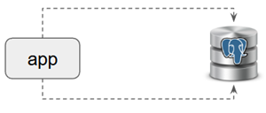
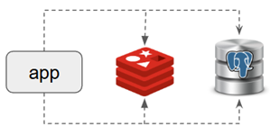
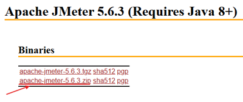
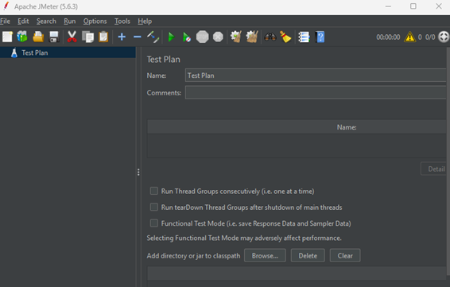
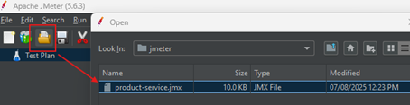
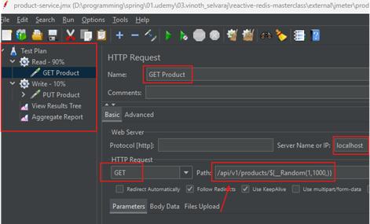
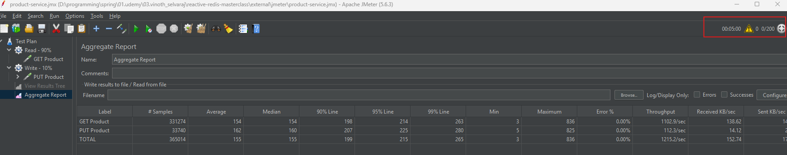
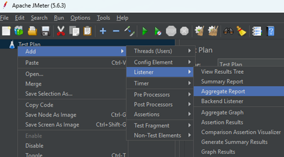
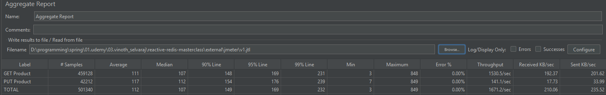

# Sección 06: Spring WebFlux & Redis: Performance

---

## Configuración de proyecto

En esta sección vamos a comprobar el rendimiento de nuestra aplicación usando Redis.

Primero realizaremos nuestra aplicación sin redis, simplemente interactuando con nuestra base de datos, al finalizar
realizaremos una prueba de rendimiento usando `JMeter` (herramienta para pruebas de rendimiento).



Segundo, añadiremos Redis a nuestra arquitectura y volveremos a ejecutar exactamente la misma prueba de rendimiento
para luego comparar resultados.



## [Dependencias](https://start.spring.io/#!type=maven-project&language=java&platformVersion=3.5.4&packaging=jar&jvmVersion=21&groupId=dev.magadiflo&artifactId=redis-performance&name=redis-performance&description=Demo%20project%20for%20Spring%20Boot&packageName=dev.magadiflo.performance.app&dependencies=webflux,data-r2dbc,lombok,postgresql)

Vamos a crear un nuevo proyecto llamado `redis-performance`
desde [Spring Initializr](https://start.spring.io/#!type=maven-project&language=java&platformVersion=3.5.4&packaging=jar&jvmVersion=21&groupId=dev.magadiflo&artifactId=redis-performance&name=redis-performance&description=Demo%20project%20for%20Spring%20Boot&packageName=dev.magadiflo.performance.app&dependencies=webflux,data-r2dbc,lombok,postgresql)
cuyas dependencias serán las siguientes.

````xml
<!--Spring Boot 3.5.4-->
<!--Java 21-->
<dependencies>
    <dependency>
        <groupId>org.springframework.boot</groupId>
        <artifactId>spring-boot-starter-data-r2dbc</artifactId>
    </dependency>
    <dependency>
        <groupId>org.springframework.boot</groupId>
        <artifactId>spring-boot-starter-webflux</artifactId>
    </dependency>

    <dependency>
        <groupId>org.postgresql</groupId>
        <artifactId>postgresql</artifactId>
        <scope>runtime</scope>
    </dependency>
    <dependency>
        <groupId>org.postgresql</groupId>
        <artifactId>r2dbc-postgresql</artifactId>
        <scope>runtime</scope>
    </dependency>
    <dependency>
        <groupId>org.projectlombok</groupId>
        <artifactId>lombok</artifactId>
        <optional>true</optional>
    </dependency>
    <dependency>
        <groupId>org.springframework.boot</groupId>
        <artifactId>spring-boot-starter-test</artifactId>
        <scope>test</scope>
    </dependency>
    <dependency>
        <groupId>io.projectreactor</groupId>
        <artifactId>reactor-test</artifactId>
        <scope>test</scope>
    </dependency>
</dependencies>
````

## 🧩 Servicio de Producto - Versión 1 (Sin Redis)

En esta lección desarrollamos una primera versión simple de nuestra aplicación `WebFlux`. Esta versión no incluye
`Redis` ni otras optimizaciones. El objetivo es comprobar el rendimiento de la aplicación interactuando únicamente con
la base de datos relacional.

👉 Esta implementación inicial servirá como `línea base` para comparar posteriormente el impacto del uso de `Redis`
como `caché`.

### 🎯 Alcance

Esta versión se centra en la funcionalidad principal, por lo tanto:

- No se usan DTOs.
- No se aplica validación.
- No se maneja cacheo.
- La estructura se limita a: `entidad + repositorio + servicio + controlador`.

### 🧱 Entidad: Product

Creamos una clase entidad que se mapea a la tabla `products` en la base de datos.

````java

@AllArgsConstructor
@NoArgsConstructor
@Builder
@Data
@Table(name = "products")
public class Product {
    @Id
    private Integer id;
    private String description;
    private double price;
}
````

🔎 Notas:

- Se usa `@Builder` para facilitar la creación de objetos `Product`.
- El campo id es la clave primaria (`@Id`).
- Las demás propiedades (description, price) corresponden a columnas simples.

### 🧩 Repositorio Reactivo

Creamos un repositorio extendiendo `ReactiveCrudRepository`, el cual nos ofrece operaciones reactivas estándar como
`findById(...)`, `save(...)`, `delete(...)`, entre otras.

````java
public interface ProductRepository extends ReactiveCrudRepository<Product, Integer> {
}
````

### 🧰 Servicio de producto

Para aplicar el `principio de Inversión de Dependencias`, definimos una interfaz de servicio que encapsula las
operaciones relacionadas al producto.

````java
public interface ProductService {
    Mono<Product> getProduct(Integer productId);

    Mono<Product> updateProduct(Integer productId, Product product);
}
````

A continuación, implementamos esta interfaz en una clase concreta, que orquesta las operaciones del repositorio.

````java

@Slf4j
@RequiredArgsConstructor
@Service
public class ProductServiceImpl implements ProductService {

    private final ProductRepository productRepository;

    @Override
    @Transactional(readOnly = true)
    public Mono<Product> getProduct(Integer productId) {
        return this.productRepository.findById(productId);
    }

    @Override
    @Transactional
    public Mono<Product> updateProduct(Integer productId, Product product) {
        return this.productRepository.findById(productId)
                .map(productDB -> {
                    product.setId(productId);
                    return product;
                })
                .flatMap(this.productRepository::save)
                .switchIfEmpty(Mono.error(() -> new NoSuchElementException("No existe el producto con id: " + productId)));
    }
}
````

🔎 Notas:

- Se usa `@Transactional` para asegurar la integridad transaccional.
- El método `updateProduct(...)`:
    - `findById(...)`: verifica que el producto exista.
    - `map(...)`: toma los nuevos datos (`product`), les asigna el ID del path (ignorando el que venga del body).
    - `flatMap(save)`: guarda el nuevo objeto con los datos actualizados.
    - `switchIfEmpty(...)`: maneja el caso en que no se encontró el producto.

### 🌐 Controlador Reactivo

Finalmente, exponemos los endpoints a través de un controlador `WebFlux`.

````java

@RequiredArgsConstructor
@RestController
@RequestMapping(path = "/api/v1/products")
public class ProductController {

    private final ProductService productService;

    @GetMapping(path = "/{productId}")
    public Mono<ResponseEntity<Product>> getProduct(@PathVariable Integer productId) {
        return this.productService.getProduct(productId)
                .map(ResponseEntity::ok);
    }

    @PutMapping(path = "/{productId}")
    public Mono<ResponseEntity<Product>> updateProduct(@PathVariable Integer productId,
                                                       @RequestBody Mono<Product> productMono) {
        return productMono
                .flatMap(product -> this.productService.updateProduct(productId, product))
                .map(ResponseEntity::ok);
    }
}
````

🔎 Notas:

- Se utiliza `Mono<Product>` en el cuerpo de la petición para aprovechar el manejo reactivo de datos en flujo.
- `ResponseEntity` encapsula el resultado con su respectivo código `HTTP (200 OK)`.
- No se maneja validación ni errores a nivel del controlador en esta versión.

## 🐘 Postgres con Docker Compose

Para ejecutar nuestra base de datos `PostgreSQL` de forma rápida y aislada, utilizaremos `Docker Compose`. A
continuación, definimos un contenedor para `Postgres` dentro del archivo `compose.yml`:

````yml
services:
  s-postgres:
    image: postgres:17-alpine
    container_name: c-postgres
    restart: unless-stopped
    ports:
      - '5433:5432'
    environment:
      POSTGRES_DB: db_redis_performance
      POSTGRES_USER: postgres
      POSTGRES_PASSWORD: magadiflo
    volumes:
      - postgres-data:/var/lib/postgresql/data

volumes:
  postgres-data:
    name: postgres-data
````

✅ Esta base de datos se utilizará para almacenar los productos que consultaremos desde la aplicación `WebFlux`.
Una vez creado el contenedor, podremos conectarnos a la base de datos desde nuestra aplicación `Spring` usando el
puerto `5433`.

> 👉 Antes de eso, será necesario agregar la configuración de conexión correspondiente en el archivo `application.yml`
> de Spring Boot.

## 🚀 Levantando el contenedor de PostgreSQL

Antes de iniciar el contenedor de `PostgreSQL`, listamos los contenedores existentes en ejecución para verificar
el estado actual del entorno.

````bash
$ docker container ls -a
CONTAINER ID   IMAGE                                 COMMAND                  CREATED       STATUS                        PORTS                                         NAMES
34818d6d187b   redis:8.0.3-alpine                    "docker-entrypoint.s…"   2 weeks ago   Up 21 minutes                 0.0.0.0:6379->6379/tcp, [::]:6379->6379/tcp   c-redis
````

Ahora sí, ejecutamos nuestro archivo `compose.yml` con `Docker Compose` para levantar el contenedor de `PostgreSQL`.

````bash
D:\programming\spring\01.udemy\03.vinoth_selvaraj\reactive-redis-masterclass (feature/section-6)
$ docker compose -f ./docker/compose.yml up -d                                                  
[+] Running 3/3                                                                                 
 ✔ Volume "postgres-data"  Created                                                              
 ✔ Container c-postgres    Started                                                              
 ✔ Container c-redis       Running                                                                                                                                                                                                                                                                  0.0s  ✔ Container c-postgres    Started                                                                                                                                                                                                       0.3s  ✔ Container c-redis       Running
````

Al listar nuevamente los contenedores, podremos verificar que el contenedor de `PostgreSQL` ya está en ejecución, junto
con el contenedor de `Redis` que habíamos creado previamente al inicio del curso.

````bash
$ docker container ls -a
CONTAINER ID   IMAGE                                 COMMAND                  CREATED              STATUS                        PORTS                                         NAMES
6728aae1932d   postgres:17-alpine                    "docker-entrypoint.s…"   About a minute ago   Up About a minute             0.0.0.0:5433->5432/tcp, [::]:5433->5432/tcp   c-postgres
34818d6d187b   redis:8.0.3-alpine                    "docker-entrypoint.s…"   2 weeks ago          Up 24 minutes                 0.0.0.0:6379->6379/tcp, [::]:6379->6379/tcp   c-redis 
````

## ⚙️ Agregando configuración de conexión a PostgreSQL

Para que nuestra aplicación pueda conectarse a la base de datos que levantamos con Docker, debemos agregar las
siguientes configuraciones en el archivo `application.yml`:

````yml
server:
  port: 8080
  error:
    include-message: always

spring:
  application:
    name: redis-performance
  r2dbc:
    url: r2dbc:postgresql://localhost:5433/db_redis_performance
    username: postgres
    password: magadiflo

logging:
  level:
    io.r2dbc.postgresql.QUERY: debug
    io.r2dbc.postgresql.PARAM: debug
````

📝 Explicación de los bloques:

- `server.port`: Puerto en el que se ejecutará la aplicación Spring Boot.
- `spring.r2dbc.url`: URL de conexión R2DBC hacia PostgreSQL, usando el puerto expuesto por Docker (5433).
- `spring.r2dbc.username/password`: Credenciales definidas en el `compose.yml`.
- `logging.level`: Activamos logs de consultas y parámetros enviados por el cliente R2DBC para facilitar el seguimiento
  durante el desarrollo y pruebas.

✅ Con esta configuración, la aplicación ya puede establecer conexión reactiva con `PostgreSQL` mediante `R2DBC`.

## Configuración de datos iniciales (Data Setup Service)

### 1. Script SQL de esquema de base de datos

Creamos el siguiente script para definir el esquema de la tabla products. Guardamos este archivo en la ubicación
`src/main/resources/sql/scheme.sql`.

````sql
DROP TABLE IF EXISTS products;

CREATE TABLE products(
    id INTEGER GENERATED ALWAYS AS IDENTITY,
    description VARCHAR(500),
    price NUMERIC(10,2),
    CONSTRAINT pk_products PRIMARY KEY(id)
);
````

En versiones modernas de `PostgreSQL` (a partir de la `+10`), se recomienda usar la cláusula
`GENERATED {ALWAYS|BY DEFAULT} AS IDENTITY` en lugar del tipo `SERIAL` para definir columnas `autoincrementales`.

¿Qué significa?

- `INTEGER`: Tipo de dato de la columna, que será numérico entero.
- `GENERATED ALWAYS`: Le indica a `PostgreSQL` que los valores de esta columna `serán generados automáticamente` por el
  sistema.
    - Si intentamos insertar manualmente un valor en esta columna, obtendremos un error.
- `AS IDENTITY`: Indica que la columna usará una secuencia interna para generar valores únicos, muy similar a lo que
  hacía `SERIAL`, pero de forma más estándar y controlada.

> Al usar `ALWAYS`:
> - PostgreSQL siempre genera el valor automáticamente usando una secuencia.
> - Si intentas insertar un valor manualmente en esa columna, obtendrás un error.
>
> Si usamos `BY DEFAULT`, entonces:
> - PostgreSQL usará la secuencia automáticamente solo si no se proporciona un valor.
> - Si tú proporcionas manualmente un valor, PostgreSQL lo aceptará sin error.

### 2. Configuración automática de base de datos y carga inicial de datos

Creamos una clase de configuración que se encargará de dos tareas:

1. Ejecutar el script SQL al arrancar la aplicación.
2. Poblar la tabla products con 1000 registros de prueba.

````java

@Slf4j
@RequiredArgsConstructor
@Configuration
public class DataSetupConfig {

    @Bean
    public ConnectionFactoryInitializer initializer(ConnectionFactory connectionFactory) {
        ClassPathResource scheme = new ClassPathResource("sql/scheme.sql");
        ResourceDatabasePopulator resourceDatabasePopulator = new ResourceDatabasePopulator(scheme);

        ConnectionFactoryInitializer initializer = new ConnectionFactoryInitializer();
        initializer.setConnectionFactory(connectionFactory);
        initializer.setDatabasePopulator(resourceDatabasePopulator);
        return initializer;
    }

    @Bean
    public CommandLineRunner runner(ProductRepository productRepository) {
        return args -> Flux.range(1, 1000)
                .map(i -> Product.builder()
                        .description("product-" + i)
                        .price(ThreadLocalRandom.current().nextInt(1, 100))
                        .build()
                )
                .collectList()
                .flatMapMany(productRepository::saveAll)
                .then()
                .doFinally(signalType -> log.info("Configuración de datos realizada: {}", signalType))
                .subscribe();
    }
}
````

- `ConnectionFactoryInitializer`: Se encarga de ejecutar el script `scheme.sql` al iniciar la aplicación, utilizando
  `R2DBC`.
- `CommandLineRunner`: Una vez que la tabla ha sido creada, se insertan 1000 productos con descripciones del tipo
  `product-1`, `product-2`, ..., y precios aleatorios entre 1 y 99.
- `doFinally(...)`: Al finalizar la ejecución del flujo, se imprime un log con la señal de finalización.

### 3. Comprobando inicialización

Una vez ejecutada la aplicación, realizamos algunas peticiones para verificar que todo funciona correctamente: la
conexión a la base de datos, la creación automática de los datos y el correcto funcionamiento de los endpoints.

Hacemos una petición GET para obtener el producto con ID 10.

````bash
$ curl -v http://localhost:8080/api/v1/products/10 | jq
>
< HTTP/1.1 200 OK
< Content-Type: application/json
< Content-Length: 49
<
{
  "id": 10,
  "description": "product-10",
  "price": 93.0
}
````

La respuesta confirma que el producto fue encontrado correctamente. Recordemos que al iniciar la aplicación, se
insertaron 1000 productos de prueba con descripciones `product-1` a `product-1000`.

Ahora actualizamos el producto 10 usando una petición PUT, cambiando su descripción y precio.

````bash
$ curl -v -X PUT -H "Content-Type: application/json" -d "{\"description\": \"Monitor LG\", \"price\": 750.50}" http://localhost:8080/api/v1/products/10 | jq
>
< HTTP/1.1 200 OK
< Content-Type: application/json
< Content-Length: 50
<
{
  "id": 10,
  "description": "Monitor LG",
  "price": 750.5
}
````

La respuesta muestra que el producto fue actualizado exitosamente en la base de datos.

## Instalación de Apache JMeter

Para realizar pruebas de rendimiento sobre nuestra API, utilizaremos `Apache JMeter`, una herramienta de código abierto
muy popular para pruebas de carga.

Puedes descargar la última versión desde el siguiente enlace oficial:
[Download Apache JMeter](https://jmeter.apache.org/download_jmeter.cgi).
Asegúrate de descargar el archivo `binario (.zip)`, no el código fuente.



Una vez descargado el archivo `.zip`, descomprímelo en una ubicación de tu preferencia. Por ejemplo.

````bash
C:\jmeter\apache-jmeter-5.6.3 
````

Para ejecutar `JMeter` en `Windows`, dirígete a la carpeta `/bin` y ejecuta el archivo `jmeter.bat`.

````bash
C:\jmeter\apache-jmeter-5.6.3\bin
$ jmeter.bat
WARN StatusConsoleListener The use of package scanning to locate plugins is deprecated and will be removed in a future release
WARN StatusConsoleListener The use of package scanning to locate plugins is deprecated and will be removed in a future release
WARN StatusConsoleListener The use of package scanning to locate plugins is deprecated and will be removed in a future release
WARN StatusConsoleListener The use of package scanning to locate plugins is deprecated and will be removed in a future release
================================================================================
Don't use GUI mode for load testing !, only for Test creation and Test debugging.
For load testing, use CLI Mode (was NON GUI):
   jmeter -n -t [jmx file] -l [results file] -e -o [Path to web report folder]
& increase Java Heap to meet your test requirements:
   Modify current env variable HEAP="-Xms1g -Xmx1g -XX:MaxMetaspaceSize=256m" in the jmeter batch file
Check : https://jmeter.apache.org/usermanual/best-practices.html
================================================================================
````

Los mensajes en consola simplemente son advertencias y buenas prácticas sugeridas por la herramienta. No afectan la
ejecución.

Después de unos segundos, se abrirá la interfaz gráfica de `JMeter`:



## Jmeter - un breve curso intensivo

En el directorio `external/jmeter/product-service.jmx` se encuentra el archivo de prueba que nos proporcionó el tutor.
Una vez que tenemos `JMeter` en funcionamiento, procedemos a abrir dicho archivo desde la interfaz gráfica.



Al abrirlo, veremos un plan de prueba ya `preconfigurado`. En mi caso, lo único que modifiqué fue el campo `Path`,
actualizándolo para que coincida con el endpoint que expone mi aplicación `WebFlux`.



- `${__Random(1,1000,)}`, Esta expresión es una función propia de `JMeter` que genera un número aleatorio entre 1
  y 1000. En este caso se está utilizando como parámetro dinámico en el endpoint, simulando peticiones a distintos
  productos.

Una vez que ejecutamos el plan de prueba, obtendremos resultados como los que se muestran a continuación:



Hasta aquí, hemos utilizado la interfaz gráfica de `JMeter` para configurar y ejecutar nuestras pruebas. Sin embargo,
`no es recomendable usar la GUI de JMeter para ejecutar pruebas de carga reales`, ya que consume muchos recursos
del sistema y puede afectar la precisión de los resultados.

> ✅ Lo ideal es `usar JMeter en modo consola (CLI)` para ejecutar las pruebas de rendimiento. Esto lo veremos en el
> siguiente apartado.

## 📊 Prueba Base (Baseline Test)

En esta sección realizamos una prueba de rendimiento básica para establecer una línea base (baseline) de comparación,
antes de aplicar caching con Redis. Para ello, ejecutamos una prueba de carga usando `Apache JMeter` en
`modo no gráfico` desde la terminal.

````bash
C:\jmeter\apache-jmeter-5.6.3\bin
$ jmeter -n -t D:\programming\spring\01.udemy\03.vinoth_selvaraj\reactive-redis-masterclass\external\jmeter\product-service.jmx -l D:\programming\spring\01.udemy\03.vinoth_selvaraj\reactive-redis-masterclass\external\jmeter\v1.jtl
````

🧩 Parámetros explicados

- Observemos que estamos ejecutando el comando dentro del directorio `/bin`.
- `-n`. Ejecuta `JMeter` en `modo no gráfico` (`non-GUI`). Esto es útil para ejecutar pruebas desde línea de comandos
  o scripts automatizados sin necesidad de abrir la interfaz gráfica.
- `-t <ruta_del_archivo.jmx>`. Especifica el script de prueba JMeter que se va a ejecutar. En este caso, usamos
  `product-service.jmx`, el cual contiene la configuración de los `hilos`, `peticiones` y `validaciones`.
- `-l <ruta_del_archivo.jtl>`. Define el archivo de salida de resultados, con extensión `.jtl`. Este archivo será creado
  al ejecutar el comando, además, este archivo almacena los datos brutos generados durante la ejecución, que luego
  pueden ser visualizados en la interfaz gráfica de JMeter.

### 🧪 Resultado de la ejecución

Durante la ejecución del test, se muestran varias métricas resumen directamente en consola:

````bash
C:\jmeter\apache-jmeter-5.6.3\bin
$ jmeter -n -t D:\programming\spring\01.udemy\03.vinoth_selvaraj\reactive-redis-masterclass\external\jmeter\product-service.jmx -l D:\programming\spring\01.udemy\03.vinoth_selvaraj\reactive-redis-masterclass\external\jmeter\v1.jtl
WARN StatusConsoleListener The use of package scanning to locate plugins is deprecated and will be removed in a future release
WARN StatusConsoleListener The use of package scanning to locate plugins is deprecated and will be removed in a future release
WARN StatusConsoleListener The use of package scanning to locate plugins is deprecated and will be removed in a future release
WARN StatusConsoleListener The use of package scanning to locate plugins is deprecated and will be removed in a future release
Creating summariser <summary>
Created the tree successfully using D:\programming\spring\01.udemy\03.vinoth_selvaraj\reactive-redis-masterclass\external\jmeter\product-service.jmx
Starting standalone test @ 2025 Aug 8 12:29:22 PET (1754674162859)
Waiting for possible Shutdown/StopTestNow/HeapDump/ThreadDump message on port 4445
summary +   7650 in 00:00:07 = 1113.2/s Avg:    19 Min:     3 Max:    74 Err:     0 (0.00%) Active: 46 Started: 46 Finished: 0
summary +  49937 in 00:00:30 = 1664.6/s Avg:    82 Min:    23 Max:   231 Err:     0 (0.00%) Active: 200 Started: 200 Finished: 0
summary =  57587 in 00:00:37 = 1561.8/s Avg:    74 Min:     3 Max:   231 Err:     0 (0.00%)
summary +  56951 in 00:00:30 = 1898.4/s Avg:   104 Min:    81 Max:   307 Err:     0 (0.00%) Active: 200 Started: 200 Finished: 0
summary = 114538 in 00:01:07 = 1712.8/s Avg:    89 Min:     3 Max:   307 Err:     0 (0.00%)
summary +  56774 in 00:00:30 = 1892.5/s Avg:   104 Min:    78 Max:   238 Err:     0 (0.00%) Active: 200 Started: 200 Finished: 0
summary = 171312 in 00:01:37 = 1768.4/s Avg:    94 Min:     3 Max:   307 Err:     0 (0.00%)
summary +  53875 in 00:00:30 = 1795.8/s Avg:   110 Min:    82 Max:   307 Err:     0 (0.00%) Active: 200 Started: 200 Finished: 0
summary = 225187 in 00:02:07 = 1774.9/s Avg:    98 Min:     3 Max:   307 Err:     0 (0.00%)
summary +  47809 in 00:00:30 = 1593.6/s Avg:   124 Min:    83 Max:   297 Err:     0 (0.00%) Active: 200 Started: 200 Finished: 0
summary = 272996 in 00:02:37 = 1740.2/s Avg:   102 Min:     3 Max:   307 Err:     0 (0.00%)
summary +  46867 in 00:00:30 = 1562.3/s Avg:   127 Min:    84 Max:   328 Err:     0 (0.00%) Active: 200 Started: 200 Finished: 0
summary = 319863 in 00:03:07 = 1711.7/s Avg:   106 Min:     3 Max:   328 Err:     0 (0.00%)
summary +  40298 in 00:00:30 = 1343.3/s Avg:   148 Min:    88 Max:   440 Err:     0 (0.00%) Active: 200 Started: 200 Finished: 0
summary = 360161 in 00:03:37 = 1660.7/s Avg:   111 Min:     3 Max:   440 Err:     0 (0.00%)
summary +  48175 in 00:00:30 = 1605.8/s Avg:   123 Min:    83 Max:   262 Err:     0 (0.00%) Active: 200 Started: 200 Finished: 0
summary = 408336 in 00:04:07 = 1654.0/s Avg:   112 Min:     3 Max:   440 Err:     0 (0.00%)
summary +  51980 in 00:00:30 = 1732.6/s Avg:   106 Min:    16 Max:   849 Err:     0 (0.00%) Active: 200 Started: 200 Finished: 0
summary = 460316 in 00:04:37 = 1662.6/s Avg:   112 Min:     3 Max:   849 Err:     0 (0.00%)
summary +  41024 in 00:00:23 = 1763.2/s Avg:   112 Min:    84 Max:   327 Err:     0 (0.00%) Active: 0 Started: 200 Finished: 200
summary = 501340 in 00:05:00 = 1670.3/s Avg:   112 Min:     3 Max:   849 Err:     0 (0.00%)
Tidying up ...    @ 2025 Aug 8 12:34:23 PET (1754674463269)
... end of run
````

📌 Interpretación:

- Solicitudes totales procesadas: 501,340
- Duración de la prueba: 5 minutos
- Throughput promedio: 1670.3 solicitudes por segundo
- Tiempo de respuesta promedio: 112ms
- Errores: 0

### 📷 Visualización en la UI de JMeter

Una vez finalizada la ejecución, podemos abrir el archivo `.jtl` con la interfaz gráfica de JMeter y visualizar los
resultados de forma más amigable.



En la columna `Throughput (rendimiento)`, se observa claramente que nuestra aplicación fue capaz de manejar:

> `≈ 1671.2 solicitudes por segundo` de manera estable.



### 📊 Distribución de peticiones

En la misma interfaz, también se puede observar cómo se distribuyeron los diferentes tipos de solicitudes durante la
prueba:

- GET: 459,128 solicitudes (≈90%)
- PUT: 42,212 solicitudes (≈10%)

Esto refleja el comportamiento esperado, ya que las operaciones de lectura (GET) son más frecuentes que las de
escritura (PUT) en la mayoría de escenarios de aplicaciones reales.

📌 Conclusión
> Este test de carga inicial nos permite obtener un punto de referencia sobre el rendimiento del servicio sin ningún
> tipo de caching aplicado. En las siguientes secciones, al integrar Redis como capa de caché, podremos comparar estos
> resultados y medir las mejoras de rendimiento obtenidas.
