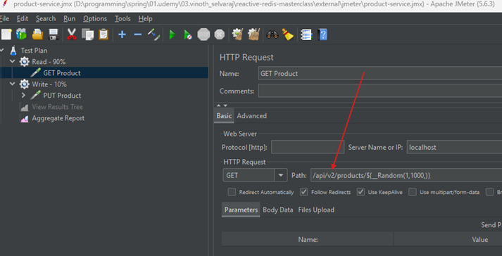
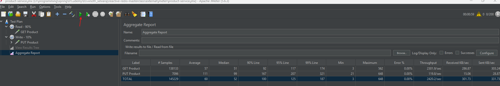
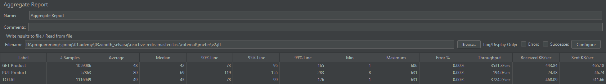

# Sección 06: Spring WebFlux & Redis: Performance

---

## Configuración de proyecto

En esta sección vamos a comprobar el rendimiento de nuestra aplicación usando Redis.

Primero realizaremos nuestra aplicación sin redis, simplemente interactuando con nuestra base de datos, al finalizar
realizaremos una prueba de rendimiento usando `JMeter` (herramienta para pruebas de rendimiento).


Segundo, añadiremos Redis a nuestra arquitectura y volveremos a ejecutar exactamente la misma prueba de rendimiento
para luego comparar resultados.


## [Dependencias](https://start.spring.io/#!type=maven-project&language=java&platformVersion=3.5.4&packaging=jar&jvmVersion=21&groupId=dev.magadiflo&artifactId=redis-performance&name=redis-performance&description=Demo%20project%20for%20Spring%20Boot&packageName=dev.magadiflo.performance.app&dependencies=webflux,data-r2dbc,lombok,postgresql)

Vamos a crear un nuevo proyecto llamado `redis-performance`
desde [Spring Initializr](https://start.spring.io/#!type=maven-project&language=java&platformVersion=3.5.4&packaging=jar&jvmVersion=21&groupId=dev.magadiflo&artifactId=redis-performance&name=redis-performance&description=Demo%20project%20for%20Spring%20Boot&packageName=dev.magadiflo.performance.app&dependencies=webflux,data-r2dbc,lombok,postgresql)
cuyas dependencias serán las siguientes.

````xml
<!--Spring Boot 3.5.4-->
<!--Java 21-->
<dependencies>
    <dependency>
        <groupId>org.springframework.boot</groupId>
        <artifactId>spring-boot-starter-data-r2dbc</artifactId>
    </dependency>
    <dependency>
        <groupId>org.springframework.boot</groupId>
        <artifactId>spring-boot-starter-webflux</artifactId>
    </dependency>

    <dependency>
        <groupId>org.postgresql</groupId>
        <artifactId>postgresql</artifactId>
        <scope>runtime</scope>
    </dependency>
    <dependency>
        <groupId>org.postgresql</groupId>
        <artifactId>r2dbc-postgresql</artifactId>
        <scope>runtime</scope>
    </dependency>
    <dependency>
        <groupId>org.projectlombok</groupId>
        <artifactId>lombok</artifactId>
        <optional>true</optional>
    </dependency>
    <dependency>
        <groupId>org.springframework.boot</groupId>
        <artifactId>spring-boot-starter-test</artifactId>
        <scope>test</scope>
    </dependency>
    <dependency>
        <groupId>io.projectreactor</groupId>
        <artifactId>reactor-test</artifactId>
        <scope>test</scope>
    </dependency>
</dependencies>
````

## 🧩 Servicio de Producto - Versión 1 (Sin Redis)

En esta lección desarrollamos una primera versión simple de nuestra aplicación `WebFlux`. Esta versión no incluye
`Redis` ni otras optimizaciones. El objetivo es comprobar el rendimiento de la aplicación interactuando únicamente con
la base de datos relacional.

👉 Esta implementación inicial servirá como `línea base` para comparar posteriormente el impacto del uso de `Redis`
como `caché`.

### 🎯 Alcance

Esta versión se centra en la funcionalidad principal, por lo tanto:

- No se usan DTOs.
- No se aplica validación.
- No se maneja cacheo.
- La estructura se limita a: `entidad + repositorio + servicio + controlador`.

### 🧱 Entidad: Product

Creamos una clase entidad que se mapea a la tabla `products` en la base de datos.

````java

@AllArgsConstructor
@NoArgsConstructor
@Builder
@Data
@Table(name = "products")
public class Product {
    @Id
    private Integer id;
    private String description;
    private double price;
}
````

🔎 Notas:

- Se usa `@Builder` para facilitar la creación de objetos `Product`.
- El campo id es la clave primaria (`@Id`).
- Las demás propiedades (description, price) corresponden a columnas simples.

### 🧩 Repositorio Reactivo

Creamos un repositorio extendiendo `ReactiveCrudRepository`, el cual nos ofrece operaciones reactivas estándar como
`findById(...)`, `save(...)`, `delete(...)`, entre otras.

````java
public interface ProductRepository extends ReactiveCrudRepository<Product, Integer> {
}
````

### 🧰 Servicio de producto

Para aplicar el `principio de Inversión de Dependencias`, definimos una interfaz de servicio que encapsula las
operaciones relacionadas al producto.

````java
public interface ProductService {
    Mono<Product> getProduct(Integer productId);

    Mono<Product> updateProduct(Integer productId, Product product);

    Mono<Void> deleteProduct(Integer productId);
}
````

A continuación, implementamos esta interfaz en una clase concreta, que orquesta las operaciones del repositorio.

````java

@Slf4j
@RequiredArgsConstructor
@Service("v1")
public class ProductServiceImplV1 implements ProductService {

    private final ProductRepository productRepository;

    @Override
    @Transactional(readOnly = true)
    public Mono<Product> getProduct(Integer productId) {
        return this.productRepository.findById(productId);
    }

    @Override
    @Transactional
    public Mono<Product> updateProduct(Integer productId, Product product) {
        return this.productRepository.findById(productId)
                .map(productDB -> {
                    product.setId(productId);
                    return product;
                })
                .flatMap(this.productRepository::save)
                .switchIfEmpty(Mono.error(() -> new NoSuchElementException("[Update] No existe el producto con id: " + productId)));
    }

    @Override
    @Transactional
    public Mono<Void> deleteProduct(Integer productId) {
        return this.productRepository.findById(productId)
                .flatMap(product -> this.productRepository.deleteById(productId))
                .switchIfEmpty(Mono.error(() -> new NoSuchElementException("[Delete] No existe el producto con id: " + productId)));
    }
}
````

🔎 Notas:

- Uso de `@Service("nombre")`: al nombrar explícitamente esta implementación (`v1`), estamos registrando este bean con
  un identificador único en el contexto de Spring. Esto evitará ambigüedad al momento de la inyección. Bueno, por ahora
  no, pero cuando implementemos la `v2` allí veremos la utilidad de este nombre.
- Se usa `@Transactional` para asegurar la integridad transaccional.
- El método `updateProduct(...)`:
    - `findById(...)`: verifica que el producto exista.
    - `map(...)`: toma los nuevos datos (`product`), les asigna el ID del path (ignorando el que venga del body).
    - `flatMap(save)`: guarda el nuevo objeto con los datos actualizados.
    - `switchIfEmpty(...)`: maneja el caso en que no se encontró el producto.

### 🌐 Controlador Reactivo

Finalmente, para esta primera versión del controlador `WebFlux`, exponemos sus endpoints.

````java

@RestController
@RequestMapping(path = "/api/v1/products")
public class ProductControllerV1 {

    private final ProductService productService;

    public ProductControllerV1(@Qualifier("v1") ProductService productService) {
        this.productService = productService;
    }

    @GetMapping(path = "/{productId}")
    public Mono<ResponseEntity<Product>> getProduct(@PathVariable Integer productId) {
        return this.productService.getProduct(productId)
                .map(ResponseEntity::ok);
    }

    @PutMapping(path = "/{productId}")
    public Mono<ResponseEntity<Product>> updateProduct(@PathVariable Integer productId,
                                                       @RequestBody Mono<Product> productMono) {
        return productMono
                .flatMap(product -> this.productService.updateProduct(productId, product))
                .map(ResponseEntity::ok);
    }
}
````

🔎 Notas:

- Uso de `@Qualifier("nombre")` en los controladores: Al indicar el nombre del bean que deseas inyectar (`v1`), estás
  guiando a Spring para que seleccione la implementación correcta de `ProductService` en cada controlador. Esto es
  esencial cuando hay más de una opción disponible, aunque ahora solo tenemos una implementación, esto nos será de
  utilidad cuando implementemos la versión 2.
- Se utiliza `Mono<Product>` en el cuerpo de la petición para aprovechar el manejo reactivo de datos en flujo.
- `ResponseEntity` encapsula el resultado con su respectivo código `HTTP (200 OK)`.
- No se maneja validación ni errores a nivel del controlador en esta versión.

📘 Resumen
> En esta arquitectura se define una interfaz común `ProductService`, la cual contará con múltiples implementaciones:
>
> `ProductServiceImplV1` y `ProductServiceImplV2`, representando distintas versiones del servicio. Para evitar
> ambigüedad en la inyección de dependencias, se utiliza la anotación `@Service("v1")` y `@Service("v2")`, junto con
> `@Qualifier("v1")` y `@Qualifier("v2")` en los controladores correspondientes. Esto garantiza que cada controlador
> reciba la implementación adecuada según la versión de la API que maneja.
>
> Por ahora, solo se ha implementado la versión `v1`. Más adelante, al incorporar la `v2`, veremos en acción la
> utilidad de esta estrategia de diferenciación y cómo permite evolucionar la API sin comprometer la compatibilidad
> ni la claridad en la arquitectura.

## 🐘 Postgres con Docker Compose

Para ejecutar nuestra base de datos `PostgreSQL` de forma rápida y aislada, utilizaremos `Docker Compose`. A
continuación, definimos un contenedor para `Postgres` dentro del archivo `compose.yml`:

````yml
services:
  s-postgres:
    image: postgres:17-alpine
    container_name: c-postgres
    restart: unless-stopped
    ports:
      - '5433:5432'
    environment:
      POSTGRES_DB: db_redis_performance
      POSTGRES_USER: postgres
      POSTGRES_PASSWORD: magadiflo
    volumes:
      - postgres-data:/var/lib/postgresql/data

volumes:
  postgres-data:
    name: postgres-data
````

✅ Esta base de datos se utilizará para almacenar los productos que consultaremos desde la aplicación `WebFlux`.
Una vez creado el contenedor, podremos conectarnos a la base de datos desde nuestra aplicación `Spring` usando el
puerto `5433`.

> 👉 Antes de eso, será necesario agregar la configuración de conexión correspondiente en el archivo `application.yml`
> de Spring Boot.

## 🚀 Levantando el contenedor de PostgreSQL

Antes de iniciar el contenedor de `PostgreSQL`, listamos los contenedores existentes en ejecución para verificar
el estado actual del entorno.

````bash
$ docker container ls -a
CONTAINER ID   IMAGE                                 COMMAND                  CREATED       STATUS                        PORTS                                         NAMES
34818d6d187b   redis:8.0.3-alpine                    "docker-entrypoint.s…"   2 weeks ago   Up 21 minutes                 0.0.0.0:6379->6379/tcp, [::]:6379->6379/tcp   c-redis
````

Ahora sí, ejecutamos nuestro archivo `compose.yml` con `Docker Compose` para levantar el contenedor de `PostgreSQL`.

````bash
D:\programming\spring\01.udemy\03.vinoth_selvaraj\reactive-redis-masterclass (feature/section-6)
$ docker compose -f ./docker/compose.yml up -d                                                  
[+] Running 3/3                                                                                 
 ✔ Volume "postgres-data"  Created                                                              
 ✔ Container c-postgres    Started                                                              
 ✔ Container c-redis       Running                                                                                                                                                                                                                                                                  0.0s  ✔ Container c-postgres    Started                                                                                                                                                                                                       0.3s  ✔ Container c-redis       Running
````

Al listar nuevamente los contenedores, podremos verificar que el contenedor de `PostgreSQL` ya está en ejecución, junto
con el contenedor de `Redis` que habíamos creado previamente al inicio del curso.

````bash
$ docker container ls -a
CONTAINER ID   IMAGE                                 COMMAND                  CREATED              STATUS                        PORTS                                         NAMES
6728aae1932d   postgres:17-alpine                    "docker-entrypoint.s…"   About a minute ago   Up About a minute             0.0.0.0:5433->5432/tcp, [::]:5433->5432/tcp   c-postgres
34818d6d187b   redis:8.0.3-alpine                    "docker-entrypoint.s…"   2 weeks ago          Up 24 minutes                 0.0.0.0:6379->6379/tcp, [::]:6379->6379/tcp   c-redis 
````

## ⚙️ Agregando configuración de conexión a PostgreSQL

Para que nuestra aplicación pueda conectarse a la base de datos que levantamos con Docker, debemos agregar las
siguientes configuraciones en el archivo `application.yml`:

````yml
server:
  port: 8080
  error:
    include-message: always

spring:
  application:
    name: redis-performance
  r2dbc:
    url: r2dbc:postgresql://localhost:5433/db_redis_performance
    username: postgres
    password: magadiflo

logging:
  level:
    io.r2dbc.postgresql.QUERY: debug
    io.r2dbc.postgresql.PARAM: debug
````

📝 Explicación de los bloques:

- `server.port`: Puerto en el que se ejecutará la aplicación Spring Boot.
- `spring.r2dbc.url`: URL de conexión R2DBC hacia PostgreSQL, usando el puerto expuesto por Docker (5433).
- `spring.r2dbc.username/password`: Credenciales definidas en el `compose.yml`.
- `logging.level`: Activamos logs de consultas y parámetros enviados por el cliente R2DBC para facilitar el seguimiento
  durante el desarrollo y pruebas.

✅ Con esta configuración, la aplicación ya puede establecer conexión reactiva con `PostgreSQL` mediante `R2DBC`.

## Configuración de datos iniciales (Data Setup Service)

### 1. Script SQL de esquema de base de datos

Creamos el siguiente script para definir el esquema de la tabla products. Guardamos este archivo en la ubicación
`src/main/resources/sql/scheme.sql`.

````sql
DROP TABLE IF EXISTS products;

CREATE TABLE products(
    id INTEGER GENERATED ALWAYS AS IDENTITY,
    description VARCHAR(500),
    price NUMERIC(10,2),
    CONSTRAINT pk_products PRIMARY KEY(id)
);
````

En versiones modernas de `PostgreSQL` (a partir de la `+10`), se recomienda usar la cláusula
`GENERATED {ALWAYS|BY DEFAULT} AS IDENTITY` en lugar del tipo `SERIAL` para definir columnas `autoincrementales`.

¿Qué significa?

- `INTEGER`: Tipo de dato de la columna, que será numérico entero.
- `GENERATED ALWAYS`: Le indica a `PostgreSQL` que los valores de esta columna `serán generados automáticamente` por el
  sistema.
    - Si intentamos insertar manualmente un valor en esta columna, obtendremos un error.
- `AS IDENTITY`: Indica que la columna usará una secuencia interna para generar valores únicos, muy similar a lo que
  hacía `SERIAL`, pero de forma más estándar y controlada.

> Al usar `ALWAYS`:
> - PostgreSQL siempre genera el valor automáticamente usando una secuencia.
> - Si intentas insertar un valor manualmente en esa columna, obtendrás un error.
>
> Si usamos `BY DEFAULT`, entonces:
> - PostgreSQL usará la secuencia automáticamente solo si no se proporciona un valor.
> - Si tú proporcionas manualmente un valor, PostgreSQL lo aceptará sin error.

### 2. Configuración automática de base de datos y carga inicial de datos

Creamos una clase de configuración que se encargará de dos tareas:

1. Ejecutar el script SQL al arrancar la aplicación.
2. Poblar la tabla products con 1000 registros de prueba.

````java

@Slf4j
@RequiredArgsConstructor
@Configuration
public class DataSetupConfig {

    @Bean
    public ConnectionFactoryInitializer initializer(ConnectionFactory connectionFactory) {
        ClassPathResource scheme = new ClassPathResource("sql/scheme.sql");
        ResourceDatabasePopulator resourceDatabasePopulator = new ResourceDatabasePopulator(scheme);

        ConnectionFactoryInitializer initializer = new ConnectionFactoryInitializer();
        initializer.setConnectionFactory(connectionFactory);
        initializer.setDatabasePopulator(resourceDatabasePopulator);
        return initializer;
    }

    @Bean
    public CommandLineRunner runner(ProductRepository productRepository) {
        return args -> Flux.range(1, 1000)
                .map(i -> Product.builder()
                        .description("product-" + i)
                        .price(ThreadLocalRandom.current().nextInt(1, 100))
                        .build()
                )
                .collectList()
                .flatMapMany(productRepository::saveAll)
                .then()
                .doFinally(signalType -> log.info("Configuración de datos realizada: {}", signalType))
                .subscribe();
    }
}
````

- `ConnectionFactoryInitializer`: Se encarga de ejecutar el script `scheme.sql` al iniciar la aplicación, utilizando
  `R2DBC`.
- `CommandLineRunner`: Una vez que la tabla ha sido creada, se insertan 1000 productos con descripciones del tipo
  `product-1`, `product-2`, ..., y precios aleatorios entre 1 y 99.
- `doFinally(...)`: Al finalizar la ejecución del flujo, se imprime un log con la señal de finalización.

### 3. Comprobando inicialización

Una vez ejecutada la aplicación, realizamos algunas peticiones para verificar que todo funciona correctamente: la
conexión a la base de datos, la creación automática de los datos y el correcto funcionamiento de los endpoints.

Hacemos una petición GET para obtener el producto con ID 10.

````bash
$ curl -v http://localhost:8080/api/v1/products/10 | jq
>
< HTTP/1.1 200 OK
< Content-Type: application/json
< Content-Length: 49
<
{
  "id": 10,
  "description": "product-10",
  "price": 93.0
}
````

La respuesta confirma que el producto fue encontrado correctamente. Recordemos que al iniciar la aplicación, se
insertaron 1000 productos de prueba con descripciones `product-1` a `product-1000`.

Ahora actualizamos el producto 10 usando una petición PUT, cambiando su descripción y precio.

````bash
$ curl -v -X PUT -H "Content-Type: application/json" -d "{\"description\": \"Monitor LG\", \"price\": 750.50}" http://localhost:8080/api/v1/products/10 | jq
>
< HTTP/1.1 200 OK
< Content-Type: application/json
< Content-Length: 50
<
{
  "id": 10,
  "description": "Monitor LG",
  "price": 750.5
}
````

La respuesta muestra que el producto fue actualizado exitosamente en la base de datos.

## Instalación de Apache JMeter

Para realizar pruebas de rendimiento sobre nuestra API, utilizaremos `Apache JMeter`, una herramienta de código abierto
muy popular para pruebas de carga.

Puedes descargar la última versión desde el siguiente enlace oficial:
[Download Apache JMeter](https://jmeter.apache.org/download_jmeter.cgi).
Asegúrate de descargar el archivo `binario (.zip)`, no el código fuente.


Una vez descargado el archivo `.zip`, descomprímelo en una ubicación de tu preferencia. Por ejemplo.

````bash
C:\jmeter\apache-jmeter-5.6.3 
````

Para ejecutar `JMeter` en `Windows`, dirígete a la carpeta `/bin` y ejecuta el archivo `jmeter.bat`.

````bash
C:\jmeter\apache-jmeter-5.6.3\bin
$ jmeter.bat
WARN StatusConsoleListener The use of package scanning to locate plugins is deprecated and will be removed in a future release
WARN StatusConsoleListener The use of package scanning to locate plugins is deprecated and will be removed in a future release
WARN StatusConsoleListener The use of package scanning to locate plugins is deprecated and will be removed in a future release
WARN StatusConsoleListener The use of package scanning to locate plugins is deprecated and will be removed in a future release
================================================================================
Don't use GUI mode for load testing !, only for Test creation and Test debugging.
For load testing, use CLI Mode (was NON GUI):
   jmeter -n -t [jmx file] -l [results file] -e -o [Path to web report folder]
& increase Java Heap to meet your test requirements:
   Modify current env variable HEAP="-Xms1g -Xmx1g -XX:MaxMetaspaceSize=256m" in the jmeter batch file
Check : https://jmeter.apache.org/usermanual/best-practices.html
================================================================================
````

Los mensajes en consola simplemente son advertencias y buenas prácticas sugeridas por la herramienta. No afectan la
ejecución.

Después de unos segundos, se abrirá la interfaz gráfica de `JMeter`:


## Jmeter - un breve curso intensivo

En el directorio `external/jmeter/product-service.jmx` se encuentra el archivo de prueba que nos proporcionó el tutor.
Una vez que tenemos `JMeter` en funcionamiento, procedemos a abrir dicho archivo desde la interfaz gráfica.


Al abrirlo, veremos un plan de prueba ya `preconfigurado`. En mi caso, lo único que modifiqué fue el campo `Path`,
actualizándolo para que coincida con el endpoint que expone mi aplicación `WebFlux`.


- `${__Random(1,1000,)}`, Esta expresión es una función propia de `JMeter` que genera un número aleatorio entre 1
  y 1000. En este caso se está utilizando como parámetro dinámico en el endpoint, simulando peticiones a distintos
  productos.

Una vez que ejecutamos el plan de prueba, obtendremos resultados como los que se muestran a continuación:


Hasta aquí, hemos utilizado la interfaz gráfica de `JMeter` para configurar y ejecutar nuestras pruebas. Sin embargo,
`no es recomendable usar la GUI de JMeter para ejecutar pruebas de carga reales`, ya que consume muchos recursos
del sistema y puede afectar la precisión de los resultados.

> ✅ Lo ideal es `usar JMeter en modo consola (CLI)` para ejecutar las pruebas de rendimiento. Esto lo veremos en el
> siguiente apartado.

## 📊 Prueba Base (Baseline Test)

En esta sección realizamos una prueba de rendimiento básica para establecer una línea base (baseline) de comparación,
antes de aplicar caching con Redis. Para ello, ejecutamos una prueba de carga usando `Apache JMeter` en
`modo no gráfico` desde la terminal.

````bash
C:\jmeter\apache-jmeter-5.6.3\bin
$ jmeter -n -t D:\programming\spring\01.udemy\03.vinoth_selvaraj\reactive-redis-masterclass\external\jmeter\product-service.jmx -l D:\programming\spring\01.udemy\03.vinoth_selvaraj\reactive-redis-masterclass\external\jmeter\v1.jtl
````

🧩 Parámetros explicados

- Observemos que estamos ejecutando el comando dentro del directorio `/bin`.
- `-n`. Ejecuta `JMeter` en `modo no gráfico` (`non-GUI`). Esto es útil para ejecutar pruebas desde línea de comandos
  o scripts automatizados sin necesidad de abrir la interfaz gráfica.
- `-t <ruta_del_archivo.jmx>`. Especifica el script de prueba JMeter que se va a ejecutar. En este caso, usamos
  `product-service.jmx`, el cual contiene la configuración de los `hilos`, `peticiones` y `validaciones`.
- `-l <ruta_del_archivo.jtl>`. Define el archivo de salida de resultados, con extensión `.jtl`. Este archivo será creado
  al ejecutar el comando, además, este archivo almacena los datos brutos generados durante la ejecución, que luego
  pueden ser visualizados en la interfaz gráfica de JMeter.

### 🧪 Resultado de la ejecución

Durante la ejecución del test, se muestran varias métricas resumen directamente en consola:

````bash
C:\jmeter\apache-jmeter-5.6.3\bin
$ jmeter -n -t D:\programming\spring\01.udemy\03.vinoth_selvaraj\reactive-redis-masterclass\external\jmeter\product-service.jmx -l D:\programming\spring\01.udemy\03.vinoth_selvaraj\reactive-redis-masterclass\external\jmeter\v1.jtl
WARN StatusConsoleListener The use of package scanning to locate plugins is deprecated and will be removed in a future release
WARN StatusConsoleListener The use of package scanning to locate plugins is deprecated and will be removed in a future release
WARN StatusConsoleListener The use of package scanning to locate plugins is deprecated and will be removed in a future release
WARN StatusConsoleListener The use of package scanning to locate plugins is deprecated and will be removed in a future release
Creating summariser <summary>
Created the tree successfully using D:\programming\spring\01.udemy\03.vinoth_selvaraj\reactive-redis-masterclass\external\jmeter\product-service.jmx
Starting standalone test @ 2025 Aug 8 12:29:22 PET (1754674162859)
Waiting for possible Shutdown/StopTestNow/HeapDump/ThreadDump message on port 4445
summary +   7650 in 00:00:07 = 1113.2/s Avg:    19 Min:     3 Max:    74 Err:     0 (0.00%) Active: 46 Started: 46 Finished: 0
summary +  49937 in 00:00:30 = 1664.6/s Avg:    82 Min:    23 Max:   231 Err:     0 (0.00%) Active: 200 Started: 200 Finished: 0
summary =  57587 in 00:00:37 = 1561.8/s Avg:    74 Min:     3 Max:   231 Err:     0 (0.00%)
summary +  56951 in 00:00:30 = 1898.4/s Avg:   104 Min:    81 Max:   307 Err:     0 (0.00%) Active: 200 Started: 200 Finished: 0
summary = 114538 in 00:01:07 = 1712.8/s Avg:    89 Min:     3 Max:   307 Err:     0 (0.00%)
summary +  56774 in 00:00:30 = 1892.5/s Avg:   104 Min:    78 Max:   238 Err:     0 (0.00%) Active: 200 Started: 200 Finished: 0
summary = 171312 in 00:01:37 = 1768.4/s Avg:    94 Min:     3 Max:   307 Err:     0 (0.00%)
summary +  53875 in 00:00:30 = 1795.8/s Avg:   110 Min:    82 Max:   307 Err:     0 (0.00%) Active: 200 Started: 200 Finished: 0
summary = 225187 in 00:02:07 = 1774.9/s Avg:    98 Min:     3 Max:   307 Err:     0 (0.00%)
summary +  47809 in 00:00:30 = 1593.6/s Avg:   124 Min:    83 Max:   297 Err:     0 (0.00%) Active: 200 Started: 200 Finished: 0
summary = 272996 in 00:02:37 = 1740.2/s Avg:   102 Min:     3 Max:   307 Err:     0 (0.00%)
summary +  46867 in 00:00:30 = 1562.3/s Avg:   127 Min:    84 Max:   328 Err:     0 (0.00%) Active: 200 Started: 200 Finished: 0
summary = 319863 in 00:03:07 = 1711.7/s Avg:   106 Min:     3 Max:   328 Err:     0 (0.00%)
summary +  40298 in 00:00:30 = 1343.3/s Avg:   148 Min:    88 Max:   440 Err:     0 (0.00%) Active: 200 Started: 200 Finished: 0
summary = 360161 in 00:03:37 = 1660.7/s Avg:   111 Min:     3 Max:   440 Err:     0 (0.00%)
summary +  48175 in 00:00:30 = 1605.8/s Avg:   123 Min:    83 Max:   262 Err:     0 (0.00%) Active: 200 Started: 200 Finished: 0
summary = 408336 in 00:04:07 = 1654.0/s Avg:   112 Min:     3 Max:   440 Err:     0 (0.00%)
summary +  51980 in 00:00:30 = 1732.6/s Avg:   106 Min:    16 Max:   849 Err:     0 (0.00%) Active: 200 Started: 200 Finished: 0
summary = 460316 in 00:04:37 = 1662.6/s Avg:   112 Min:     3 Max:   849 Err:     0 (0.00%)
summary +  41024 in 00:00:23 = 1763.2/s Avg:   112 Min:    84 Max:   327 Err:     0 (0.00%) Active: 0 Started: 200 Finished: 200
summary = 501340 in 00:05:00 = 1670.3/s Avg:   112 Min:     3 Max:   849 Err:     0 (0.00%)
Tidying up ...    @ 2025 Aug 8 12:34:23 PET (1754674463269)
... end of run
````

📌 Interpretación:

- Solicitudes totales procesadas: 501,340
- Duración de la prueba: 5 minutos
- Throughput promedio: 1670.3 solicitudes por segundo
- Tiempo de respuesta promedio: 112ms
- Errores: 0

### 📷 Visualización en la UI de JMeter

Una vez finalizada la ejecución, podemos abrir el archivo `.jtl` con la interfaz gráfica de JMeter y visualizar los
resultados de forma más amigable.


En la columna `Throughput (rendimiento)`, se observa claramente que nuestra aplicación fue capaz de manejar:

> `≈ 1671.2 solicitudes por segundo` de manera estable.


### 📊 Distribución de peticiones

En la misma interfaz, también se puede observar cómo se distribuyeron los diferentes tipos de solicitudes durante la
prueba:

- GET: 459,128 solicitudes (≈90%)
- PUT: 42,212 solicitudes (≈10%)

Esto refleja el comportamiento esperado, ya que las operaciones de lectura (GET) son más frecuentes que las de
escritura (PUT) en la mayoría de escenarios de aplicaciones reales.

📌 Conclusión
> Este test de carga inicial nos permite obtener un punto de referencia sobre el rendimiento del servicio sin ningún
> tipo de caching aplicado. En las siguientes secciones, al integrar Redis como capa de caché, podremos comparar estos
> resultados y medir las mejoras de rendimiento obtenidas.

## Agregando Redisson

Para poder trabajar con `Redis` y aprovechar su rendimiento como `capa de caché`, agregamos la dependencia de
`Redisson` en el archivo `pom.xml` de nuestro proyecto `redis-performance`:

````xml

<dependency>
    <groupId>org.redisson</groupId>
    <artifactId>redisson-spring-boot-starter</artifactId>
    <version>3.50.0</version>
</dependency>
````

> `Redisson` es un cliente `Redis` para Java que ofrece soporte completo para estructuras de datos, operaciones
> distribuidas, sincronización, y más. En este proyecto lo utilizaremos para cachear respuestas de productos y mejorar
> el rendimiento bajo alta carga.

### Preparando la nueva versión del servicio

Creamos una nueva clase de servicio `ProductServiceImplV2` donde implementaremos, en la siguiente lección, la lógica
de caché con `Redis`. Por ahora solo declaramos la clase y los métodos que implementan la interfaz `ProductService`.

````java

@Slf4j
@RequiredArgsConstructor
@Service
public class ProductServiceImplV2 implements ProductService {

    @Override
    public Mono<Product> getProduct(Integer productId) {
        return null;
    }

    @Override
    public Mono<Product> updateProduct(Integer productId, Product product) {
        return null;
    }

    @Override
    public Mono<Void> deleteProduct(Integer productId) {
        return null;
    }
}
````

Esta clase será la encargada de:

- Consultar `Redis` para verificar si un producto ya está cacheado antes de acceder a la base de datos.
- Actualizar tanto la base de datos como la caché cuando se modifique un producto.

En las siguientes secciones implementaremos esta lógica paso a paso.

## Abstract Cache Template

Antes de integrar `Redis` en nuestra aplicación, implementaremos una `abstracción genérica` para el manejo de caché
siguiendo el patrón de diseño `Template Method`.

Este patrón nos permitirá definir la estructura general de las operaciones (obtener, actualizar, eliminar) mientras
delegamos los pasos específicos a subclases concretas.

De esta manera, mantenemos un flujo común y consistente para todas las operaciones con caché, independientemente de la
tecnología usada (por ejemplo, Redis, Memcached, etc.).

````java
public abstract class CacheTemplate<KEY, ENTITY> {

    /**
     * Recupera un elemento del caché si existe,
     * de lo contrario lo obtiene de la fuente de datos
     * y luego lo guarda en caché.
     */
    public final Mono<ENTITY> get(KEY key) {
        return this.getFromCache(key)
                .switchIfEmpty(this.getFromSource(key)
                        .flatMap(entity -> this.updateCache(key, entity))
                );
    }

    /**
     * Actualiza la entidad en la fuente de datos y
     * luego elimina la entrada correspondiente en caché
     * para que se regenere en la próxima lectura.
     */
    public final Mono<ENTITY> update(KEY key, ENTITY entity) {
        return this.updateSource(key, entity)
                .flatMap(updatedEntity -> this.deleteFromCache(key)
                        .thenReturn(updatedEntity)
                );
    }

    /**
     * Elimina la entidad tanto de la fuente de datos
     * como del caché.
     */
    public final Mono<Void> delete(KEY key) {
        return this.deleteFromSource(key)
                .then(this.deleteFromCache(key));
    }

    // Métodos abstractos a implementar por las subclases
    protected abstract Mono<ENTITY> getFromSource(KEY key);

    protected abstract Mono<ENTITY> getFromCache(KEY key);

    protected abstract Mono<ENTITY> updateSource(KEY key, ENTITY entity);

    protected abstract Mono<ENTITY> updateCache(KEY key, ENTITY entity);

    protected abstract Mono<Void> deleteFromSource(KEY key);

    protected abstract Mono<Void> deleteFromCache(KEY key);
}
````

🔍 Claves de la implementación

1. `Métodos plantilla (final)`
    - `get()`, `update()` y `delete()` definen el flujo de trabajo y no pueden ser sobrescritos.
    - Garantizan un orden fijo de ejecución.


2. `Métodos abstractos`
    - Las subclases deberán implementar la lógica específica para:
        - Obtener desde la fuente de datos.
        - Obtener desde caché.
        - Actualizar en la fuente y/o caché.
        - Eliminar de la fuente y/o caché.


3. `Reactividad`
    - Toda la API es reactiva (`Mono`), manteniendo compatibilidad con `Spring WebFlux`.
    - Se usan operadores como `switchIfEmpty()` y `flatMap()` para encadenar flujos de datos.

## Implementación de CacheTemplate para Product

En esta clase implementamos nuestra abstracción `CacheTemplate` definida anteriormente, pero especializada para la
entidad `Product`.

````java

@Service
public class ProductCacheTemplate extends CacheTemplate<Integer, Product> {

    private final ProductRepository productRepository;
    private final RMapReactive<Integer, Product> productRMapReactive;

    public ProductCacheTemplate(ProductRepository productRepository, RedissonReactiveClient redissonReactiveClient) {
        this.productRepository = productRepository;
        this.productRMapReactive = redissonReactiveClient.getMap("product", new TypedJsonJacksonCodec(Integer.class, Product.class));
    }

    @Override
    protected Mono<Product> getFromSource(Integer id) {
        return this.productRepository.findById(id);
    }

    @Override
    protected Mono<Product> getFromCache(Integer id) {
        return this.productRMapReactive.get(id);
    }

    @Override
    protected Mono<Product> updateSource(Integer id, Product product) {
        return this.productRepository.findById(id)
                .doOnNext(productDB -> product.setId(id))
                .flatMap(productDB -> this.productRepository.save(product));
    }

    @Override
    protected Mono<Product> updateCache(Integer id, Product product) {
        return this.productRMapReactive.fastPut(id, product).thenReturn(product);
    }

    @Override
    protected Mono<Void> deleteFromSource(Integer id) {
        return this.productRepository.deleteById(id);
    }

    @Override
    protected Mono<Void> deleteFromCache(Integer id) {
        return this.productRMapReactive.fastRemove(id).then();
    }
}
````

🔍 Puntos clave

1. `RMapReactive con TypedJsonJacksonCodec`
    - Se usa `TypedJsonJacksonCodec(Integer.class, Product.class)` para serializar y deserializar automáticamente las
      claves y valores en `Redis` usando JSON.
    - Esto asegura que los datos se guarden en un formato legible y compatible con nuestra entidad `Product`.


2. `Implementación de métodos abstractos`
    - `getFromSource()` → Busca en la base de datos usando `ProductRepository`.
    - `getFromCache()` → Recupera directamente desde `Redis`.
    - `updateSource()` → Actualiza el producto en la base de datos asegurando que el ID sea el correcto.
    - `updateCache()` → Inserta o actualiza en `Redis` con `fastPut()` y retorna el producto.
    - `deleteFromSource()` → Elimina de la base de datos.
    - `deleteFromCache()` → Borra la clave de `Redis` con `fastRemove()`.


3. `Reactividad plena`
    - Todas las operaciones retornan `Mono` para integrarse con `Spring WebFlux`.
    - Se usan operadores como `thenReturn()` y `then()` para encadenar acciones y garantizar que el resultado final sea
      el esperado.

## 🧩 Servicio de Producto - Versión 2 (con Redis)

En esta versión, extendemos la arquitectura del servicio de productos incorporando una capa de caché basada en Redis.
Para ello, utilizamos una implementación concreta del patrón de diseño `Template Method`, representado por la clase
`CacheTemplate`. Esta clase encapsula la lógica común de acceso a caché y delega las operaciones específicas al
`ProductRepository` y al `RMapReactive`, permitiendo una integración fluida entre persistencia y almacenamiento en
memoria.

### 🛠️ Implementación del Servicio ProductServiceImplV2

La clase `ProductServiceImplV2` delega todas las operaciones CRUD al `CacheTemplate`, lo que permite desacoplar la
lógica de negocio del mecanismo de almacenamiento.

````java

@Slf4j
@RequiredArgsConstructor
@Service("v2")
public class ProductServiceImplV2 implements ProductService {

    private final CacheTemplate<Integer, Product> productCacheTemplate;

    @Override
    public Mono<Product> getProduct(Integer productId) {
        return this.productCacheTemplate.get(productId);
    }

    @Override
    public Mono<Product> updateProduct(Integer productId, Product product) {
        return this.productCacheTemplate.update(productId, product);
    }

    @Override
    public Mono<Void> deleteProduct(Integer productId) {
        return this.productCacheTemplate.delete(productId);
    }
}
````

🔍 Nota técnica:
> El uso de `@Service("v2")` permite distinguir esta implementación de otras versiones del servicio, facilitando la
> inyección controlada mediante `@Qualifier("v2")`.

### 🌐 Controlador REST para la Versión 2

El controlador `ProductControllerV2` expone los endpoints REST que interactúan con la nueva versión del servicio. Se
utiliza `@Qualifier("v2")` para asegurar que se inyecte la implementación correcta.

````java

@RestController
@RequestMapping(path = "/api/v2/products")
public class ProductControllerV2 {

    private final ProductService productService;

    public ProductControllerV2(@Qualifier("v2") ProductService productService) {
        this.productService = productService;
    }

    @GetMapping(path = "/{productId}")
    public Mono<ResponseEntity<Product>> getProduct(@PathVariable Integer productId) {
        return this.productService.getProduct(productId)
                .map(ResponseEntity::ok);
    }

    @PutMapping(path = "/{productId}")
    public Mono<ResponseEntity<Product>> updateProduct(@PathVariable Integer productId,
                                                       @RequestBody Mono<Product> productMono) {
        return productMono
                .flatMap(product -> this.productService.updateProduct(productId, product))
                .map(ResponseEntity::ok);
    }

    @DeleteMapping(path = "/{productId}")
    public Mono<ResponseEntity<Void>> deleteProduct(@PathVariable Integer productId) {
        return this.productService.deleteProduct(productId)
                .thenReturn(ResponseEntity.noContent().build());
    }
}
````

📌 Observación:
> La estructura del controlador sigue los principios de diseño reactivo, utilizando Mono para representar operaciones
> asincrónicas. Esto permite una mejor escalabilidad en entornos de alta concurrencia.

## 🧩 Probando el Servicio de Producto - Versión 2 (con Redis)

Antes de comenzar, habilitaremos el siguiente bloque en `application.yml` para visualizar los logs de las consultas que
se ejecuten contra la base de datos:

````yml
logging:
  level:
    io.r2dbc.postgresql.QUERY: debug
    io.r2dbc.postgresql.PARAM: debug
````

### GET - Consultando un producto

Realizamos una primera petición a la nueva versión del servicio:

````bash
$ curl -v http://localhost:8080/api/v2/products/100 | jq
>
< HTTP/1.1 200 OK
< Content-Type: application/json
< Content-Length: 51
<
{
  "id": 100,
  "description": "product-100",
  "price": 54.0
}
````

En la consola del IDE podemos ver las consultas ejecutadas hacia la base de datos:

````bash
io.r2dbc.postgresql.PARAM                : Bind parameter [0] to: 100
io.r2dbc.postgresql.QUERY                : Executing query: SELECT products.* FROM products WHERE products.id = $1 LIMIT 2
````

Si consultamos Redis justo después, encontramos que el producto ya fue almacenado en caché:

````bash
127.0.0.1:6379> keys *
(empty array)
127.0.0.1:6379> keys *
1) "product"
127.0.0.1:6379> hgetall product
1) "100"
2) "{\"description\":\"product-100\",\"id\":100,\"price\":54.0}"
127.0.0.1:6379>
````

Ahora, si hacemos una segunda petición al mismo producto, el dato será retornado desde Redis y no habrá consultas a la
base de datos (no aparecen logs en consola):

````bash
$ curl -v http://localhost:8080/api/v2/products/100 | jq
>
< HTTP/1.1 200 OK
< Content-Type: application/json
< Content-Length: 51
<
{
  "id": 100,
  "description": "product-100",
  "price": 94.0
}
````

### PUT - Actualizando un producto

Actualizamos el producto previamente consultado:

````bash
$ curl -v -X PUT -H "Content-Type: application/json" -d "{\"description\": \"Monitor LG\", \"price\": 1500.50}" http://localhost:8080/api/v2/products/100 | jq
>
< HTTP/1.1 200 OK
< Content-Type: application/json
< Content-Length: 52
<
{
  "id": 100,
  "description": "Monitor LG",
  "price": 1500.5
}
````

En consola observamos las consultas ejecutadas para validar existencia y actualizar:

````bash
io.r2dbc.postgresql.PARAM                : Bind parameter [0] to: 100
io.r2dbc.postgresql.QUERY                : Executing query: SELECT products.* FROM products WHERE products.id = $1 LIMIT 2
io.r2dbc.postgresql.PARAM                : Bind parameter [0] to: Monitor LG
io.r2dbc.postgresql.PARAM                : Bind parameter [1] to: 1500.5
io.r2dbc.postgresql.PARAM                : Bind parameter [2] to: 100
io.r2dbc.postgresql.QUERY                : Executing query: UPDATE products SET description = $1, price = $2 WHERE products.id = $3 
````

Después de la actualización, Redis queda vacío porque nuestra lógica elimina el registro de caché al modificar un
producto:

````bash
127.0.0.1:6379> keys *
(empty array)
127.0.0.1:6379> 
````

Si volvemos a consultar el producto, el servicio lo traerá desde la base de datos, y Redis será nuevamente actualizado:

````bash
$ curl -v http://localhost:8080/api/v2/products/100 | jq
>
< HTTP/1.1 200 OK
< Content-Type: application/json
< Content-Length: 52
<
{
  "id": 100,
  "description": "Monitor LG",
  "price": 1500.5
}
````

````bash
io.r2dbc.postgresql.PARAM                : Bind parameter [0] to: 100
io.r2dbc.postgresql.QUERY                : Executing query: SELECT products.* FROM products WHERE products.id = $1 LIMIT 2 
````

````bash
127.0.0.1:6379> keys *
(empty array)
127.0.0.1:6379> keys *
1) "product"
127.0.0.1:6379> hget product 100
"{\"description\":\"Monitor LG\",\"id\":100,\"price\":1500.5}"
127.0.0.1:6379>
````

### DELETE - Eliminando un producto

Ejecutamos la eliminación:

````bash
$ curl -v -X DELETE http://localhost:8080/api/v2/products/100 | jq
>
< HTTP/1.1 204 No Content
<
````

En la consola se observa la eliminación en la base de datos:

````bash
io.r2dbc.postgresql.PARAM                : Bind parameter [0] to: 100
io.r2dbc.postgresql.QUERY                : Executing query: DELETE FROM products WHERE products.id = $1
````

Y también la eliminación en Redis:

````bash
127.0.0.1:6379> hget product 100
(nil)
127.0.0.1:6379>
````

✅ Resumen del comportamiento observado:

- Primera consulta: va a la base de datos y almacena en Redis.
- Consultas posteriores: se sirven desde Redis (sin consultas a la DB).
- Actualización: elimina de Redis y fuerza la próxima consulta desde DB.
- Eliminación: borra de DB y también de Redis.

## 🚀 Prueba de Rendimiento - Servicio de Producto V2 (con Redis)

En esta sección realizaremos una prueba de rendimiento sobre la nueva versión del servicio que utiliza `Redis` como
`caché`.

El objetivo es medir la mejora en performance respecto a la versión anterior (sin Redis). Para ello, utilizaremos
`Apache JMeter`, comenzando con una prueba corta de `“calentamiento”` y luego una prueba completa.

### Preparando el entorno

Iniciamos `JMeter` en modo gráfico para configurar y depurar el test. En una terminal, nos ubicamos en el directorio
`/bin` de la instalación de `JMeter` y ejecutamos:

````bash
C:\jmeter\apache-jmeter-5.6.3\bin
$ jmeter.bat
WARN StatusConsoleListener The use of package scanning to locate plugins is deprecated and will be removed in a future release
WARN StatusConsoleListener The use of package scanning to locate plugins is deprecated and will be removed in a future release
WARN StatusConsoleListener The use of package scanning to locate plugins is deprecated and will be removed in a future release
WARN StatusConsoleListener The use of package scanning to locate plugins is deprecated and will be removed in a future release
================================================================================
Don't use GUI mode for load testing !, only for Test creation and Test debugging.
For load testing, use CLI Mode (was NON GUI):
   jmeter -n -t [jmx file] -l [results file] -e -o [Path to web report folder]
& increase Java Heap to meet your test requirements:
   Modify current env variable HEAP="-Xms1g -Xmx1g -XX:MaxMetaspaceSize=256m" in the jmeter batch file
Check : https://jmeter.apache.org/usermanual/best-practices.html
================================================================================
````

📌 `Nota importante`: El modo gráfico de `JMeter` no está recomendado para pruebas de carga reales, solo para creación
y depuración de planes de prueba. En entornos productivos, se recomienda modo CLI (no gráfico).

### Configuración de la prueba

Abrimos el archivo del plan de pruebas: `external/jmeter/product-service.jmx` y modificamos la configuración para que
apunte a la versión 2 de nuestro servicio de productos (con Redis).



Además, ajustamos el campo `Duration (seconds)` a `60` segundos para una prueba inicial de `“calentamiento”`. Esto lo
aplicamos tanto a la prueba de lectura (GET) como a la de escritura (PUT).

### Ejecución de la prueba de calentamiento

Ejecutamos la prueba durante 60 segundos para precargar datos en Redis y simular el estado “caliente” de la aplicación.



💡 Contexto real:
> En entornos productivos, es habitual que una aplicación ya tenga datos precargados en el caché antes de entrar en
> plena operación.
>
> Esto evita que la primera ola de solicitudes sufra latencias altas mientras el caché se va llenando.
>
> Este `“warm-up”` puede durar desde unas horas hasta varios días, dependiendo del caso de uso.

En nuestro caso de desarrollo, bastará con 60 segundos.

### Verificando datos en Redis

Después del calentamiento, verificamos que Redis tiene información cargada:

````bash
127.0.0.1:6379> keys *
(empty array)
127.0.0.1:6379> keys *
1) "product"
127.0.0.1:6379> hlen product
(integer) 934
127.0.0.1:6379> hget product 100
"{\"description\":\"product-jmeter-100\",\"id\":100,\"price\":87.0}"
127.0.0.1:6379> 
````

Observaciones:

- Tenemos `934 registros en caché`, porque el plan de prueba está configurado con:
    - `90%` solicitudes GET (lecturas)
    - `10%` solicitudes PUT (actualizaciones)
- La base de datos real tiene `1000` productos, por lo que el número en caché es ligeramente menor debido a que no
  todos los registros han sido consultados todavía.

### Preparando la prueba final

Antes de ejecutar la prueba completa:

1. Limpiamos los resultados en `JMeter` usando el ícono de la escoba.
2. Cambiamos el valor de `Duration (seconds)` a `300` segundos para que coincida con la configuración de la versión
   1 (sin Redis).

Esto permitirá una comparación justa de resultados entre ambas versiones.

### ⚡ Prueba de Rendimiento - Ejecución en Consola (Versión 2 con Redis)

Después del `“calentamiento”` inicial, ahora ejecutaremos la prueba completa en modo `no gráfico` de `JMeter` para
obtener mediciones reales y comparables con la versión 1 (sin Redis).

### Ejecución de la prueba

Desde el directorio `/bin` de `JMeter`, lanzamos la prueba usando el siguiente comando.

````bash
C:\jmeter\apache-jmeter-5.6.3\bin
$ jmeter -n -t D:\programming\spring\01.udemy\03.vinoth_selvaraj\reactive-redis-masterclass\external\jmeter\product-service.jmx -l D:\programming\spring\01.udemy\03.vinoth_selvaraj\reactive-redis-masterclass\external\jmeter\v2.jtl
````

> 📌 Es importante cambiar el nombre del archivo de salida a `v2.jtl` para no sobreescribir los resultados anteriores.

### Resultados en consola

La prueba se ejecutó durante `300 segundos` (`5 minutos`) y `JMeter` mostró el resumen en tiempo real:

````bash
C:\jmeter\apache-jmeter-5.6.3\bin
λ jmeter -n -t D:\programming\spring\01.udemy\03.vinoth_selvaraj\reactive-redis-masterclass\external\jmeter\product-service.jmx -l D:\programming\spring\01.udemy\03.vinoth_selvaraj\reactive-redis-masterclass\external\jmeter\v2.jtl
WARN StatusConsoleListener The use of package scanning to locate plugins is deprecated and will be removed in a future release
WARN StatusConsoleListener The use of package scanning to locate plugins is deprecated and will be removed in a future release
WARN StatusConsoleListener The use of package scanning to locate plugins is deprecated and will be removed in a future release
WARN StatusConsoleListener The use of package scanning to locate plugins is deprecated and will be removed in a future release
Creating summariser <summary>
Created the tree successfully using D:\programming\spring\01.udemy\03.vinoth_selvaraj\reactive-redis-masterclass\external\jmeter\product-service.jmx
Starting standalone test @ 2025 Aug 12 12:58:55 PET (1755021535388)
Waiting for possible Shutdown/StopTestNow/HeapDump/ThreadDump message on port 4445
summary +   3792 in 00:00:04 =  874.5/s Avg:    15 Min:     1 Max:   278 Err:     0 (0.00%) Active: 27 Started: 27 Finished: 0
summary +  74915 in 00:00:30 = 2497.2/s Avg:    48 Min:     3 Max:   475 Err:     0 (0.00%) Active: 200 Started: 200 Finished: 0
summary =  78707 in 00:00:34 = 2292.3/s Avg:    46 Min:     1 Max:   475 Err:     0 (0.00%)
summary + 103573 in 00:00:30 = 3452.4/s Avg:    56 Min:     5 Max:   606 Err:     0 (0.00%) Active: 200 Started: 200 Finished: 0
summary = 182280 in 00:01:04 = 2833.3/s Avg:    52 Min:     1 Max:   606 Err:     0 (0.00%)
summary +  97658 in 00:00:30 = 3255.3/s Avg:    60 Min:     6 Max:   531 Err:     0 (0.00%) Active: 200 Started: 200 Finished: 0
summary = 279938 in 00:01:34 = 2967.5/s Avg:    55 Min:     1 Max:   606 Err:     0 (0.00%)
summary + 118974 in 00:00:30 = 3965.8/s Avg:    49 Min:     7 Max:   631 Err:     0 (0.00%) Active: 200 Started: 200 Finished: 0
summary = 398912 in 00:02:04 = 3208.3/s Avg:    53 Min:     1 Max:   631 Err:     0 (0.00%)
summary + 114020 in 00:00:30 = 3800.7/s Avg:    51 Min:     3 Max:   447 Err:     0 (0.00%) Active: 200 Started: 200 Finished: 0
summary = 512932 in 00:02:34 = 3323.5/s Avg:    53 Min:     1 Max:   631 Err:     0 (0.00%)
summary + 117602 in 00:00:30 = 3919.5/s Avg:    49 Min:    10 Max:   410 Err:     0 (0.00%) Active: 200 Started: 200 Finished: 0
summary = 630534 in 00:03:04 = 3420.5/s Avg:    52 Min:     1 Max:   631 Err:     0 (0.00%)
summary + 129396 in 00:00:30 = 4313.9/s Avg:    45 Min:     6 Max:   348 Err:     0 (0.00%) Active: 200 Started: 200 Finished: 0
summary = 759930 in 00:03:34 = 3545.5/s Avg:    51 Min:     1 Max:   631 Err:     0 (0.00%)
summary + 131197 in 00:00:30 = 4373.4/s Avg:    44 Min:     3 Max:   511 Err:     0 (0.00%) Active: 200 Started: 200 Finished: 0
summary = 891127 in 00:04:04 = 3647.1/s Avg:    50 Min:     1 Max:   631 Err:     0 (0.00%)
summary + 121763 in 00:00:30 = 4058.8/s Avg:    48 Min:     3 Max:   404 Err:     0 (0.00%) Active: 200 Started: 200 Finished: 0
summary = 1012890 in 00:04:34 = 3692.2/s Avg:    50 Min:     1 Max:   631 Err:     0 (0.00%)
summary + 104059 in 00:00:26 = 4042.4/s Avg:    48 Min:     3 Max:   573 Err:     0 (0.00%) Active: 0 Started: 200 Finished: 200
summary = 1116949 in 00:05:00 = 3722.2/s Avg:    49 Min:     1 Max:   631 Err:     0 (0.00%)
Tidying up ...    @ 2025 Aug 12 13:03:55 PET (1755021835744)
... end of run
````

📌 Interpretación:

- Solicitudes totales procesadas: 1,116,949
- Duración de la prueba: 5 minutos
- Throughput promedio: 3722.2 solicitudes por segundo
- Tiempo de respuesta promedio: 49ms
- Errores: 0

### 📷 Visualización en la UI de JMeter

Podemos abrir el archivo `v2.jtl` en la interfaz gráfica para un análisis más visual. En la columna `Throughput`, se
aprecia que la aplicación mantuvo un rendimiento estable de aproximadamente:

> `≈ 3724.2 solicitudes por segundo` de manera estable.



### 📊 Distribución de peticiones

En la misma interfaz, también se puede observar cómo se distribuyeron los diferentes tipos de solicitudes durante la
prueba:

- GET: 1,059,086 solicitudes (≈90%)
- PUT: 57,863 solicitudes (≈10%)

Esto refleja el comportamiento esperado, ya que las operaciones de lectura (GET) son más frecuentes que las de
escritura (PUT) en la mayoría de escenarios de aplicaciones reales.

### 📌 Conclusión

Comparando con la prueba sin Redis, vemos una mejora sustancial en el rendimiento:

- Redis permite manejar un mayor número de solicitudes por segundo.
- La latencia promedio se mantiene baja (≈49ms) incluso con carga sostenida.
- No se registraron errores, lo que indica estabilidad en la implementación.

En resumen, el uso de Redis como capa de caché reduce drásticamente la carga en la base de datos y mejora la capacidad
de respuesta.

