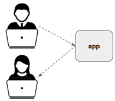
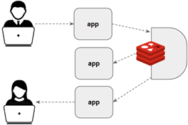
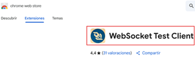
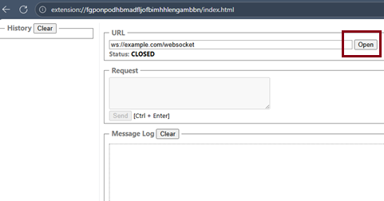
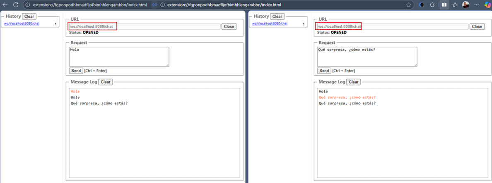
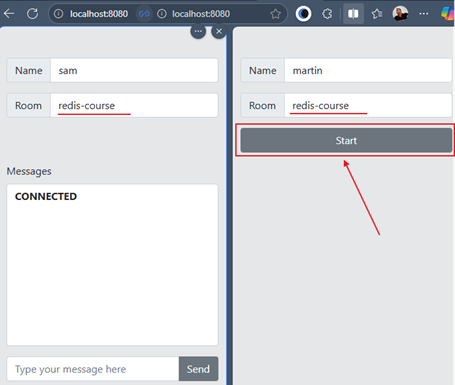
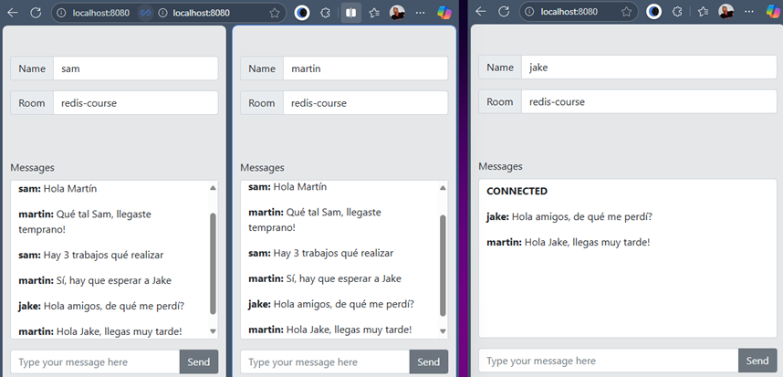

# Sección 08: Chat Application con WebSocket

---

## Introducción al Chat Application

Antes de construir una aplicación de chat en tiempo real, es importante entender la diferencia entre
`Server-Sent Events (SSE)` y `WebSocket`, ya que ambos permiten comunicación en tiempo real pero con enfoques distintos.

### SSE (Server-Sent Events)

- `Unidireccional`: Solo el servidor puede enviar mensajes al cliente.
- `Formato`: Exclusivamente texto (no soporta binario).
- `Uso típico`: Casos donde el cliente solo necesita recibir actualizaciones, por ejemplo:
    - Cotizaciones de bolsa.
    - Actualización en tiempo real de métricas o logs.
    - Actualización de precios.

### WebSocket

- `Bidireccional`: Tanto cliente como servidor pueden enviarse mensajes.
- `Formato`: Soporta texto y binario.
- `Uso típico`: Casos donde se requiere interacción entre ambos lados, por ejemplo:
    - Aplicaciones de chat.
    - Juegos multijugador en tiempo real.
    - Colaboración en vivo (ej. Google Docs).

### Ejemplo con una sola instancia

Crear una aplicación de chat con `WebSocket` es sencillo:

- Tenemos una aplicación corriendo.
- Dos usuarios se conectan a esa aplicación.
- Ambos intercambian mensajes a través del canal WebSocket.



### El reto con múltiples instancias

En entornos de producción, es común que la aplicación se despliegue en múltiples instancias (por ejemplo, en Kubernetes
o detrás de un balanceador de carga).

¿Qué sucede en ese caso?

- `Usuario A` puede estar conectado a la `instancia 1`.
- `Usuario B` puede estar conectado a la `instancia 2`.
- Si un mensaje se envía desde A, este nunca llegará a B porque están en instancias diferentes.

Para resolver este problema necesitamos un `canal de comunicación compartido entre todas las instancias`.

Aquí es donde entra `Redis` con su funcionalidad de `Pub/Sub (Publicar/Suscribirse)`. `Redis` actúa como un message
broker que garantiza que todos los mensajes sean entregados a los clientes sin importar a qué instancia estén
conectados.



## WebSocketSession

En el proyecto `redis-spring` creamos un servicio llamado `ChatRoomService` que implementa la interfaz
`WebSocketHandler`. Esta interfaz define el método `handle(...)`, el cual será invocado cada vez que un cliente
establezca una conexión `WebSocket` con nuestro servidor.

### ¿Qué es un WebSocketSession?

`WebSocketSession` *representa la conexión persistente entre el cliente y el servidor.* El cliente puede ser una
aplicación web (navegador) o móvil, y a través de esta sesión se gestionan tanto los mensajes entrantes como los
mensajes salientes.

Recordemos que los `WebSocket` permiten comunicación `bidireccional`
(comunicación en ambos sentidos: cliente → servidor y servidor → cliente) y `full-duplex`
(ambos sentidos pueden operar simultáneamente, sin bloquearse entre sí).

Esto significa que en una aplicación de chat:

- El `cliente (frontend)` envía mensajes → funciona como `publisher`.
- El `servidor (backend)` los recibe → actúa como `subscriber` mediante `session.receive()`.
- A su vez, el servidor también puede `enviar mensajes` a los clientes → en este caso, `session.send(...)` actúa como
  `publisher`, y el cliente debe estar suscrito a esos mensajes.

En otras palabras:

- `session.receive()` nos entrega un flujo reactivo `(Flux<WebSocketMessage>)` con todo lo que los clientes escriben.
- `session.send(Publisher<WebSocketMessage>)` nos permite enviar datos reactivos al cliente conectado.

A continuación se muestra la clase `ChatRoomService` con la implementación del `WebSocketHandler` y la definición
del método `handle(...)`.

````java

@Slf4j
@Service
public class ChatRoomService implements WebSocketHandler {
    @Override
    public Mono<Void> handle(WebSocketSession session) {
        //subscribe
        session.receive();

        //publisher
        session.send();
        return null;
    }
}
````

## Chat Messages Broadcasting

En esta etapa integramos `Redis` `Pub/Sub` mediante `Redisson` para que los mensajes puedan compartirse entre múltiples
instancias de nuestra aplicación.

Esto resuelve el problema de que, si dos clientes están conectados a instancias diferentes, ambos puedan seguir
comunicándose sin importar en qué nodo estén.

El flujo de comunicación es:

1. Un cliente envía un mensaje por `WebSocket` → el servidor lo recibe con `session.receive()`.
2. Ese mensaje se publica en un canal de `Redis` `(topic.publish(...))`.
3. `Redis` reenvía automáticamente ese mensaje a todas las instancias suscritas al canal.
4. Cada instancia recibe el mensaje y lo reenvía a los clientes `WebSocket` `(session.send(...))`.

De esta forma, `Redis` actúa como un `message broker` que garantiza el `broadcast global`.

````java

@Slf4j
@RequiredArgsConstructor
@Service
public class ChatRoomService implements WebSocketHandler {

    private final RedissonReactiveClient client;

    @Override
    public Mono<Void> handle(WebSocketSession session) {
        String room = "dummy"; // Canal de Redis (puede ser dinámico)
        RTopicReactive topic = this.client.getTopic(room, StringCodec.INSTANCE);

        //Subscribe: recibir mensajes del cliente y publicarlos en Redis
        Mono<Void> incomingFlux = session.receive()
                .map(WebSocketMessage::getPayloadAsText)
                .flatMap(topic::publish) // publica el mensaje en Redis
                .doOnError(throwable -> log.error(throwable.getMessage()))
                .doFinally(signalType -> log.info("Subscriber finally {}", signalType))
                .then(); // convierte el Flux<Long> en Mono<Void>, dejando claro que no usamos los valores

        //Publisher: escuchar mensajes desde Redis y enviarlos al cliente WebSocket
        Flux<WebSocketMessage> outgoingFlux = topic.getMessages(String.class)
                .map(session::textMessage) // convierte los mensajes en formato WebSocket
                .doOnError(throwable -> log.error(throwable.getMessage()))
                .doFinally(signalType -> log.info("Publisher finally {}", signalType));

        // Ejecutar ambos flujos en paralelo mientras dure la sesión WebSocket
        return session.send(outgoingFlux)
                .and(incomingFlux);
    }
}
````

### 🔑 Puntos clave

- `Canal de Redis (RTopicReactive)`. Redis maneja los mensajes de manera centralizada, permitiendo que todas las
  instancias reciban lo publicado en ese canal.

- `Flujo de entrada (session.receive())`. Los mensajes entrantes desde el cliente se convierten a texto y se publican
  en `Redis` mediante `topic.publish(...)`.

- `Flujo de salida (session.send(...))`. `topic.getMessages(...)` expone un `Flux` con todos los mensajes publicados en
  `Redis`. Cada mensaje se transforma en un `WebSocketMessage` y se envía al cliente conectado.

- `Backpressure y memoria`. Redis `Pub/Sub` no tiene almacenamiento persistente (no es como un `queue`), por lo que los
  mensajes solo se entregan a los clientes conectados en ese momento. Si un cliente no está conectado, perderá los
  mensajes.

- `Canales dinámicos`. En este ejemplo se usa `dummy`, pero en un chat real el nombre del canal debería asociarse a la
  sala de chat o a un identificador dinámico.

- `Combinación de flujos con .and(...)`. Usamos `.and(...)` para `ejecutar en paralelo` el flujo de salida
  (enviar mensajes) y el de entrada (publicar en Redis). `.and(...)` ignora los valores y espera a que ambos flujos
  terminen para cerrar la sesión `WebSocket`.

- `.and(...)` es un operador de combinación de `Reactor`.
    - Se aplica sobre un `Mono<Void>` y recibe otro `Publisher<?>`.
    - Devuelve un `Mono<Void>` que:
        - `Ejecuta ambos flujos en paralelo`.
        - Se completa solo cuando ambos han finalizado (o uno falla).
- En este caso:
    - `session.send(outgoingFlux)` mantiene el flujo de mensajes hacia el cliente.
    - `incomingFlux` mantiene vivo el flujo de publicación en Redis.

Así logramos que enviar y recibir mensajes ocurran simultáneamente durante toda la sesión `WebSocket`.

📌 Conclusión:
> El uso de `.and(...)` en este servicio asegura que tanto la publicación de mensajes en Redis como la entrega de
> mensajes a los clientes `ocurran en paralelo`, y que el ciclo de vida completo quede controlado por `WebFlux`.
>
> Al usar `.then()` sobre `incomingFlux`, dejamos claro que los valores emitidos por `Redis` no se usan, haciendo
> el código más limpio y expresivo.

## WebSocket Config

Para habilitar la comunicación por `WebSocket` en nuestra aplicación usamos la clase de configuración
`ChatRoomSocketConfig`.

````java

@RequiredArgsConstructor
@Configuration
public class ChatRoomSocketConfig {

    private final ChatRoomService chatRoomService;

    @Bean
    public HandlerMapping handlerMapping() {
        Map<String, WebSocketHandler> urlMap = Map.of(
                "/chat", this.chatRoomService
        );
        return new SimpleUrlHandlerMapping(urlMap, -1);
    }
}
````

🔎 Explicación

- `HandlerMapping` personalizado
    - Se crea un `SimpleUrlHandlerMapping` que expone el endpoint `/chat`.
    - Cada vez que un cliente se conecte a esta ruta, `Spring` delegará la sesión al `ChatRoomService`.
    - El parámetro `-1` define la prioridad de este mapeo. Un valor negativo asegura que esta configuración no
      interfiera con otros mapeos más específicos (por ejemplo, de controladores `@RestController`).

### ¿Qué significa ese `-1`?

`Spring` utiliza un mecanismo de ordenamiento para decidir qué `HandlerMapping` se evalúa primero cuando llega una
solicitud. Este orden se define con un número entero:

| Valor de orden                                      | Prioridad       | ¿Qué implica?                                      |
|-----------------------------------------------------|-----------------|----------------------------------------------------|
| `Integer.MIN_VALUE` o valores muy bajos (como` -1`) | Alta prioridad  | Se evalúa antes que otros mappings con orden mayor |
| `0` o valores positivos                             | Menor prioridad | Se evalúan después.                                |

En nuestro caso específico:

````bash
return new SimpleUrlHandlerMapping(urlMap, -1);
````

- El `-1` indica que este `HandlerMapping` tiene alta prioridad.
- Garantiza que las peticiones a `/chat` se redirijan directamente al `WebSocket` y no a otros controladores
  `@RestController` que podrían tener el mismo path.
- Esto es útil cuando tienes múltiples `HandlerMapping` en tu aplicación (por ejemplo, uno para `WebSocket` y otro para
  controladores HTTP normales).
- Al darle prioridad alta, Spring intentará resolver primero las rutas `WebSocket` antes de pasar a otros mapeos.

#### ¿Y si no se especifica?

Si no se define el orden, Spring usa un valor por defecto `(Ordered.LOWEST_PRECEDENCE)`, lo que podría hacer que este
mapping se evalúe después de otros, y eso podría causar que no se resuelva correctamente la ruta `/chat`.

#### Ejemplo práctico

Supongamos que tenemos el `@RestController` con:

````java

@GetMapping("/chat")
public String test() {
    return "REST endpoint";
}
````

Y nuestro `SimpleUrlHandlerMapping` está configurado con `orden -1`, entonces:

- Una petición `WebSocket` a `ws://localhost:8080/chat` irá al `WebSocketHandler`.
- Una petición `HTTP GET` a `http://localhost:8080/chat` seguirá funcionando, porque son distintos protocolos.
- Pero `si no usas -1`, `Spring` podría resolver primero el `RestController` y nunca entrar al `WebSocket`.

> El parámetro `-1` establece la prioridad del mapeo `WebSocket`, indicando que este `HandlerMapping` debe evaluarse
> antes que los mapeos por defecto. De esta forma, aseguramos que las conexiones a `/chat` sean manejadas correctamente
> por el `ChatRoomService` y no interfieran con otros endpoints.

La clase `ChatRoomService` implementa la lógica central del `WebSocket`.

````java

@Slf4j
@RequiredArgsConstructor
@Service
public class ChatRoomService implements WebSocketHandler {

    private final RedissonReactiveClient client;

    @Override
    public Mono<Void> handle(WebSocketSession session) {
        String room = this.getChatRoomName(session);
        RTopicReactive topic = this.client.getTopic(room, StringCodec.INSTANCE);

        //subscribe
        Mono<Void> incomingFlux = session.receive()
                .map(WebSocketMessage::getPayloadAsText)
                .flatMap(topic::publish)
                .doOnError(throwable -> log.error(throwable.getMessage()))
                .doFinally(signalType -> log.info("Subscriber finally {}", signalType))
                .then();

        //publisher
        Flux<WebSocketMessage> outgoingFlux = topic.getMessages(String.class)
                .map(session::textMessage)
                .doOnError(throwable -> log.error(throwable.getMessage()))
                .doFinally(signalType -> log.info("Publisher finally {}", signalType));

        return session.send(outgoingFlux)
                .and(incomingFlux);
    }

    private String getChatRoomName(WebSocketSession session) {
        URI uri = session.getHandshakeInfo().getUri();
        return UriComponentsBuilder.fromUri(uri)
                .build()
                .getQueryParams()
                .toSingleValueMap()
                .getOrDefault("room", "default");
    }
}
````

🔎 Explicación

- Selección dinámica de salas `(getChatRoomName(...))`
    - El nombre de la sala de chat se extrae del parámetro `room` en la `URL` del `WebSocket`.
    - Ejemplo de conexión desde el cliente: `ws://localhost:8080/chat?room=sala1`.
    - Si no se envía un parámetro `room`, se asigna automáticamente `default`.


- Flujo de entrada `(incomingFlux)`
    - Cada mensaje recibido desde el cliente se publica en el canal Redis asociado a la sala.
    - Usamos `.then()` para ignorar los valores (Long) que devuelve publish y quedarnos únicamente con la señal de
      finalización.


- Flujo de salida `(outgoingFlux)`
    - Escucha en el canal Redis y envía todos los mensajes publicados hacia el cliente actual.
    - De esta forma, todos los clientes conectados a la misma sala reciben lo que cualquiera envíe.


- Combinación con `.and(...)`
    - `session.send(outgoingFlux)` gestiona los mensajes que enviamos al cliente.
    - `incomingFlux` gestiona los mensajes entrantes que publicamos en Redis.
    - Con `.and(...)` ejecutamos ambos en paralelo, esperando a que terminen antes de cerrar la sesión.

⚡ Beneficio principal

> Con esta configuración, cualquier número de instancias de tu aplicación puede manejar clientes de múltiples salas en
> paralelo. `Redis` actúa como el punto de sincronización que asegura que los mensajes lleguen a todos los clientes de
> la misma sala, sin importar a qué instancia estén conectados.

**Nota**
> En la clase `CityService` comentamos esta anotación `@Scheduled(fixedRate = 10_000)` dado que el método anotado
> con ese `scheduled` usa un servicio que deberíamos levantar, pero en nuestro caso no necesitamos trabajar con
> ningún servicio externo.

## WebSocket Test Client

Para validar el correcto funcionamiento de nuestro backend de chat con `WebSocket`, podemos utilizar una extensión de
navegador que actúe como cliente `WebSocket genérico`.

### 🔌 Instalación de la extensión

En este caso, utilizamos la extensión gratuita disponible en `Microsoft Edge` (también existe en `Chrome Web Store`).



Al abrir la extensión, se nos muestra una interfaz gráfica simple para conectarnos a un servidor `WebSocket`.



### 📡 Prueba de conexión

1. Abrimos dos ventanas de la extensión.
2. Nos conectamos al endpoint configurado en nuestro backend: `ws://localhost:8080/chat`
3. Desde la primera ventana, enviamos un mensaje de prueba.
4. Verificamos que el mensaje aparece en la segunda ventana de la extensión.



### 🔎 Explicación

- Cada ventana de la extensión representa un cliente WebSocket distinto.
- Al enviar un mensaje desde un cliente, este se publica en el canal Redis y se reenvía automáticamente a todos los
  demás clientes conectados a la misma sala (room).
- Esto confirma que la siguiente lógica está funcionando correctamente:
    - `session.receive()` → Redis publish
    - Redis subscribe → `session.send()`

## 💻 Chat Application - HTML Template

Para probar nuestro chat con `WebSocket` directamente en el navegador, creamos una plantilla HTML en:

````bash
src/main/resources/static/index.html 
````

De esta manera, al levantar la aplicación podremos acceder a: `http://localhost:8080/index.html`

````html
<!doctype html>
<html lang="en">
<head>
    <!-- Required meta tags -->
    <meta charset="utf-8">
    <meta name="viewport" content="width=device-width, initial-scale=1">
    <!-- Bootstrap CSS -->
    <link href="https://cdn.jsdelivr.net/npm/bootstrap@5.0.2/dist/css/bootstrap.min.css" rel="stylesheet"
          integrity="sha384-EVSTQN3/azprG1Anm3QDgpJLIm9Nao0Yz1ztcQTwFspd3yD65VohhpuuCOmLASjC" crossorigin="anonymous">
    <!--------------------------------------------------------------------------------------------->
    <title>Redis Chat Demo</title>
</head>
<body style="background-color: #E5E7E9;">
<div class="container mt-5">

    <!-- Nombre del usuario -->
    <div class="input-group mb-3">
        <span class="input-group-text" id="basic-addon1">Name</span>
        <input type="text" class="form-control" placeholder="Name" id="name">
    </div>

    <!-- Nombre de la sala -->
    <div class="input-group mb-3">
        <span class="input-group-text" id="basic-addon1">Room</span>
        <input type="text" class="form-control" placeholder="Room" id="room">
    </div>

    <!-- Botón para iniciar la conexión -->
    <div class="mb-3" id="start-control">
        <button class="form-control btn btn-secondary" type="button" id="start">Start</button>
    </div>

    <!-- Contenedor del chat (visible solo tras iniciar) -->
    <div id="chat-div" class="invisible">
        <!-- Historial de mensajes -->
        <div class="mb-3">
            <label for="exampleFormControlTextarea1" class="form-label">Messages</label>
            <div class="form-control overflow-auto" style="height:250px;" id="history">

            </div>
        </div>
        <!-- Entrada de mensajes -->
        <div class="input-group mb-3">
            <input type="text" class="form-control" placeholder="Type your message here" id="message">
            <button class="btn btn-secondary" type="button" id="send">Send</button>
        </div>

    </div>

</div>

<!-- Lógica de WebSocket -->
<script>
    // will be executed after pressing start button
    const chatFunction = () => {
        // Datos del usuario y sala
        const name = document.getElementById('name').value;
        const room = document.getElementById('room').value;
        const history = document.getElementById('history');
        const message = document.getElementById('message');
        const send = document.getElementById('send');
        const chatDiv = document.getElementById('chat-div');
        const startControl = document.getElementById('start-control');

        // Mostrar chat y ocultar controles de inicio
        chatDiv.classList.remove('invisible');
        startControl.classList.add('invisible');

        // Construcción dinámica del URI. Ejm. ws://localhost:8080/chat?room=some-name
        const uri = `ws://${window.location.hostname}:${window.location.port}/chat?room=${room}`;
        websocket = new WebSocket(uri);

        // Manejo de mensajes entrantes
        websocket.onmessage = (evt) => {
            let obj = JSON.parse(evt.data);
            let ele = document.createElement('p');
            ele.innerHTML = `<b>${obj.sender}:</b>&nbsp;${obj.message}`;
            history.appendChild(ele);
        }
        
        // Eventos de conexión y desconexión
        websocket.onopen = (evt) => {
            let ele = document.createElement('p');
            ele.innerHTML = `<b>CONNECTED</b>`;
            history.appendChild(ele);
        }

        websocket.onclose = (evt) => {
            let ele = document.createElement('p');
            ele.innerHTML = `<b>DISCONNECTED</b>`;
            history.appendChild(ele);
        }

        // Envío de mensajes
        const sendMessage = () => {
            let obj = {
                sender: name,
                message: message.value
            }
            message.value = '';

            websocket.send(JSON.stringify(obj));
        }
        send.addEventListener('click', sendMessage);
    }

    document.getElementById('start').addEventListener('click', chatFunction);
</script>
<!--------------------------------------------------------------------------------------------->
<script src="https://cdn.jsdelivr.net/npm/bootstrap@5.0.2/dist/js/bootstrap.bundle.min.js"
        integrity="sha384-MrcW6ZMFYlzcLA8Nl+NtUVF0sA7MsXsP1UyJoMp4YLEuNSfAP+JcXn/tWtIaxVXM"
        crossorigin="anonymous"></script>
</body>
</html>
````

🔎 Explicación

- Formulario inicial
    - Permite ingresar el nombre de usuario y el nombre de la sala (room).
    - Tras presionar "Start", se construye la URL de conexión WebSocket:
      `ws://localhost:8080/chat?room=<nombre-de-la-sala>`
- Eventos de WebSocket
    - `onopen`: Muestra que la conexión se abrió.
    - `onclose`: Muestra que la conexión se cerró.
    - `onmessage`: Cada vez que el servidor publica un mensaje, se renderiza en el historial.
- Envío de mensajes
    - Los mensajes enviados se transforman en JSON con la estructura:
    ````json 
    {
     "sender": "Alice",
     "message": "Hola a todos!"
    }
    ````
    - El backend recibe ese JSON, lo publica en Redis y lo reenvía a todos los clientes de la misma sala.

✅ Resultado esperado

Al abrir varias ventanas del navegador con index.html y conectarse a la misma sala:

1. Cada usuario podrá escribir mensajes.
2. Todos los demás verán los mensajes en tiempo real.

👉 Esto convierte a tu aplicación en un chat distribuido con Redis + WebSocket funcionando de extremo a extremo.

## Chat Application - Demo y tarea asignada

Ejecutamos nuestra aplicación y abrimos dos pestañas apuntando a `http://localhost:8080`. Luego, nos conectamos a la
sala `redis-course` e ingresamos un nombre para cada usuario. Finalmente damos en `Start`.



Veamos en funcionamiento nuestro chat, inicialmente con dos usuarios conectados a la misma sala, posteriormente
se nos une un nuevo usuario.


